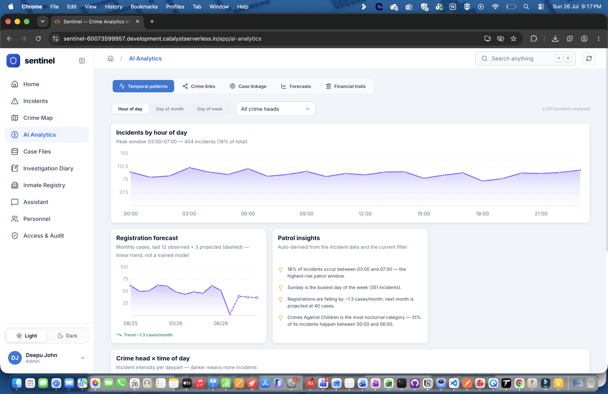
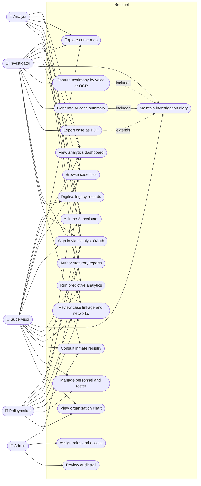
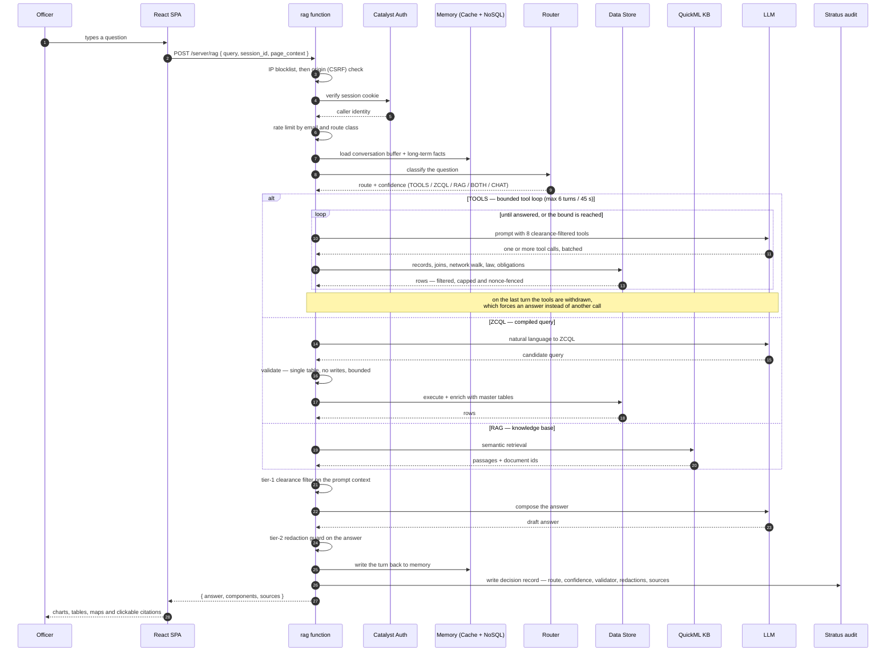
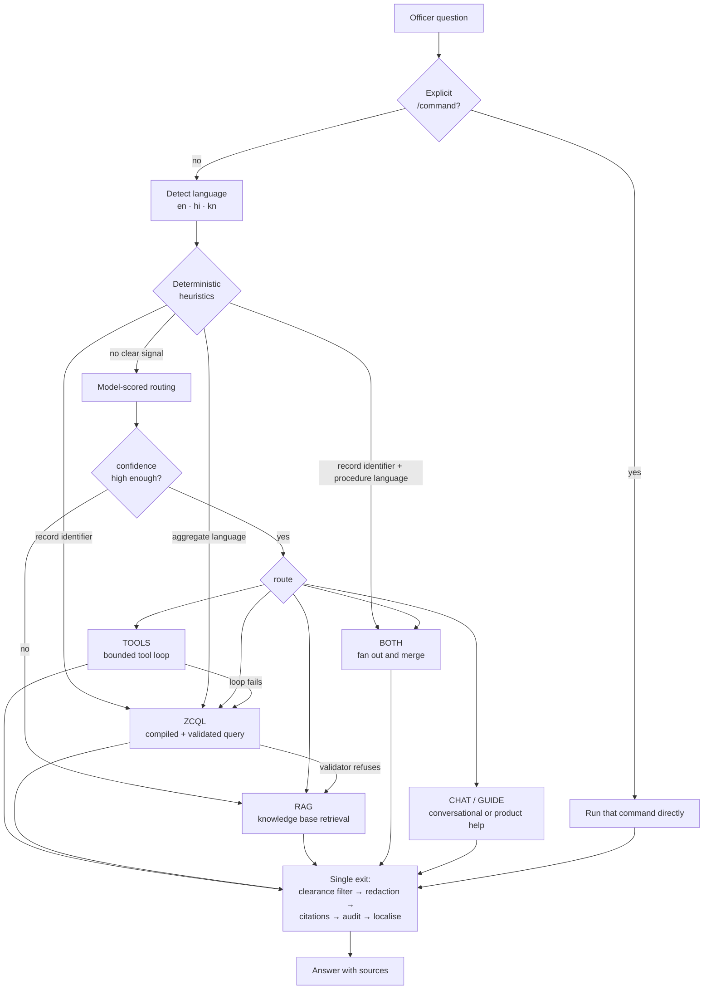
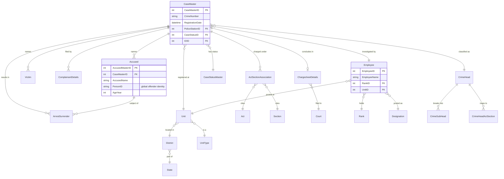
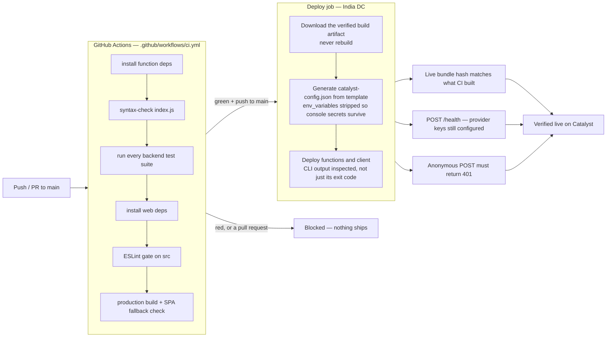

<div align="center">

# 🛡️ Sentinel

### Crime Intelligence & Case-Management Platform for the Karnataka State Police

Sentinel unifies crime analytics, an AI investigative assistant, a digital case diary, report
authoring and governance into a single platform — built natively on the **CCTNS / BNSS**
framework and running end-to-end on **Zoho Catalyst**.

[](https://sentinel-60073599957.development.catalystserverless.in/app/index.html)


</div>

---

## Live Demo & Judge Login

**Live app:** <https://sentinel-60073599957.development.catalystserverless.in/app/index.html>

Sign in with the shared evaluation account below. It has full **Admin** access, so every
feature — including the **Access & Audit** console and role management — is visible:

| Field | Value |
| --- | --- |
| **Email** | `deepujohn.t01@gmail.com` |
| **Password** | `Zohohack2026!` |

---

## Table of Contents

1. [Overview](#overview)
2. [Objectives](#objectives)
3. [Key Features](#key-features)
4. [Architecture](#architecture)
5. [Tech Stack](#tech-stack)
6. [Zoho Catalyst Services Used](#zoho-catalyst-services-used)
7. [Project Structure](#project-structure)
8. [The Dataset](#the-dataset)
9. [The Forecasting Models](#the-forecasting-models)
10. [REST API Reference](#rest-api-reference)
11. [Prerequisites](#prerequisites)
12. [Setup & Installation](#setup--installation)
13. [Running Locally](#running-locally)
14. [Build & Deploy](#build--deploy)
15. [Testing](#testing)
16. [Documentation](#documentation)
17. [Roles & Access](#roles--access)
18. [Security & Compliance](#security--compliance)
19. [Future Scope](#future-scope)
20. [Team](#team)
21. [Copyright & Licence](#copyright--licence)

---

## Overview

Police forces sit on vast volumes of data and paperwork that stay locked and hard to use —
hard to query, slow to investigate, impossible to forecast from, and weakly audited. A station
writer who wants to know *"which districts saw the sharpest rise in vehicle theft last quarter"*
has no way to ask; an investigating officer maintaining a Case Diary under **BNSS S.172** is
still writing longhand; a supervisor reviewing who looked at what has no trail to review.

Sentinel closes all four gaps on one platform:

| From | To |
| --- | --- |
| **Data locked in tables** | FIR data queryable in plain English, and visible as trends, maps and risk boards |
| **Paper investigation** | A full digital Case Diary with voice-to-text and scan-OCR testimony capture |
| **Reactive policing** | Forecasting, district-risk scoring, cross-case linkage and co-offending networks |
| **Weak oversight** | Rank-based access control and a tamper-evident audit trail on every action |

Everything runs on a realistic **synthetic** Karnataka FIR dataset built on a 26-table
CCTNS-aligned schema, with production use on real citizen data explicitly gated behind legal
sign-off. The frontend browses the Data Store directly from the browser over ZCQL and pulls
whole tables for analytics as one columnar snapshot each; everything that writes, calls a model,
handles media or renders a PDF goes through a single serverless function that holds every
credential server-side and enforces role and audit checks.

---

## Objectives

1. **Make FIR data answerable in plain language.** An officer should get a cited, chart-backed
   answer to a natural-language question in seconds, without knowing SQL or the schema — in
   English, Hindi or Kannada.
2. **Replace the paper Case Diary with a compliant digital one.** Full **BNSS S.172** diary
   proceedings mapped onto the CCTNS **IIF1–IIF5** integrated forms, including S.161 statements,
   evidence with chain-of-custody, and court-ready PDF export.
3. **Shift the department from reactive to proactive.** Surface crime forecasts with confidence
   bands, district risk scores, repeat-offender networks and cross-case linkage *before* the
   next incident, not after.
4. **Cut the clerical load on investigating officers.** Testimony captured by voice or by
   scanning a page; legacy paper records digitised and made searchable; statutory reports drafted
   from templates with AI narrative assistance.
5. **Turn physical paper into a knowledge base the AI can answer from.** Through **Report Studio**
   and **Records**, an officer uploads any physical material — a handwritten statement, a typed
   FIR, a seizure memo, a scanned court order, even an interview recording. Zia OCR and
   speech-to-text lift the text, an AI pass structures it into a searchable record, and it is
   indexed into the RAG knowledge base. From that point the material is not just archived: the
   assistant can cite it in an answer, and the officer can search across every page the station
   has ever scanned.
6. **Make every access accountable.** Enforce a rank-based access model end-to-end and record
   every view, edit, export, sign-in and denial — with user, role, IP, location and IST timestamp
   — in an exportable audit trail.
7. **Keep AI advisory, cited and fair.** Every model output carries its sources, protected
   attributes are excluded from risk models, and a human officer stays in the loop on every
   decision.
8. **Prove it can run on managed Indian infrastructure.** The entire platform — hosting, data,
   storage, auth, OCR, speech, PDF and retrieval — runs on Zoho Catalyst's `zoho.in` data centre
   with no self-managed servers.

---

## Key Features

### 🏠 Home Dashboard

The department's daily situational picture on one screen: **eight headline KPIs** — FIRs
registered with period-on-period change, open investigations, solved rate, heinous share,
accused, victims, arrests & surrenders and chargesheet rate — above a **26-card bento** ordered
into bands that each fill the row exactly.

| Band | Cards |
| --- | --- |
| **Where** | District geo-heatmap, station load, socio-economic correlation choropleth (districts shaded by indicator, circles sized by cases, with a Pearson *r* readout) |
| **What** | Crime category, most-charged legal sections, seasonality (calendar month × crime head), heinous vs non-heinous, and a **crime-flow Sankey** tracing category → type → outcome with ribbon width as case volume |
| **Who** | Accused and complainant age profiles, gender split, repeat offenders, complainant occupations, victim profile, force rank distribution |
| **How well** | Case-status funnel, pendency ageing (green fresh → red long-pending), chargesheet filing lag, average investigation time per crime head, IO caseload, court load |

**Time is a control, not a setting.** Today / Month / Year / 5 Years, or any custom date range,
re-derives every KPI and every chart — so the same twenty-six questions can be asked of any
window. A headline crime-trend chart carries its own independent range for comparison. The whole
page exports to **PDF** in one click, as the briefing document a senior officer walks into a
meeting with.


### 🗺️ Crime Map

A custom SVG + `d3-geo` map of India that drills **state → district → police station**. Districts
are shaded by incident density; drilling into a district reveals station boundaries, beat-level
hotspots and clustered incident pins. Each station card carries its jurisdiction officers with
one-tap `tel:` call links, so a map lookup ends in a phone call rather than a second search.


### 🤖 AI Assistant

A full chat workspace at `/assistant`, not a corner widget. An officer asks a question in plain
English, Hindi or Kannada and a router decides how to answer it:

- **Tool loop** — the model is given **eight clearance-filtered tools** and runs as many
  lookups as one question needs before answering, batching independent ones into a single
  turn. This is the lane that answers questions the single-lane paths structurally cannot:
  ZCQL has no joins, so *"which FIRs were filed in Belagavi last month and who is accused in
  them"* is two dependent lookups, and *"who has this man offended with"* is a graph walk.
  See [Assistant tools](#assistant-tools) for the full set.
- **ZCQL lane** — the question is compiled to a validated, single-table ZCQL query against the
  live FIR schema, then enriched with master-table names and district rollups in code.
- **RAG lane** — legal, procedural and SOP questions are answered from a QuickML knowledge base.
- **Hybrid** — a question that is both ("what does S.41 require, and how many arrests did
  Belagavi make under it") fans out to both lanes and merges the answers.

Around that: per-officer **memory** (a live conversation buffer, durable long-term facts, and
semantic recall of older sessions), **voice input** via Zia speech-to-text, **document
attachments** (PDF/Office files read as context, with each chip stating plainly whether the
assistant can actually see the file), **slash commands**, ↑/↓ prompt history, saved
conversations, and replies rendered as charts, tables, maps and record cards. Every answer
carries interactive **source citations** you can click through to the exact row or document.


### 📈 AI Analytics

Five analytical surfaces under one page. Home tells you what happened; this tells you what it
means and what to do next.

#### Temporal patterns

Incident profiles by **hour of day, day of month and day of week**, filterable to any crime
head, which automatically name the peak patrol window ("34% of incidents occur between 20:00 and
24:00") and expose a **crime-head × daypart matrix** — which offences are nocturnal, which are
business-hours. Patrol insights are derived from the data rather than written by hand.

#### Crime links — the co-offending network

Two people are linked when they appear as accused in the **same FIR**, and `Accused.PersonID` is
a *global* offender identity, so the same person is tracked **across** FIRs. That single fact is
what makes the whole network possible.

From it: **connected components → rings**, **degree centrality → leaders**, **local clustering →
brokers vs lieutenants**. Every member is labelled **Kingpin / Broker / Repeat / Member** from
the maths rather than by assertion. The ring map draws one labelled node per ring, sized by
membership, on a canvas from a layout computed once — hover to trace a ring's connections, click
to open its members and every linked crime.

#### Case linkage — behavioural comparative case analysis

Pick an index offence; every other FIR is ranked by **MO similarity (Jaccard, 50%) +
inter-crime distance (30%) + temporal proximity (20%)** — the weighting used in the
Bennell/Burrell linkage literature.

It **publishes its own accuracy on the card**: ROC AUC ≈ 0.87 against ground-truth series plus a
top-10 hit rate, both measured on held-out data by rolling-origin validation. A separate
**calibration** panel answers the question most tools skip — the ranking is good, but does a
"72%" actually mean 72%? An isotonic correction closes the gap without reordering anything, so
the AUC above it is unchanged by it.

#### Forecasts — three deployed models

Not a trend line: **live QuickML models** covering force-wide FIR volume, ten crime heads and
thirty-one districts — 42 series from **3 pipelines**, in the *direct multi-horizon* form used
for global forecasting models (one row = series × origin × horizon, so the series is a feature
and one pipeline covers them all).

- **30 / 60 / 90-day horizons**, with a 95% band derived from each model's measured held-out
  error rather than from the endpoint, which returns a point estimate only.
- **Scored against the baseline a forecaster actually has to beat** — each series' own
  historical average, because for noisy counts the mean beats both naive and seasonal-naive:
  **+65% force-wide (4.1% MAPE), +12% by crime head, +7% by district**. These are the
  rolling-origin numbers, not the optimistic console metric from a random split.
- Monthly, and that is not a detail: weekly, every one of these lost to a flat average, because
  Poisson noise grows as √level while the seasonal signal grows with the level.

Alongside: a **district risk board** for next month, **repeat-offender risk scoring** with a
visible frequency / recency / severity / network breakdown, and **anomaly alerts** for any week
running ≥2σ above its trailing baseline.

#### Financial trails — money-laundering typologies

A transaction graph screened against **nine standard AML typologies**: structuring, layering,
fan-in (mule hub), fan-out (dispersal), round-tripping, pass-through, high-value cash, high-risk
channel, and shell/mule routing.

- **Prioritised alerts** — entities ranked by composite laundering risk, each with the
  typologies that triggered it and a plain-language assessment an analyst can act on.
- An interactive **money-flow map** on the same canvas renderer as the ring map: entities of
  interest, mule and shell accounts, one edge per counterparty relationship, node size by value
  moved, colour by account kind. The graph is deliberately *uneven* — shared accounts, chains of
  varying depth and hubs with a long tail — because a field of identical stars would say nothing
  about where two chains meet, which is the finding.
- **The accounts are synthetic; the branches are real.** Every IFSC resolves live through the
  public directory, so layering acquires a geography: which districts the money actually crossed.

All outputs are advisory, cited and guardrail-bound: protected attributes (religion, caste,
gender) are excluded from every risk model.




### 📓 Investigation Diary

A digital **Case Diary under BNSS S.172**, mapped onto the CCTNS integrated forms **IIF1–IIF5**.
Each case carries dated diary entries, S.161 witness statements, evidence with a
chain-of-custody log, persons (accused / victim / complainant / witness), a case timeline and
investigator findings.

Testimony is captured two ways without typing: **live voice-to-text**, or by **photographing a
handwritten page** and running Zia OCR — with the source scan and the source recording both kept
in object storage, so extracted text is always traceable back to the artefact it came from.
Rule-based logic flags cold cases and suggests next investigative steps; an AI **case summary**
drafts a "state of the investigation" brief using *only* the case's own entries, with numbered
citations back to each one. The whole case exports as a court-ready PDF.


### 📝 Report Studio

Twelve statutory report templates derived from the CCTNS Integrated Investigation Forms — FIR
(IIF-1), Case Diary, Arrest/Surrender Memo (IIF-3), Charge Sheet / Final Form (IIF-5), Seizure
Memo (IIF-4), Unnatural Death Report, Missing Person Report, General Diary, Law & Order Report,
Crime Analysis Report, Performance Report and Case Status Report.

Reports are authored in a **paged A4 editor** (TipTap) that renders exactly as it will print,
with continuation sheets, tables and rich fields. AI narrative polish rewrites a drafted section
into formal report language with the original one click away under Undo. Drafts are stored in
object storage with soft delete, and render to PDF server-side through SmartBrowz.


### 🗄️ Records (Digitisation)

Legacy paper and media brought into the system. An officer uploads a scan, a photograph, a
spreadsheet, a document, a deck or an interview recording; Sentinel extracts the text — Zia OCR
for images, Zia speech-to-text for audio, in-browser extraction for office formats — runs an AI
structuring pass, and files the result as a searchable record linked to a case. Large recordings
upload **directly** to object storage through a short-lived pre-signed PUT rather than through
the function. The original file is always kept alongside the text it produced.

### 🔒 Inmate Registry (Custody & Corrections)

A person-centric custodial view built over the FIR data: every distinct offender becomes a
custodial record aggregating their cases, charges, arrests and case statuses. Registry, alerts
and analytics views, plus a per-person detail page. Correctional facts the FIR schema does not
carry — facility, bail history, sentence and remission, parole, reporting obligations — are
deterministically synthesised per person so the registry is realistic and stable across reloads.


### 👮 Personnel

A 3,368-officer directory across the full Karnataka rank ladder (PC → DGP, 12 ranks), with a
weekly **duty roster** and a per-district **organisation chart** rendered from the Unit
hierarchy. Rank insignia are drawn inline. Because ZCQL is single-table, `Employee` is joined
against `Rank`, `Unit` and `District` client-side; contact details and duty status are not in the
FIR schema at all, so they are derived deterministically from `EmployeeID` — the same officer
gets the same email, phone and status on every device.


### 📁 Case Files

Direct, paginated browse of the underlying 26-table FIR schema, grouped into Cases / People /
Reference. Read straight from the Data Store in the browser via ZCQL — the raw evidence behind
every dashboard on the platform.


### 🛡️ Access & Audit

Rank-based access control over five roles, assigned by an admin (the `admin` role itself comes
from Catalyst's own *App Administrator* project role and can never be self-assigned). The
sidebar hides what the router blocks, and the block is verified server-side from the session,
not the client.

Alongside it, a tamper-evident **audit trail**: every feature view, record edit, sign-in,
denial, export, role change, AI query and memory write is recorded with user, role, IP,
approximate location and IST timestamp — stored as per-day objects and exportable to CSV/XLSX.
Assistant answers additionally leave an immutable **decision record** describing *how* the
answer was reached: the route taken and its confidence, what the ZCQL validator allowed or
refused, what the clearance filter redacted, and which sources were cited.


### 📴 Working with no signal

Station connectivity is uneven, so the app keeps working without it. A service worker caches the
app shell, the maps and the reference tables; diary entries written at a scene are queued in
IndexedDB and flushed on reconnect; an offline bar states the connection state and how many
writes are waiting.

The shape of this is set by one decision: **no citizen data is cached to disk.** What the queue
holds is the officer's *own* work — the entry they typed — and it is deleted the moment it
reaches the server. The honest limitation is surfaced rather than hidden: offline you can add to
a case you already have open, but you cannot browse to one you have not loaded, because the case
itself was never cached. `navigator.onLine` is not trusted either — a station on a dead uplink
still reports "online", so reachability is measured with a real round trip.

Signing out wipes all of it: cached shell, reference data and any queued write. If unsynced work
would be lost, the officer is warned *before* it happens, not after.

### 🌐 Cross-cutting

Multilingual UI and answers (**English / हिन्दी / ಕನ್ನಡ**), global search with deep links into
any tab, an **action queue** of investigative obligations with due dates, a help centre that
emails the admin, per-user profiles with photos, light/dark themes, an accessibility gate in CI,
and an error boundary that keeps one broken panel from taking the page down.

---

## Architecture

Sentinel is a **three-path** application, and each split is deliberate.

**Browsing is direct.** Case Files and other row-level reads query the Catalyst Data Store *from
the browser* over ZCQL, authenticated by the user's own Catalyst session. No function sits in
the middle, so a page of records costs one round trip and no serverless cold start.

**Analytics arrive as one snapshot per table.** ZCQL returns 300 rows a query, so at 30,000 FIRs
the home page alone needed **437 browser round trips** before it could draw anything. Those
reads now happen inside the datacentre and each table comes back as a single columnar response
from `/analytics/snapshot` — data rather than the same twelve JSON keys repeated 30,000 times.
A page requests only the tables it uses, in parallel, and the result is shared across every
panel and every tab for the life of the session.

**Everything that writes goes through one function.** Anything that writes, calls a model,
touches media, renders a PDF or reads the audit trail is routed through the `rag` Advanced I/O
function. That function is the only place credentials exist, the only place role checks are
authoritative, and the single choke point where every action gets audited.

### Making the analytics feel instant

The snapshot fixed the network. It did not fix the *wait*, because every analytics tab turns
those rows into a model of its own before it can draw — a co-offending graph, a synthesised
transaction ledger, a linkage candidate set. Three rules now hold across the five tabs:

| Rule | Why |
| --- | --- |
| **Derived models are cached for the session** (`utils/derived.js`) | The FIR data is read-only and every model is a pure function of it, so a cached model is the same model. The cache holds *promises*, so two panels mounting at once share one build; a rejection is evicted so Retry can actually retry. A second visit to a tab costs ~1 ms instead of ~370 ms. |
| **Tabs are kept, not destroyed** | Switching away hides a tab rather than unmounting it, so filters, page positions and a laid-out map survive. Unvisited tabs are never mounted, so the first paint stays cheap. |
| **Long work runs after the paint, in slices** | An `await` on a resolved promise resumes in a *microtask*, which runs **before** the browser paints — so a component could mount a spinner, block for half a second and never show it. Builds now wait for a real frame first, and anything measured in seconds (the linkage validation, a 190-node force layout) yields every ~10 ms so the page keeps responding. |

Graph maps are drawn to a **canvas** from a layout computed once, never a live force simulation
in the browser: one DOM node per graph node plus its label is the bottleneck past a couple of
hundred, and a simulation that re-renders the React tree on every frame is worse than that.

> **Editable diagrams (Lucidchart).** The two headline diagrams below are also maintained as
> Lucidchart documents, so they can be exported to PNG/PDF for slides and submission packs, and
> edited by hand rather than only in code:
>
> | Diagram | Lucidchart |
> | --- | --- |
> | System architecture | [Sentinel — System Architecture](https://lucid.app/lucidchart/a0d0b223-126e-40c4-a826-606d9a8b7602/view) |
> | Use case | [Sentinel — Use Case Diagram](https://lucid.app/lucidchart/c355d0a0-1c93-4c48-8c4d-8ced3db8ff21/view) |
>
> The Mermaid versions in this README are the canonical, version-controlled copies — they change
> with the code in the same commit. Treat the Lucid documents as the presentation copies and
> re-export them when the Mermaid changes.

### System architecture

```mermaid
flowchart TB
    User(["👮 Police officer<br/>browser"])

    subgraph Client["Client — React 19 SPA, served from Catalyst Web Hosting at /app"]
        direction LR
        Nav["Auth + RBAC context<br/>route guards, sidebar"]
        Read["Dashboard · Crime Map · Case Files<br/>AI Analytics · Inmate Registry"]
        Cachez["Derived-model cache<br/>one build per session, tabs kept mounted"]
        Write["Assistant · Investigation Diary · Report Studio<br/>Records · Access and Audit"]
    end

    subgraph Fn["rag — Catalyst Advanced I/O Function, Node 20"]
        direction TB
        Gate["Router gate<br/>IP blocklist → origin check → session check → rate limit"]
        Handlers["58 routes, one gate"]
        Guard["Clearance filter + redaction<br/>tier 1 pre-prompt, tier 2 post-generation"]
        Gate --> Handlers --> Guard
    end

    subgraph Catalyst["Zoho Catalyst platform services"]
        direction LR
        Auth["Authentication<br/>OAuth + User Management"]
        DS[("Data Store<br/>26-table FIR schema")]
        ST[("Stratus<br/>object storage")]
        Cache[("Cache<br/>chat-sessions")]
        NoSQL[("NoSQL<br/>officer memory")]
        Zia["Zia<br/>OCR · Speech-to-Text · Vision"]
        SB["SmartBrowz<br/>HTML → PDF"]
        QML["QuickML<br/>3 forecast pipelines · chargesheet classifier<br/>RAG knowledge base"]
    end

    subgraph LLM["LLM providers — ordered fallback chain"]
        Groq["Groq<br/>gpt-oss-120b · qwen3.6-27b"]
        Claude["Anthropic<br/>claude-opus-5"]
    end

    User --> Client
    Nav <--> Auth
    Read -- "ZCQL row browse, user session" --> DS
    Read -- "one columnar snapshot per table" --> Fn
    Read --> Cachez
    Write -- "HTTPS POST /server/rag/*" --> Fn

    Gate -. "verify caller session" .-> Auth
    Handlers -- "ZCQL admin read/write" --> DS
    Handlers -- "diary · evidence · audit · reports · profiles" --> ST
    Handlers -- "conversation buffer" --> Cache
    Handlers -- "long-term facts" --> NoSQL
    Handlers -- "OCR · transcription · vision" --> Zia
    Handlers -- "render report" --> SB
    Handlers -- "forecast predictions · semantic retrieval" --> QML
    Handlers -- "routing · chat · summaries · tools" --> LLM
    Groq -. "on failure" .-> Claude
```



### Use case diagram



> Every use case above — including a *denied* attempt at one — is recorded in the audit trail with
> user, role, IP, approximate location and IST timestamp.

### Request lifecycle: assistant question



### Assistant routing



### Data model: core FIR schema

The 26-table CCTNS-aligned schema, with `CaseMaster` at the centre. Reference/master tables
(`Act`, `Section`, `District`, `Rank`, `CasteMaster`, `ReligionMaster`, …) hang off these.



> `Accused.PersonID` is a **global** offender identity rather than a per-case one. That single
> decision is what makes the co-offending network, the case-linkage ranking and the custody
> registry possible at all.

### Deployment pipeline



Three things this pipeline learned the hard way, all now asserted rather than assumed: the
Catalyst CLI has printed a fatal error and still exited `0`; a deploy carrying an
`env_variables` map silently overwrites the console's secrets; and a deploy can report success
while shipping nothing. So success is proved against the live site — bundle hash, health route
and a 401 on an anonymous call — not against the CLI's exit code.

---

## Tech Stack

### Frontend

| Area | Technology | Used for |
| --- | --- | --- |
| Framework | **React 19** (`react`, `react-dom`) | The whole SPA |
| Language | **JavaScript + TypeScript 5.4** | `App.tsx` and entry points are TS; feature code is JS |
| Build | **react-scripts 5** (CRA) | Dev server, production bundle, `postbuild` SPA fallback |
| Routing | **react-router-dom 7** | Client routing under the `/app` basename, with per-route guards |
| Maps | **d3-geo** + **topojson-client** | Custom SVG India → Karnataka → district → station drill-down |
| Maps | **Leaflet** + `leaflet.heat` + `leaflet.markercluster` | Incident heatmaps and pin clustering |
| Charts | **visx** (`@visx/scale`, `shape`, `curve`, `responsive`) + hand-built SVG | The vendored chart kit in `components/charts/` — trend lines and areas, bar columns and rows, rings, stat tiles — plus `Charts.js` and `Sankey.js` for the forecast chart, funnels and flow diagrams |
| Graph maps | **Canvas 2D** (`components/GraphCanvas.js`) | The co-offending ring map and the money-flow map: a precomputed seeded layout drawn in one pass, rather than a live simulation in the DOM |
| Motion | **motion** (`motion/react`) | Spring-driven chart crosshairs and reveal transitions, all honouring `prefers-reduced-motion` |
| Rich text | **TipTap 3** (`@tiptap/*` + ProseMirror) | The paged A4 report editor, tables and text alignment |
| PDF | **jsPDF** + **html2canvas** | Client-side PDF export of cases and dashboards |
| PDF (server) | **SmartBrowz** | High-fidelity HTML → PDF for statutory reports |
| Documents | **pdfjs-dist** | Reading attached PDFs in the browser for assistant context |
| Spreadsheets | **SheetJS / xlsx** | CSV and XLSX exports, and reading attached spreadsheets |
| i18n | **i18next** + **react-i18next** + browser language detector | English, Hindi and Kannada UI and answers |
| Icons | **lucide-react** | Icon set throughout |
| Offline | **Service Worker** + **IndexedDB** | Cached app shell, maps and reference tables; a write queue that flushes on reconnect |
| Browser APIs | Web Speech API, MediaRecorder, `requestIdleCallback`, `scheduler.yield` | Voice input, evidence recording, and yielding long work back to the browser |

### Backend

| Area | Technology | Used for |
| --- | --- | --- |
| Runtime | **Node.js 20** on a Catalyst **Advanced I/O** function | The single `rag` function — the entire backend |
| SDK | **zcatalyst-sdk-node 3.4** | Data Store, Stratus, Cache, NoSQL, User Management |
| LLM (primary) | **Groq** — `openai/gpt-oss-120b`, `qwen/qwen3.6-27b` | Routing, chat, ZCQL compilation, summarisation |
| LLM (fallback) | **Anthropic** — `claude-opus-5` via `@anthropic-ai/sdk` | The tool loop, and failover when Groq is unavailable |
| Retrieval | **QuickML RAG API** | Legal / SOP knowledge base and semantic memory recall |
| Auth | **OAuth 2.0** refresh-token flow against `accounts.zoho.in` | Server-to-server calls to Zia, QuickML and SmartBrowz |
| Mail | **nodemailer** | Help Centre tickets to the administrator |

Provider order is configurable (`LLM_PROVIDER_ORDER`, default `groq,claude`) and every lane
falls through the chain, so one provider being down degrades latency rather than the feature.

### Data tooling

| Technology | Used for |
| --- | --- |
| **Python 3** + **Pandas** / **NumPy** | Generating the synthetic FIR dataset, the co-offending network and the personnel ladder |
| **Pillow** | Rank-insignia asset generation |
| Catalyst CLI **`ds:import`** | Bulk-loading the 26 tables from CSVs staged in Stratus |

### DevOps

| Technology | Used for |
| --- | --- |
| **GitHub Actions** | Tests, lint gate, production build, deploy, and three post-deploy live assertions |
| **Catalyst CLI** (`zcatalyst-cli`) | `catalyst serve`, `catalyst deploy`, `ds:import` |
| **ESLint** | A hard gate on application source; advisory on smoke tests |
| Plain `node *.test.js` suites | Backend tests with no framework dependency |

---

## Zoho Catalyst Services Used

Sentinel is not "hosted on" Catalyst — it is *built out of* Catalyst. Ten platform services
are in the critical path — twelve capabilities in all, counting Zia's OCR, Speech-to-Text and
Vision separately — and there is no self-managed server anywhere in the system.

| Catalyst service | How Sentinel uses it |
| --- | --- |
| **Web Hosting (Client)** | Serves the React bundle at `/app`. `postbuild` copies `index.html` → `404.html` so client-side routes survive a hard refresh. |
| **Functions — Advanced I/O** | The single `rag` function (Node 20) is the entire backend: 58 routes — `/health` ahead of the gates, and 57 behind one router gate that enforces the IP blocklist, CSRF origin check, session check and rate limit before any handler runs. `apigate.test.js` counts them and fails if a route is ever dispatched ahead of the gate. |
| **Data Store (ZCQL)** | The 26-table CCTNS-aligned FIR schema, plus the `ChatConversations` table. Read **directly from the browser** over ZCQL for row-level browsing; whole tables for analytics arrive as one columnar snapshot per table read inside the datacentre; read and written with admin scope from the function. |
| **Stratus (object storage)** | Investigation diary entries, evidence media, scanned source documents, per-day audit logs, user profiles and photos, Report Studio drafts, and CSV staging for `ds:import`. |
| **Authentication & User Management** | Zoho OAuth sign-in, session verification on every API call, and the *App Administrator* project role that backs the `admin` app role — so admin can never be self-assigned. |
| **Cache** | The `chat-sessions` segment holds the assistant's live conversation buffer — read and written every turn, so it has to be cheap. |
| **NoSQL** | Durable officer memory: `chat_session_turns` (TTL'd copy of every turn), `officer_long_term_memory` (precise facts keyed by officer) and `memory_kb_documents`. |
| **Zia — OCR** | Reads handwritten and printed pages photographed by an officer, turning them into diary statements and digitised records. |
| **Zia — Speech-to-Text** | Live voice-to-text for testimony capture and assistant voice input, plus transcription of uploaded interview recordings. |
| **Zia — Vision** | The fast attachment pre-parser: runs vision services in parallel on an attached image the moment it is attached, so the digest is ready before the officer finishes typing. |
| **SmartBrowz** | Renders the composed HTML of a statutory report or a full case file into a court-ready PDF, server-side. |
| **QuickML** | Three distinct jobs. **Forecasting:** three deployed pipelines (force-wide volume, ten crime heads, thirty-one districts) served through prediction endpoints, one key per model so a leaked key is one model rather than all of them. **Classification:** a chargesheet-likelihood model over 21 case features, which returns its own measured accuracy with every prediction. **Retrieval:** the RAG knowledge base behind legal and procedural answers, and the semantic-recall tier of officer memory. |

> **Graceful degradation is deliberate.** Cache segments and NoSQL tables cannot be created from
> code — only from the console. Every memory read returns empty and every write returns `false`
> when the backing store is absent, so the assistant behaves exactly as it did before memory
> existed rather than erroring. The same applies to QuickML: no knowledge base means the RAG lane
> falls through, not fails, and a forecast model with no key is reported as unconfigured by
> `/health` rather than drawn as a flat line. A model outage blanks its own card and nothing
> else on the page.

---

## Project Structure

```
sentinel/
├── catalyst.json                    # Catalyst project config — client source dir + function targets
├── .catalystrc                      # Project/org/environment ids the CLI deploys against (public ids)
├── app-config.json                  # AppSail stack config (node20) — not used by the current deploy
├── README.md                        # This document
│
├── .github/
│   └── workflows/ci.yml             # Test → lint → build → deploy → verify-live pipeline
│
├── docs/
│   ├── sentinel-wireframes.png      # Low-fidelity layout of every screen
│   └── screenshots/                 # App screenshots referenced by this README
│
├── scripts/
│   └── rotate-rag-token.sh          # Renews the Zoho OAuth refresh token used by the function
│
├── react-app/                       # ── FRONTEND ── React SPA, deployed to Web Hosting, served at /app
│   ├── package.json                 # Deps + scripts; `homepage: /app`; postbuild writes the SPA 404 fallback
│   ├── client-package.json          # Catalyst client manifest — entry page, login redirect, 404 route
│   ├── tsconfig.json                # TypeScript config for the TS entry points
│   ├── public/
│   │   ├── index.html               # Shell; loads Catalyst Web SDK v4 + /__catalyst/sdk/init.js
│   │   ├── maps/india.json          # TopoJSON boundaries for India, its states and districts
│   │   ├── insignia/                # Rank-insignia images for the personnel ladder
│   │   └── manifest.json            # PWA manifest, icons, favicons
│   └── src/
│       ├── index.tsx                # React root; mounts the app and i18n
│       ├── App.tsx                  # Router, providers and the guarded route table
│       ├── i18n.js                  # i18next setup and language detection
│       ├── locales/{en,hi,kn}/      # UI translation catalogues — English, Hindi, Kannada
│       │
│       ├── pages/                   # ── One file per screen ──
│       │   ├── Reports.js           # Home dashboard — trends, composition, funnel, workload, geo-heatmap
│       │   ├── Dashboard.js         # Post-sign-in welcome landing
│       │   ├── CrimeMap.js          # State → district → station drill-down map
│       │   ├── Incidents.js         # Latest FIRs with fully enriched detail
│       │   ├── CaseFiles.js         # Paginated ZCQL browser over the 26-table schema
│       │   ├── Assistant.js         # Full AI chat workspace — sessions, files, voice, citations
│       │   ├── AIAnalytics.js       # Five-tab analytics shell (patterns/links/linkage/forecasts/financial)
│       │   ├── InvestigationDiary.js# Case list for the BNSS S.172 diary
│       │   ├── InvestigationCase.js # Single case — diary, statements, evidence, persons, timeline
│       │   ├── ReportStudio.js      # Statutory report library and draft manager
│       │   ├── ReportEditor.js      # Paged A4 editor for a single report
│       │   ├── Records.js           # Digitised legacy records list and search
│       │   ├── RecordDetail.js      # One digitised record with its source artefact
│       │   ├── Custody.js           # Inmate registry — registry, alerts, analytics
│       │   ├── CustodyRecord.js     # Per-person custodial detail page
│       │   ├── Personnel.js         # Officer directory
│       │   ├── Roster.js            # Weekly duty roster
│       │   ├── OrgChart.js          # Per-district organisation chart
│       │   ├── AccessAudit.js       # Role assignment + audit-trail console with CSV/XLSX export
│       │   ├── Profile.js           # Per-officer profile and photo
│       │   └── HelpCenter.js        # Help articles and support ticket to the admin
│       │
│       ├── components/              # ── Reusable UI ──
│       │   ├── Sidebar.js           # Primary navigation; hides what the router blocks
│       │   ├── TopBar.js            # Page header, filters, breadcrumbs
│       │   ├── GlobalSearch.js      # Command-palette search across every destination
│       │   ├── Charts.js            # Trend areas, bar lists, funnels, stat tiles, forecast chart
│       │   ├── charts/              # Vendored chart kit — shared primitives and tokens
│       │   ├── Sankey.js            # Case-lifecycle flow diagram
│       │   ├── GraphCanvas.js       # The canvas graph renderer — pan, zoom, focus, picking
│       │   ├── NetworkOverview.js   # Ring map of the co-offending landscape (GraphCanvas)
│       │   ├── MoneyFlowMap.js      # Money-flow map, same renderer, coloured by account kind
│       │   ├── NetworkGraph.js      # Legacy SVG force graph — assistant replies only
│       │   ├── CrimeLinks.js        # Co-offending network tab
│       │   ├── CaseLinkage.js       # Behavioural case-linkage tab
│       │   ├── Forecasts.js         # Forecast + district-risk tab
│       │   ├── FinancialTrails.js   # AML typology-detection tab
│       │   ├── GeoHeatMap.js        # District-shaded Karnataka heatmap
│       │   ├── SocioCrimeMap.js     # Socio-economic indicators overlaid on crime
│       │   ├── ChatWidget.js        # Compact assistant surface embedded in other pages
│       │   ├── AguiRenderer.js      # Renders assistant replies as charts, tables, maps, cards
│       │   ├── SourceCitations.js   # Interactive citation chips and the source viewer
│       │   ├── Thinking.js          # Streaming "working on it" state for the assistant
│       │   ├── SlashMenu.js         # Slash-command picker in the composer
│       │   ├── DocEditor.js         # TipTap paged A4 editor core
│       │   ├── DocToolbar.js        # Formatting toolbar for the editor
│       │   ├── RichText.js          # Read-only rich-text renderer
│       │   ├── RichField.js         # Inline editable field inside a report template
│       │   ├── TextBoxNode.js       # Custom TipTap node for positioned form boxes
│       │   ├── RingList.js          # Circular progress list used on dashboards
│       │   ├── RankInsignia.js      # Draws a Karnataka Police rank badge
│       │   ├── Avatar.js            # Officer avatar with photo fallback
│       │   ├── AuditTracker.js      # Fires an audit event on every route/feature view
│       │   ├── RequireAccess.js     # Route guard; blocks and logs unauthorised visits
│       │   ├── ErrorBoundary.js     # Keeps one broken panel from taking down the page
│       │   ├── LoadingScreen.js     # Full-page and panel loading states
│       │   ├── ConfirmDialog.js     # Destructive-action confirmation
│       │   ├── DateRangeCalendar.js # Shared date-range picker
│       │   ├── LanguageSwitcher.js  # en / hi / kn switcher
│       │   ├── LiveClock.js         # IST clock in the top bar
│       │   ├── ScrollToHash.js      # Deep-link scrolling for global search
│       │   └── ZoomControls.js      # Pan/zoom controls for maps and graphs
│       │
│       ├── context/
│       │   ├── AuthContext.js       # Catalyst OAuth session, sign-in/out, current user
│       │   ├── AccessContext.js     # Current app role and the feature→role matrix
│       │   └── LayoutContext.js     # Sidebar collapse and shared layout state
│       │
│       ├── utils/                   # ── Data layers and domain logic ──
│       │   ├── catalyst.js          # Loads and wraps the Catalyst Web SDK v4
│       │   ├── datastore.js         # Browser ZCQL + the analytics snapshot cache (one read per table)
│       │   ├── derived.js           # Per-session cache of each analytics tab's derived model
│       │   ├── idle.js              # Yielding to the browser, and warming tabs when it is idle
│       │   ├── graphLayout.js       # Seeded force layout, shared by both graph maps
│       │   ├── access.js            # Role labels and the authoritative feature→role registry
│       │   ├── audit.js             # Client-side audit event emitter
│       │   ├── reports.js           # Home-dashboard data layer over the FIR schema
│       │   ├── incidents.js         # Latest FIRs with related rows stitched in (ZCQL has no joins)
│       │   ├── aianalytics.js       # Temporal pattern mining — hour/day profiles, peak windows
│       │   ├── predict.js           # QuickML forecast bundle, district risk, anomaly alerts
│       │   ├── crimelinks.js        # Co-offending network construction
│       │   ├── caselinkage.js       # Jaccard + geo + temporal case-linkage ranking
│       │   ├── financial.js         # Deterministic transaction synthesis, AML typologies, money map
│       │   ├── publicRefs.js        # Keyless public lookups — IFSC branches, PIN codes
│       │   ├── custody.js           # Person-centric custodial registry derivation
│       │   ├── personnel.js         # Officer directory derivation from Employee/Rank/Unit
│       │   ├── roster.js            # Weekly duty-roster derivation
│       │   ├── investigation.js     # Case diary client — entries, statements, evidence, persons
│       │   ├── digitise.js          # Records-digitisation data layer
│       │   ├── extract.js           # Turns an attached file into text the assistant can use
│       │   ├── unzip.js             # Minimal ZIP reader so Office formats can be opened in-browser
│       │   ├── attachments.js       # Decides and states what an attachment actually gives the model
│       │   ├── vision.js            # Client half of the fast attachment pre-parser
│       │   ├── assistant.js         # Conversation storage, history and the pluggable reply path
│       │   ├── pageContext.js       # Sends "what the officer is looking at" with every message
│       │   ├── slashCommands.js     # Slash-command definitions for the composer
│       │   ├── sources.js           # Client-side citation model
│       │   ├── provenance.js        # How a record was captured governs what its page may claim
│       │   ├── richFormat.js        # One formatter for everything the assistant renders
│       │   ├── searchIndex.js       # Catalogue of every navigable destination for global search
│       │   ├── reportStudio.js      # Report draft CRUD against the function
│       │   ├── reportPdf.js         # Composes report HTML and requests the server-side PDF
│       │   ├── profile.js           # Profile and photo read/write
│       │   └── lazyWithReload.js    # Code-split imports that survive a redeploy
│       │
│       ├── data/
│       │   ├── reportTemplates.js   # The 12 IIF-based statutory report templates
│       │   ├── hierarchyStore.js    # Unit/rank hierarchy used by the org chart
│       │   └── socioeconomic.js     # District socio-economic indicators
│       │
│       └── __smoke__/               # 50 front-end suites (citations, extraction, PDF, i18n, sign-out, graphs, …)
│
├── functions/
│   └── rag/                         # ── BACKEND ── the single Catalyst Advanced I/O function
│       ├── index.js                 # Router gate + all 58 routes + the assistant lanes and tool loop
│       ├── zcql.js                  # Natural language → ZCQL compiler, validator and row enrichment
│       ├── tools.js                 # The eight clearance-filtered tools the model may call
│       ├── memory.js                # Officer memory over Cache + NoSQL + QuickML KB
│       ├── sources.js               # The unified citation contract, server side
│       ├── redaction.js             # Two-tier clearance filter — pre-prompt and post-generation
│       ├── guard.js                 # Prompt-injection defence — nonce-fenced retrieved content
│       ├── grounding.js             # Did the answer stay inside what was actually read
│       ├── integrity.js             # Tamper-evidence for the audit trail — per-day seals
│       ├── analytics.js             # Whole-table snapshots, columnar, paged inside the datacentre
│       ├── forecast.js              # The three QuickML pipelines, bands, and the Stratus bundle cache
│       ├── forecast_features.json   # The exact feature row for every (series, horizon)
│       ├── statutory.js             # BNS / BNSS statutory citation
│       ├── legal.js                 # Act–section reference lookups
│       ├── network.js               # Server-side network assembly for assistant replies
│       ├── i18n.js                  # Language detection and the three answer languages
│       ├── vision.js                # Fast attachment pre-parser over Zia vision services
│       ├── masters.json             # Snapshot of master tables, for enriching ZCQL results in code
│       ├── catalyst-config.template.json  # Env-var template — copy to catalyst-config.json
│       └── *.test.js                # 25 backend suites — no framework, one node script each
│
├── ksp/                             # ── DATASET ── synthetic Karnataka FIR data, generators, importers
│   ├── fir/                         # The 26-table CCTNS-aligned schema (the live dataset)
│   │   ├── *.csv                    # One CSV per table — CaseMaster, Accused, Victim, Employee, …
│   │   ├── generate_fir_dataset.py  # Seeded generator for the whole FIR schema
│   │   ├── generate_accused_network.py # Builds consistent offender series and co-offending links
│   │   ├── enrich_personnel.py      # Expands Employee onto the 12-rank Karnataka ladder
│   │   └── import/
│   │       ├── SCHEMA.md            # Column types and lengths for every table — create these first
│   │       ├── configs/*.json       # One non-interactive `ds:import` config per table
│   │       ├── prepare_import.py    # Stages CSVs and writes the import configs
│   │       └── run_import.sh        # Runs every import in dependency order
│   ├── ml/                          # ── FORECASTING ── the QuickML training tables
│   │   └── export_forecast_data.py  # Builds the three monthly training tables and the feature rows
│   ├── rag_docs/                    # Plain-text corpus uploaded to the QuickML knowledge base
│   ├── import/                      # Import tooling for the earlier flat dataset
│   ├── *.csv                        # The earlier flat 16-table dataset (superseded by fir/)
│   └── fix_datetimes.py             # Normalises datetime columns to what the Data Store accepts
│
└── datastore_export/                # Ad-hoc Data Store exports (untracked working files)
```

---

## The Dataset

Real FIR data cannot leave a police network, so Sentinel runs on a **synthetic Karnataka FIR
dataset** built specifically for this project. It is not random filler: the schema is modelled
on the CCTNS Integrated Investigation Forms, the values are drawn from real Karnataka
geography and the Karnataka Police rank ladder, and the relationships between tables were
generated so that the analytics on top of them have something true to find.

### Schema — 26 tables

Live in the Catalyst **Data Store**; column types and lengths are in
[`ksp/fir/import/SCHEMA.md`](ksp/fir/import/SCHEMA.md).

| Group | Table | Rows | What it holds |
| --- | --- | --: | --- |
| **Cases** | `CaseMaster` | 30,000 | The FIR itself — crime number, registration date, station, status, IO |
| | `ActSectionAssociation` | 34,409 | Which Act and Section each case is charged under |
| | `ArrestSurrender` | 28,708 | Arrest and court-surrender events per accused |
| | `ChargesheetDetails` | 21,789 | Final report / charge sheet filed with the court |
| **People** | `Accused` | 44,237 | Accused persons, carrying the **global** `PersonID` offender identity |
| | `ComplainantDetails` | 32,389 | Who filed the complaint |
| | `Victim` | 27,572 | Victims linked to their case |
| | `Employee` | 3,368 | Police officers across a 12-rank ladder, with unique full names |
| **Geography** | `Unit` | 155 | Police stations, circles and sub-divisions |
| | `Court` | 62 | Courts that charge sheets are filed in |
| | `District` | 39 | Karnataka districts (plus neighbouring-state entries) |
| | `State` | 7 | States referenced by the data |
| | `UnitType` | 6 | Station / circle / sub-division / range classification |
| **Crime taxonomy** | `CrimeHeadActSection` | 36 | Maps a crime head onto its Act–Section combinations |
| | `Section` | 35 | Sections within those Acts |
| | `CrimeSubHead` | 31 | Sub-heads beneath each major head |
| | `Act` | 10 | IPC, BNS, and the special/local laws in use |
| | `CrimeHead` | 10 | Major heads — body, property, women, cyber, economic … |
| | `CaseStatusMaster` | 7 | Under investigation, charge-sheeted, disposed, cold … |
| | `CaseCategory` | 4 | Case category lookup |
| | `GravityOffence` | 2 | Heinous / non-heinous classification |
| **Person masters** | `OccupationMaster` | 14 | Occupation lookup |
| | `Rank` | 12 | PC → DGP, the Karnataka Police rank ladder |
| | `CasteMaster` | 10 | Reference only — **excluded from every risk model** |
| | `ReligionMaster` | 7 | Reference only — **excluded from every risk model** |
| | `Designation` | 6 | Posting designations |

**222,925 rows in total** — 219,104 case-linked records over 3,821 rows of reference data.

The CSVs are gitignored and the seeded generators are the tracked source of truth, so these
counts are reproducible rather than remembered. They are what CI builds on every push:

```bash
cd ksp/fir
rm -f Employee.base.csv
N_CASES=30000 STAFF_PER_PS=26 python3 generate_fir_dataset.py
python3 generate_accused_network.py
python3 enrich_personnel.py
```

Both environment variables move the numbers, and `STAFF_PER_PS` moves them further than it
looks: it sets the station roster (six per station gives 888 officers, twenty-six gives 3,368),
and because it draws from the same seeded stream, changing it shifts every table generated after
it by a few dozen rows. `rm -f Employee.base.csv` is not optional — the enrichment reads that
file as its pristine input, so a stale one silently carries the previous roster forward.

### Why 30,000 cases, and what it changed

The dataset was built at 2,200 FIRs and scaled to **30,000** — a realistic year of registrations
for a force this size, and the point at which the analytics stop being a demo.

The size is not cosmetic; it broke things that a small dataset hid, and each break is now a test:

- **Row ceilings that never bit.** Three separate paths carried their own limit — 6,000 rows in
  the analytics builder, 10,000 in the generic fetch, 30,000 in crime links. At 2,200 cases none
  of them ever fired. At 30,000 all three truncated silently, drawing every chart on the first
  fifth of the data rather than failing loudly.
- **Paging arithmetic.** ZCQL returns 300 rows a query, so a full scan is 100 round trips; those
  now run concurrently and land in one shared snapshot per table instead of each analytics tab
  re-reading the same 30,000 rows for itself.
- **Comparisons that grew quadratically.** Case linkage scores an index offence against ~30,000
  candidates — 3.6 million comparisons — which is why the ranking streams a top-10 rather than
  scoring everything into an array first.

### How it was built

- **[`generate_fir_dataset.py`](ksp/fir/generate_fir_dataset.py)** — seeded generator for the
  whole schema. Case volumes follow plausible district weights, registration dates carry
  realistic seasonality and day-of-week structure, and crime heads are distributed to match
  broad NCRB-shaped proportions rather than a flat random draw.
- **[`generate_accused_network.py`](ksp/fir/generate_accused_network.py)** — the piece that makes
  the analytics real. It assigns each offender a **global `PersonID`** that persists across every
  case they appear in, then plants consistent offender *series*: repeat offenders operating in a
  signature modus operandi, within a coherent geography, over a coherent time window, with
  co-offending partners. This is what the case-linkage ranking (AUC ≈ 0.87 on the planted series)
  and the co-offending network graph actually detect.
- **[`enrich_personnel.py`](ksp/fir/enrich_personnel.py)** — expands `Employee` to 3,368 officers
  with unique full names distributed across the 12-rank ladder and posted to real units.
- **[`fix_datetimes.py`](ksp/fix_datetimes.py)** — normalises datetime columns to the exact format
  the Data Store's importer accepts.

---

## The Forecasting Models

The Forecasts tab is the one place Sentinel ships **trained models** rather than derived
statistics, so it is worth being precise about what they are and how they were scored.

### Three pipelines, forty-two series

| Pipeline | Series | Training rows | What it forecasts |
| --- | :-: | --: | --- |
| `firvolume` | 1 | 159 | The force-wide monthly FIR total |
| `crimehead` | 10 | 1,590 | Monthly volume per crime head |
| `district` | 31 | 4,929 | Monthly volume per district |

All three share one table shape: 24 months of observed history, a 12-month warm-up before the
first usable origin, a 6-month horizon, and the same **12 features** — `series`, `horizon`,
`month`, `quarter`, `lag_1`, `lag_2`, `lag_3`, `lag_12`, `seasonal_lag_12`, `roll_3`, `roll_6`,
`roll_12` — predicting `target_count`.

QuickML's *forecasting* pipelines are per-target — one series each, so forty-two pipelines built
and maintained by hand. These are **regression tables in the direct multi-horizon form** used for
global forecasting models:

```
one row = (series s, origin t, horizon h)  →  target y_s[t+h]
features = calendar(t+h) + h + lags/rollings of s observed up to t + s
```

The series is a **feature**, so one pipeline covers every series in its table — three pipelines,
not forty-two — and a district with a thin, noisy history borrows the seasonal shape from the
other thirty. *Direct* rather than recursive (`h` is a feature and lags always come from real
observed history, never from the model's own output), so there is no compounding error along the
horizon and each horizon is an independent row the backend never has to chain.

### Monthly, and why that is not a detail

This started weekly and every model lost to a flat per-series average. The cause is arithmetic,
not modelling: registrations are counts, so their noise grows as √level while the seasonal signal
grows *with* the level. A district averaging 5 FIRs a week carries Poisson noise of ±2.2 against
a seasonal swing of ±1.7 — the signal sits underneath the noise and no model can recover it.
Bucketing to months multiplies the level by ~4.3 and the signal-to-noise by ~2.

Measured the same way (pooled rolling-origin, leak-free), the switch is the difference between a
product and a decoration:

| | Weekly | Monthly |
| --- | :-: | :-: |
| Force-wide | +11% | **+65%** (MAPE 4.1%) |
| Crime head | −5% | **+12%** (MAPE 15.6%) |
| District | −2% | **+7%** (MAPE 22.0%) |

### Every measured number, per pipeline

These are the figures the Forecasts card publishes and the ones
[`functions/rag/forecast.js`](functions/rag/forecast.js) serves. All are **pooled
rolling-origin, leak-free** — the model is scored only on months it never saw.

| Metric | `firvolume` | `crimehead` | `district` |
| --- | --: | --: | --: |
| Series covered | 1 | 10 | 31 |
| **MAE** (held out) | 31.6 FIRs/month | 9.1 FIRs/month | 4.3 FIRs/month |
| **MAPE** | 4.1% | 15.6% | 22.0% |
| Baseline MAE — the series' own average | 91.2 | 10.3 | 4.6 |
| **Skill over that baseline** | **+65%** | **+12%** | **+7%** |
| Relative MAE (MAE ÷ level) | 0.041 | 0.116 | 0.172 |
| 95% band at the forecast value | ±10.1% | ±28.5% | ±42.3% |
| Forecast horizon | 6 months | 6 months | 6 months |

The band row is derived, not reported: a QuickML regression endpoint returns a point estimate
and nothing else, so the interval comes from measured error — MAE → σ as `MAE × √(π/2)`, then
`1.96σ`, i.e. `relMae × 2.4565`, scaled with the predicted value and floored at ±1 FIR, the
resolution of a count. A large district therefore gets a wider band in absolute FIRs than a
small one, and the widths above are what that works out to as a percentage.

**Two design choices the numbers paid for:**

- *A dedicated total, rather than summing the districts.* Summing the 31 district forecasts does
  work — **+46% to +59%** — but the dedicated pipeline lands **+64% to +67% across three
  learners**, and is steadier, because the aggregate is where the seasonal swing most clearly
  clears the noise. Its 6-month horizon (rather than 3) is also what makes its table large
  enough to train on, and is needed anyway: the dataset ends in June while the dashboard has to
  forecast past today.
- *Skill against the mean, not against naive.* Skill is reported over **each series' own
  historical average**, never naive or seasonal-naive. For noisy counts the mean beats both, so
  a model scored only against those can look strong while adding nothing.

### Why these are not QuickML's console scores

QuickML's console reports a metric from a **random split**, and on a table of lag features
adjacent rows share history — an origin's `lag_1` is a neighbouring row's target — so a random
split leaks the answer across the boundary and the score is optimistic by construction. It is
the right default for i.i.d. tabular data and the wrong one for a time series flattened into a
table.

The figures above were therefore measured offline in [`ksp/ml`](ksp/ml/) by pooled
rolling-origin validation, which is the only way to score a month the model has never seen. They
are lower than the console's, and they are the ones on the card.

### Two honest limitations, surfaced rather than hidden

- A QuickML regression endpoint returns a **point estimate and nothing else**, so the interval on
  the chart is inferred from held-out error rather than reported by the model — see the band row
  above. It is an honest width, not a model-supplied one.
- The features are **exactly the twelve that were measured**. Nothing is added at serving time
  that was not in the backtest, and a trend counter is deliberately absent because a tree cannot
  extrapolate one.

### The fourth model: chargesheet likelihood

Not a forecast, and it lives in [`index.js`](functions/rag/index.js) rather than `forecast.js`,
but it is the other trained QuickML model this platform serves, so its numbers belong here.

| Metric | Value |
| --- | --- |
| Kind | Binary classification — will this case reach a charge sheet |
| Features | 21 (crime head and minor head, category, gravity, station, district, incident hour and weekday, registration month and year, report delay, counts of accused / victims / complainants / arrests, arrest made, mean accused and victim age, station caseload, IO caseload, case age) |
| **Accuracy** | **81.87%** |
| Majority-class baseline | 72.6% |
| Skill over that baseline | +9.3 points |
| Served at | `POST /server/rag/predict/chargesheet` |

The accuracy is returned **with every prediction** rather than published once: roughly one call
in five is wrong, and a screen that shows a confident percentage while hiding that is worse than
showing no model at all.

---

## REST API Reference

Every endpoint is a **`POST`** to the `rag` function under `/server/rag/…`. There are no `GET`
routes — the router rejects any other method with `405`.

### The gate every request passes

```
POST /server/rag/<path>
   │
   ├─ /health only ─────────────────► answered before the gate (deploy verification)
   │
   ├─ 1. IP blocklist ──────────────► 403 Access denied
   ├─ 2. Origin check (CSRF) ───────► 403; a request carrying an Origin must carry one of
   │                                   ours. A request with none (curl, CI) falls to step 3 —
   │                                   browsers cannot suppress it, so this costs nothing.
   ├─ 3. Catalyst session check ────► 401 (this is asserted in CI on every deploy)
   ├─ 4. Rate limit ────────────────► 429 + Retry-After
   │      general routes vs. metered routes (transcription, OCR, PDF, every LLM lane)
   └─ 5. Handler
```

### Assistant

| Endpoint | Does |
| --- | --- |
| `POST /server/rag/` | **The main assistant endpoint.** Detects language, routes the question (TOOLS / ZCQL / RAG / BOTH / CHAT), runs the lane, applies the two-tier clearance filter, attaches citations, writes the audit decision record, and returns `{ answer, components, sources, response_id }`. |
| `POST /server/rag/transcribe` | Zia speech-to-text for voice input and uploaded recordings. |
| `POST /server/rag/vision/parse` | Fast attachment pre-parser — runs Zia vision services in parallel on attach so the digest is ready before the officer hits send. |
| `POST /server/rag/health` | Reports **whether** each provider and the RAG credentials are configured — never a value. The one route ahead of the session gate; CI asserts against it after every deploy. |

### Analytics & forecasting

| Endpoint | Does |
| --- | --- |
| `POST /server/rag/analytics/snapshot` | Returns one whole reference table as a **columnar** payload (`{ cols, rows }`) — the read that replaced 437 browser round trips on the home page. Paged and retried server-side; a refused page is retried rather than failing the build. |
| `POST /server/rag/forecast` | The assembled forecast bundle for all three QuickML pipelines: history, per-horizon predictions, 95% bands and each model's held-out quality figures. Normally a Stratus blob read — QuickML bills per prediction call and a full refresh is 42 series × 6 horizons = **252 calls**, so the numbers come from the models but are paid for once. Keyed by the dataset's origin month, so a cached bundle is not a stale one. |
| `POST /server/rag/forecast/refresh` | Forces the bundle to be rebuilt from the live model endpoints. |
| `POST /server/rag/predict/<model>` | The non-forecasting QuickML models. Today that is `chargesheet` — a chargesheet-likelihood classifier over 21 case features. The response carries the model's measured accuracy alongside the prediction, because roughly one call in five is wrong and a screen that hides that is worse than no model. |

### Assistant memory

| Endpoint | Does |
| --- | --- |
| `POST /server/rag/memory/get` | Returns the officer's long-term facts and recent turns. |
| `POST /server/rag/memory/consolidate` | Folds a session's turns into durable long-term facts. |
| `POST /server/rag/memory/forget` | Deletes memory — scoped by `match`, or all. The deletion itself is audited even though the memory is gone, and any KB document that could not be deleted is reported rather than silently counted as wiped. |

### Conversations

| Endpoint | Does |
| --- | --- |
| `POST /server/rag/conversations/list` | The signed-in officer's saved chats. |
| `POST /server/rag/conversations/save` | Upserts one chat as a single row in the `ChatConversations` Data Store table (one row per chat, so concurrent sessions cannot clobber each other), with a Stratus fallback. |
| `POST /server/rag/conversations/delete` | Deletes one chat. |

### Investigation Diary

| Endpoint | Does |
| --- | --- |
| `POST /server/rag/investigation/list` | Cases with status, IO and cold-case flags. |
| `POST /server/rag/investigation/get` | One case in full — diary entries, statements, evidence, persons, timeline, findings. |
| `POST /server/rag/investigation/create` | Opens a case file. |
| `POST /server/rag/investigation/append` | Adds a diary entry, S.161 statement, evidence item, person or finding. |
| `POST /server/rag/investigation/update` | Edits an existing entry. |
| `POST /server/rag/investigation/reorder` | Reorders entries within a section. |
| `POST /server/rag/investigation/delete` | Removes an entry. |
| `POST /server/rag/investigation/status` | Changes case status. |
| `POST /server/rag/investigation/summarize` | Drafts a "state of the investigation" brief from **only** that case's own entries, with numbered citations back to each source entry. |
| `POST /server/rag/investigation/ocr` | Runs Zia OCR on a photographed page **and** keeps the source scan in Stratus, so extracted text is always traceable to the document it came from. |
| `POST /server/rag/investigation/media/upload` | Stores evidence media. Bodies are hex-encoded because raw binary and base64 trip the gateway's resource-access scanner on cookie-authenticated calls. |
| `POST /server/rag/investigation/media/get` | Returns `{ data, mime }` for playback, so recordings are never served from a bare unauthenticated URL. |

### Records digitisation

| Endpoint | Does |
| --- | --- |
| `POST /server/rag/digitise/upload` | Uploads a scan or photo and OCRs it. |
| `POST /server/rag/digitise/ingest` | Ingests text the browser already extracted from a spreadsheet, document, deck or transcript. Everything downstream is identical to a scan; `sourceKind` records honestly how the text was obtained. |
| `POST /server/rag/digitise/source-url` | Hands back a **short-lived pre-signed PUT** so a large file goes straight to Stratus instead of being hex-encoded through the function. |
| `POST /server/rag/digitise/source-done` | Confirms a direct upload and kicks off processing. |
| `POST /server/rag/digitise/source` | Attaches the original file to a record that was ingested as text — a transcript is not a substitute for the recording it came from. |
| `POST /server/rag/digitise/list` | Digitised records. |
| `POST /server/rag/digitise/get` | One record with its structured fields. |
| `POST /server/rag/digitise/update` | Corrects extracted fields. |
| `POST /server/rag/digitise/delete` | Removes a record. |
| `POST /server/rag/digitise/file` | Returns the stored source artefact. |
| `POST /server/rag/digitise/search` | Full-text search across digitised records — also reachable by the assistant as a tool. |

### Report Studio

| Endpoint | Does |
| --- | --- |
| `POST /server/rag/reportdocs/list` | Report drafts, excluding soft-deleted ones. |
| `POST /server/rag/reportdocs/get` | One draft. |
| `POST /server/rag/reportdocs/save` | Saves a draft to Stratus. |
| `POST /server/rag/reportdocs/delete` | Soft-deletes a draft. |
| `POST /server/rag/reportdocs/ai` | Rewrites a drafted section into formal report language. Facts are preserved by instruction, the officer reviews before saving, and the original stays one click away under Undo. |
| `POST /server/rag/report-pdf` | The browser composes self-contained HTML; **SmartBrowz** renders it and the function returns `{ pdf: <base64> }`. |

### Inmate registry

| Endpoint | Does |
| --- | --- |
| `POST /server/rag/custody/list` | Custodial records. |
| `POST /server/rag/custody/save` | Updates a custodial record. |
| `POST /server/rag/custody/seed` | Seeds the registry from the FIR data. |

### Access, audit and identity

| Endpoint | Does |
| --- | --- |
| `POST /server/rag/access/me` | The caller's app role. Fails **open** to the least-privileged field role so a cold function start never locks anyone out of the UI — note that disclosure decisions deliberately do *not* reuse this fallback. |
| `POST /server/rag/access/users` | All users and their roles. **Admin only.** |
| `POST /server/rag/access/save` | Assigns a role. **Admin only**; `admin` itself comes from the Catalyst project role and cannot be granted here. |
| `POST /server/rag/access/record` | Writes one audit event. Deliberately bland path — `/audit/log` matches ad-blocker privacy lists, which silently kill the fetch in the browser. |
| `POST /server/rag/access/records` | Reads the audit trail from per-day Stratus objects. **Admin only.** |
| `POST /server/rag/profile/get` | The signed-in officer's profile. |
| `POST /server/rag/profile/save` | Updates it. |
| `POST /server/rag/profile/photo` | Photo upload as a **raw binary** body — the gateway's resource-access policy rejects arbitrary base64 blobs inside a scanned JSON request. |
| `POST /server/rag/support` | Emails the administrator a Help Centre ticket and keeps a Stratus copy. |

### Assistant tools

Within the TOOLS lane the model may call **eight** tools. Each is dispatched through one
function ([`functions/rag/tools.js`](functions/rag/tools.js)), and that single choke point is
where the caller's clearance filter and the result cap are applied — so a tool added later
cannot forget either.

| Tool | Does | Why the single-lane path cannot |
| --- | --- | --- |
| `query_records` | A validated single-table ZCQL query against the live FIR schema, with optional district resolution and station→district rollup. | — |
| `join_records` | Relates `CaseMaster` to `Accused`, `Victim`, `ComplainantDetails`, `ArrestSurrender`, `ChargesheetDetails` or `ActSectionAssociation`, matching on `CaseMasterID` **inside the function**. | ZCQL has no joins, and doing it by hand means pasting hundreds of ids into an `IN` clause until the list truncates and the count comes out silently wrong. |
| `traverse_network` | The co-offending graph: `neighbours` (1–3 hops), `path` between two people, `ring`, `most_connected`. Returns edges the assistant can draw. | Following a person from one case to another needs the global `PersonID` across tables. |
| `lookup_reference` | Resolves master-table codes to names — districts, units, ranks, designations, crime heads and sub-heads, statuses, categories, courts. | — |
| `lookup_law` | One provision by number, search by offence wording, IPC→BNS and BNS→IPC mapping, or every section held for an act. Covers the 35 sections in this deployment across IPC, NDPS, Arms, IT, POCSO, MV, Excise, Dowry Prohibition and the Karnataka Police Act. | Answering from the model's own recollection is exactly what must not happen with a section number an officer will cite. |
| `case_obligations` | What is outstanding or running out of time on the officer's own cases — statutory deadlines, perishable evidence, procedural gaps — each with what the law does when the clock runs out. | Reads the investigation diaries, not the Data Store. It calls the **same builder** the Action Queue page calls, so "what's urgent?" asked in chat and the page an officer opens cannot disagree. |
| `search_knowledge_base` | Semantic retrieval from the QuickML legal/SOP corpus. | — |
| `search_scanned_records` | Searches the station's own digitised paper — scanned FIRs, statements, seizure memos, transcripts. | The Data Store has no column for what an officer wrote in free text. |

**The loop is bounded on four axes**, because a model that decides how many lookups to run must
not also decide how much of the Data Store enters the prompt:

| Bound | Value | What it stops |
| --- | --- | --- |
| Iterations | `TOOL_MAX_ITERATIONS` = 6 | On the last permitted turn **the tools are withdrawn**, which forces an answer rather than a call the loop cannot service. |
| Wall clock | `TOOL_BUDGET_MS` = 45 s (30 s per model call) | A slow lookup turning into an unbounded chat request. |
| Rows per result | 60 | A loop of calls filling the context window with rows. |
| Bytes per result | 12,000 | One wide row set crowding out the question. |

Independent calls come back in one turn and their results go back in **one** user message —
splitting them teaches the model to stop batching.

**Every tool result is fenced before the model reads it.** Two tools fence their own passages;
the other six return record fields, and record fields are not system-generated — a `BriefFacts`
narrative is prose a member of the public partly dictated by walking in to file a complaint. So
the fence is applied at dispatch, in the per-request random nonce a hostile document cannot
close, covering all eight tools and any tool added later. Injection markers found in retrieved
content go to the audit trail; the model is given the fenced text and never the fact that it was
suspected, which would only invite it to argue the point.

**Failure falls through, it does not surface.** If the loop cannot run — no `ANTHROPIC_API_KEY`,
no answer produced, budget spent — the question drops into the ZCQL or RAG lane it would have
taken before this route existed, so the worst case is the behaviour that was already there. What
ran is recorded either way: the audit entry carries `tools:<names>|iterations=<n>`, and rows the
loop read become the answer's citations.

---

## Prerequisites

| Requirement | Notes |
| --- | --- |
| **Node.js 18+** and npm | The function targets the Node 20 runtime; CI builds on 20 |
| **Python 3.9+** | Required. `ksp/**/*.csv` is gitignored — the seeded generators are the tracked source of truth, so the dataset is built, not cloned |
| **Zoho Catalyst account** | <https://catalyst.zoho.in> — this project lives on the **India** data centre |
| **Catalyst CLI** | `npm install -g zcatalyst-cli` |
| **Zoho Self-Client** | <https://api-console.zoho.in> — issues the OAuth refresh token the function uses |
| **Groq API key** | <https://console.groq.com> — the primary LLM provider |
| **Anthropic API key** | <https://console.anthropic.com> — optional, but the assistant's tool loop runs on Claude |

---

## Setup & Installation

### 1. Clone and link the Catalyst project

```bash
git clone https://github.com/vanguard-hack/sentinel.git
cd sentinel

catalyst login
catalyst init
```

> The committed `.catalystrc` points at the authors' project. `catalyst init` overwrites it with
> yours. If the CLI authenticates against the wrong region, set `CATALYST_ACTIVE_DC=in` — without
> a local config store it defaults to the US data centre and fails with a bare
> "Authentication failure".

### 2. Install dependencies

```bash
cd react-app && npm install --legacy-peer-deps && cd ..
cd functions/rag && npm install && cd ../..
```

### 3. Configure backend secrets

```bash
cp functions/rag/catalyst-config.template.json functions/rag/catalyst-config.json
```

`catalyst-config.json` is gitignored — keep real secrets out of version control.

**Required:**

| Variable | Where it comes from |
| --- | --- |
| `RAG_CLIENT_ID` / `RAG_CLIENT_SECRET` | Your Zoho Self-Client at api-console.zoho.in |
| `RAG_REFRESH_TOKEN` | Generate once from the Self-Client; [`scripts/rotate-rag-token.sh`](scripts/rotate-rag-token.sh) renews it |
| `RAG_ORG` | Your Catalyst organisation ID |
| `GROQ_API_KEY` | console.groq.com |

**Optional but recommended:**

| Variable | Default | Purpose |
| --- | --- | --- |
| `ANTHROPIC_API_KEY` | — | Enables the Claude lane; the assistant's tool loop needs it |
| `LLM_PROVIDER_ORDER` | `groq,claude` | Set `claude,groq` to put answer quality ahead of latency |
| `CLAUDE_MODEL` / `CLAUDE_MODEL_FAST` | `claude-opus-5` | Set `CLAUDE_MODEL_FAST=claude-haiku-4-5` to cut the cost of cheap calls |
| `GROQ_MODEL` / `GROQ_MODEL_FAST` | `openai/gpt-oss-120b` / `qwen/qwen3.6-27b` | Model overrides |
| `CONV_BUCKET` | `accused` | Your Stratus bucket name |
| `RAG_DOCUMENT_IDS` | — | Scopes RAG retrieval to specific knowledge-base documents |
| `SUPPORT_EMAIL`, `SMTP_USER`, `SMTP_PASS` | — | Help Centre ticket delivery (a Gmail **app password**, not the account password) |
| `RATE_LIMIT_PER_MIN` / `RATE_LIMIT_METERED_PER_MIN` | — | Per-user rate limits for general and metered routes |
| `BLOCKED_IPS` | — | Comma-separated IP blocklist, checked before anything else |
| `TOOL_MAX_ITERATIONS` / `TOOL_BUDGET_MS` | `6` / `45000` | Bounds on the assistant's tool loop — turns, and milliseconds of wall clock |
| `MEMORY_*` | see [`functions/rag/memory.js`](functions/rag/memory.js) | Cache segment, NoSQL table names and TTLs for officer memory |
| `QUICKML_KEY_FIRVOLUME` / `QUICKML_KEY_CRIMEHEAD` / `QUICKML_KEY_DISTRICT` | — | One endpoint key per forecasting model. Kept separate on purpose: a leaked key is one model rather than all three. Without them the Forecasts tab says the models are unavailable instead of drawing a line it cannot justify — and `/health` reports which are configured. |
| `QUICKML_KEY_CHARGESHEET` | — | Endpoint key for the chargesheet-likelihood classifier behind `/predict/chargesheet`. |
| `QUICKML_PREDICT_URL` / `QUICKML_ENV` | project default | Override the prediction endpoint or environment |

The refresh token needs scopes for **QuickML** (including `QuickML.deployment.READ` for
transcription, not just `QuickML.rag.READ`), **Data Store**, **Stratus**, **Zia**, **SmartBrowz**
and **User Management**.

> ⚠️ **On deploy, `env_variables` overwrites the Catalyst console's values.** If you set secrets in
> the console, strip `env_variables` from the config before deploying — otherwise the template's
> placeholders replace your real keys. This is exactly what CI does; see
> [`.github/workflows/ci.yml`](.github/workflows/ci.yml).

### 4. Create the Stratus bucket

In the Catalyst console → **Stratus**, create a bucket named **`accused`** (or set `CONV_BUCKET`
to your own name). Under **Bucket Permissions**, authenticated users need at minimum:

```json
"allowed_actions": ["GetObject", "PutObject"]
```

This is not optional — investigation records, evidence, audit logs, report drafts and profiles
all live here. Without `PutObject`, every save fails with *"request denied by resource access
policy"*.

### 5. Generate and load the FIR dataset

The CSVs are not in the repository. Build them first, with the same parameters CI uses — the
generators are seeded, so this reproduces the exact dataset the row-count table describes:

```bash
cd ksp/fir
rm -f Employee.base.csv
N_CASES=30000 STAFF_PER_PS=26 python3 generate_fir_dataset.py
python3 generate_accused_network.py
python3 enrich_personnel.py
```

Then create every table listed in [`ksp/fir/import/SCHEMA.md`](ksp/fir/import/SCHEMA.md) in the
Catalyst console — there is no auto-create and no CLI equivalent — and import:

```bash
cd import
./run_import.sh
```

Two gotchas the configs already work around: `ds:import` prompts interactively for a bucket
unless you pass `--config`, and staged object keys must **not** have a leading slash.

### 6. Enable Zia and QuickML

- **Zia** — enable OCR, Speech-to-Text and Vision in the console.
- **QuickML — retrieval** — create a RAG knowledge base and upload the corpus in
  [`ksp/rag_docs/`](ksp/rag_docs/). Put the resulting document IDs in `RAG_DOCUMENT_IDS` if you
  want to scope retrieval.
- **QuickML — forecasting** — build the three training tables and the serving feature rows:

  ```bash
  cd ksp/ml && python3 export_forecast_data.py
  ```

  That writes `firvolume_train.csv`, `crimehead_train.csv` and `district_train.csv` to upload as
  QuickML datasets, plus `functions/rag/forecast_features.json` — the exact feature row for every
  `(series, horizon)` the dashboard can ask for. Train one **regression** pipeline per table,
  deploy each, and put its endpoint key in the matching `QUICKML_KEY_*` variable.

  > The feature names in `forecast_features.json` are a contract with the trained model. QuickML
  > returns `null` rather than erroring when a feature name does not match a training column, so
  > a typo fails silently and looks like a bad model.

### 7. (Optional) Enable assistant memory

Cache segments and NoSQL tables can only be created from the console. Create them once:

| Resource | Name | Keys |
| --- | --- | --- |
| Cache segment | `chat-sessions` | — |
| NoSQL table | `chat_session_turns` | PK `session_id` (S), SK `turn_timestamp` (N), TTL `expires_at` |
| NoSQL table | `officer_long_term_memory` | PK `badge_id` (S), SK `memory_key` (S), TTL `expires_at` |
| NoSQL table | `memory_kb_documents` | PK `badge_id` (S), SK `kb_document_id` (S) |

Skip this and the assistant simply behaves as it did before memory existed — every read returns
empty, every write returns `false`, nothing errors.

---

## Running Locally

```bash
cd react-app && npm start
catalyst serve
```

Two things to know:

- The app is served under the **`/app`** base path (`homepage` in `package.json`, `basename` on
  the router). Running the dev server bare works, but links assume that prefix.
- The `rag` function must be reachable at **`/server/rag/*`** for the assistant, diary, reports,
  records, custody and audit to work at all. Use `catalyst serve`, or point the dev server at a
  deployed function.
- **`catalyst serve` needs the Node version the CLI was installed under.** On the wrong one it
  silently skips the function and serves only the client — the only sign is
  `skipping serve of function [rag]` in the log, and every API call then 404s. Put that Node's
  bin directory ahead of `PATH`, e.g.
  `PATH="$HOME/.nvm/versions/node/v20.20.2/bin:$PATH" catalyst serve --http 3000`.
- **Local has no separate data plane.** Data Store and Stratus calls from a local serve proxy to
  and mutate **real Development data**. Testing function logic is safe; testing a destructive
  data operation is not.
- `npm install` in `react-app` needs `--legacy-peer-deps` — react-scripts 5 pins TypeScript
  `^3 || ^4` against the installed 5.x.

---

## Build & Deploy

```bash
cd react-app && npm run build && cd ..
catalyst deploy

catalyst deploy --only client
catalyst deploy --only functions
```

Live at:

```
https://<project>-<org>.development.catalystserverless.in/app/index.html
```

### Verifying a deploy actually landed

The Catalyst CLI has printed a fatal error and still exited `0`, and deploys have reported
success while shipping nothing. Check the live site, not the exit code:

```bash
curl -fsSL https://<host>/app/index.html | grep -o 'main\.[a-z0-9]*\.js'

curl -fsS -X POST https://<host>/server/rag/health -H 'Content-Type: application/json' -d '{}'

curl -s -o /dev/null -w '%{http_code}\n' -X POST https://<host>/server/rag/ \
  -H 'Content-Type: application/json' -d '{"query":"ping"}'
```

CI runs all three automatically on every push to `main`.

---

## Testing

**1,565 checks across 75 suites** — 1,101 backend checks in 25 suites and 464 frontend tests in
50 — all passing as of the last run on `main`. Everything runs locally in well under a minute
and needs no database, no network and no credentials: the tests that cover platform behaviour
assert against the *source* and against injected fakes rather than a live Catalyst project.

```bash
cd functions/rag && npm test           # every *.test.js, in order

cd react-app
CI=true npx react-scripts test --watchAll=false
npx eslint src --ext .js --ignore-pattern '__smoke__'

node scripts/a11y-check.test.js && node scripts/a11y-check.js
```

### How the backend suites work

No test framework. Each `*.test.js` is a plain node script with a local `check(name, cond)` that
prints `ok`/`FAIL` and exits non-zero; `npm test` loops over them, and dropping a new file in is
all it takes to add a suite.

Several suites read `index.js` as text and evaluate a fragment with `new Function` so they
exercise the real implementation rather than asserting on how the source reads. That is
deliberate: **a guard tested by regex is a guard that passes while doing nothing.**

### Backend suites (`functions/rag/*.test.js`) — the load-bearing ones

| Suite | Checks | What it holds the code to |
| --- | :-: | --- |
| `statutory.test.js` | 116 | Statutory citation and the BNS/BNSS mapping — the legal text an answer is allowed to assert. |
| `analytics.test.js` | 113 | The snapshot endpoint: columnar encoding, per-table paging, clearance, and retrying a refused page instead of failing the whole build. |
| `tools.test.js` | 88 | Tool schemas, dispatch and the bounded loop. Every tool must declare a name, description and schema with required inputs; `query_records` must warn the model that joins fail *and* tell it to use an `IN` clause instead; and the clearance filter must run on every tool result. |
| `guard.test.js` | 77 | Prompt-injection defence. The threat model is **indirect** injection — attachments, OCR, seized documents — so retrieved content is fenced in a per-request random nonce a hostile document cannot close. |
| `forecast.test.js` | 66 | The QuickML bundle: response-shape parsing per pipeline, band derivation from measured error, cache keying by origin month, and one model's outage never blanking the others. |
| `sources.test.js` | 50 | The unified citation contract — how a database row, a knowledge-base passage and a digitised record are each labelled, deduplicated and ordered, including the rule that a record whose title came from its filename is not printed twice. |
| `protected.test.js` | 42 | Protected attributes (religion, caste, gender) stay out of every risk model and every prompt. |
| `integrity.test.js` | 42 | Tamper-evidence on the audit trail — per-day seals, and a broken chain that reports itself. |
| `apigate.test.js` | 41 | The security gate. Asserts on the router source itself that the session check is dispatched **before the first route**, that a missing session returns rather than falls through, and that the route count hasn't grown past what the gate covers — so a newly added endpoint cannot quietly land outside it. |
| `injection.test.js` | 39 | Adversarial inputs end to end, from a poisoned attachment to a crafted question. |
| `validator.test.js` | 17 | The ZCQL validator, written adversarially — each case is something an injected prompt might realistically emit. Rejects comma cross-joins, explicit joins, subqueries, stacked statements and every write keyword; accepts a literal that merely *contains* a keyword (`WHERE BriefFacts = 'join the gang'`) as data, not syntax. Must fail closed with a reason rather than silently rewrite. |
| `noanswer.test.js` | 13 | One rule: if the assistant did not answer, it attributes nothing. A source chip beside *"the records don't hold this"* reads as though something was found and invites an officer to open a record that does not exist. |

…plus `solar`, `bench`, `network`, `legal`, `i18n`, `purgeseeded`, `grounding`, `vision`,
`router`, `keys`, `csrf`, `join` and `memory`.

### Frontend suites (`react-app/src/__smoke__/`)

50 suites, 464 tests. Beyond rendering, several pin behaviour that had already gone wrong once
and would go wrong silently again:

| Suite | Holds the line on |
| --- | --- |
| `signout.test.js` · `signoutflow.test.js` | Nothing local — a timer, a wedged IndexedDB open, a browser with site data blocked — may stand between the click and the end of the session. |
| `sdkversion.test.js` | The Catalyst Web SDK **version** pinned in `public/index.html`. Sign out is the one flow the app cannot implement itself — the session cookie is HttpOnly, so only the SDK's own logout navigation clears it — and SDK 4.0.0 built a logout URL Zoho IAM answers with `?error=invalid_portal`. The suites above mock `catalyst.auth.signOut`, so by construction they cannot see a bad URL built inside it; they passed throughout the outage. This one asserts the only thing they cannot. |
| `linkagevalidation.test.js` | The optimised validation reports the *same* hit rate as the implementation it replaced, including the all-ties case where selection order is the only thing deciding. |
| `moneygraph.test.js` | The money network's **shape**: one connected network rather than a field of stars, accounts genuinely shared, lopsided degree, edges past the first hop, and no account transferring to itself. |
| `ringedges.test.js` | Ring edges assembled the fast way still match the definition — every edge inside its own ring, none dropped or duplicated, no edge crossing two gangs. |
| `analyticscache.test.js` · `tabresponsive.test.js` | A model is built once and shared; a rejection is never cached as an answer; long work yields instead of blocking. |
| `maplabels.test.js` | The class of bug, not the literal: a map never paints label text in a surface colour. |
| `forecastaxes.test.js` | Both axes exist, the y ceiling covers the confidence band rather than clipping it, and hovering reads out *on* the chart. |

### What CI runs

Every push and pull request: install both workspaces → syntax-check the function → **regenerate
the whole FIR dataset from the seeded generators** and assert `forecast_features.json` still
matches it → run all 25 backend suites → run the 50 frontend suites → lint `src` as a hard gate
(`__smoke__` is advisory) → the accessibility gate → production build → assert `build/404.html`
exists. Only a green run on
`main` proceeds to deploy, and the deploy then asserts three things against the **live** site:
the bundle hash matches what CI built, `/health` still reports its provider keys, and an
anonymous `POST` still returns `401`.

---

## Documentation

**This README is the documentation.** Everything — the architecture, the API, setup, the dataset,
testing, and the guide for anyone forking the project — is in this one file, by design. There is
no separate docs site, wiki or handbook to fall out of date.

### Where to look for what

| Topic | Section |
| --- | --- |
| What the product does, screen by screen | [Key Features](#key-features) |
| How it is put together | [Architecture](#architecture) (six diagrams) · [Tech Stack](#tech-stack) · [Zoho Catalyst Services Used](#zoho-catalyst-services-used) |
| What every file and folder is for | [Project Structure](#project-structure) |
| The data it runs on | [The Dataset](#the-dataset) |
| Every endpoint | [REST API Reference](#rest-api-reference) |
| Standing it up yourself | [Prerequisites](#prerequisites) → [Setup & Installation](#setup--installation) → [Running Locally](#running-locally) → [Build & Deploy](#build--deploy) |
| What is tested, and what isn't | [Testing](#testing) |
| Who can see what | [Roles & Access](#roles--access) · [Security & Compliance](#security--compliance) |
| Where the project goes next | [Future Scope](#future-scope) |

### Diagrams

| Diagram | Canonical (Mermaid, in this README) | Presentation copy |
| --- | --- | --- |
| System architecture | [↑ System architecture](#system-architecture) | [Lucidchart](https://lucid.app/lucidchart/a0d0b223-126e-40c4-a826-606d9a8b7602/view) |
| Use case | [↑ Use case diagram](#use-case-diagram) | [Lucidchart](https://lucid.app/lucidchart/c355d0a0-1c93-4c48-8c4d-8ced3db8ff21/view) |
| Request lifecycle (sequence) | [↑ Request lifecycle](#request-lifecycle-assistant-question) | — |
| Assistant routing | [↑ Assistant routing](#assistant-routing) | — |
| Data model (ER) | [↑ Data model](#data-model-core-fir-schema) | — |
| Deployment pipeline | [↑ Deployment pipeline](#deployment-pipeline) | — |
| Screen wireframes | — | [`docs/sentinel-wireframes.png`](docs/sentinel-wireframes.png) |

The Mermaid diagrams are the source of truth: they live in version control and change with the
code in the same commit. The Lucidchart documents are for slides and export — re-export them when
the Mermaid changes.

---

## Roles & Access

Access is tied to the **KSP rank hierarchy**. An admin assigns roles on the **Access & Audit**
page; the `admin` role itself comes from the Catalyst *App Administrator* project role and can
never be self-assigned. The sidebar hides what the router blocks, and the block is verified
server-side from the session — blocked visits are audit-logged, not silently dropped.

| Feature | Investigator | Analyst | Supervisor | Policymaker | Admin |
| --- | :-: | :-: | :-: | :-: | :-: |
| Home dashboard | ✅ | ✅ | ✅ | ✅ | ✅ |
| AI Assistant | ✅ | ✅ | ✅ | ✅ | ✅ |
| Profile · Help Centre | ✅ | ✅ | ✅ | ✅ | ✅ |
| Crime Map | ✅ | ✅ | ✅ | — | ✅ |
| Incidents | ✅ | — | ✅ | — | ✅ |
| Case Files | ✅ | — | ✅ | — | ✅ |
| Investigation Diary | ✅ | — | ✅ | — | ✅ |
| Report Studio | ✅ | — | ✅ | — | ✅ |
| Records | ✅ | — | ✅ | — | ✅ |
| Inmate Registry | ✅ | — | ✅ | ✅ | ✅ |
| AI Analytics | — | ✅ | ✅ | ✅ | ✅ |
| Personnel · Org Chart | — | — | ✅ | ✅ | ✅ |
| Duty Roster | — | — | ✅ | — | ✅ |
| **Access & Audit** | — | — | — | — | ✅ |

The matrix above is generated from [`react-app/src/utils/access.js`](react-app/src/utils/access.js),
which is the single source of truth.

---

## Security & Compliance

- **Credentials never reach the browser.** Every API key, OAuth token and SMTP password lives
  server-side in the function's environment. All AI, media, OCR and PDF calls proxy through it.
- **One gate, ahead of every route.** IP blocklist → origin (CSRF) check → session verification
  → rate limit, applied by the router rather than by each handler, so a new endpoint cannot
  forget to check. CI asserts on every deploy that an anonymous `POST` still returns `401`.
- **Two-tier clearance filtering.** Tier 1 keeps unauthorised data out of the model's prompt;
  tier 2 catches an identifier the model restated or inferred rather than copied. An identity
  lookup that *fails* redacts more, not less — the disclosure path deliberately does not reuse
  the UI's fail-open role default.
- **ZCQL is validated before it runs.** One `SELECT` over one table. Joins, subqueries,
  comma-joins, multiple statements and every write keyword are rejected, and a query with no
  `WHERE` must carry a `LIMIT`.
- **Immutable decision records.** Every assistant answer leaves an audit event describing *how*
  it was reached — route and confidence, what the officer was looking at, what the validator
  allowed or refused, what was redacted and which sources were cited. A reviewer can reconstruct
  the decision without the answer.
- **Full audit trail.** Every feature view, edit, sign-in, denial, export, role change and memory
  write is recorded with user, role, IP, approximate location and IST timestamp, stored as
  per-day objects and exportable to CSV/XLSX.
- **AI guardrails.** Outputs are advisory and cited. Protected attributes — religion, caste,
  gender — are excluded from every risk model. A human officer stays in the loop throughout.
- **Rate limiting by cost.** Routes that cost money per call (Zia transcription and OCR,
  SmartBrowz rendering, every LLM lane) are metered separately from general reads.
- Aligns with **DPDP Act** and *Puttaswamy* principles of need-to-know, proportionality and
  accountability.

---

## Future Scope

Sentinel is deliberately positioned as an **analytics and AI layer on top of existing
CCTNS/BNSS infrastructure**, not a replacement for it. That framing shapes everything below.

### Near term — from prototype to pilot

| | |
| --- | --- |
| **Live CCTNS / ICJS integration** | Replace the synthetic dataset with a live sync connector to CCTNS and ICJS. The schema is already CCTNS-aligned, so this is a connector and a field-mapping exercise, not a re-architecture — and a sync, not a full historical re-migration. |
| **Production hardening** | Third-party security review, VAPT, load testing at district scale, and a formal DPDP compliance assessment before a single real FIR enters the system. |
| **Write-back to CCTNS** | Today Sentinel reads from the FIR schema and writes diary, report and record artefacts to its own store. A pilot needs a governed write-back path so a digital Case Diary is the system of record, not a parallel copy. |
| **Native mobile app** | The web app is responsive, but testimony capture, evidence photography and hotspot navigation belong on a phone in the field. |

### Medium term — deeper intelligence

| | |
| --- | --- |
| **Multi-modal evidence analysis** | CCTV and dashcam footage, vehicle number-plate recognition, and face matching against wanted lists — each behind an explicit legal authorisation gate, none of it automated to a decision. |
| **Real financial-intelligence feeds** | Replace the synthesised transaction trails with STR/CTR feeds from FIU-IND and authorised bank/UPI records, turning the AML typology detector from a demo into an operational tool. |
| **Cross-state linkage** | The case-linkage and co-offending models stop at the Karnataka boundary. Offenders do not. Federated linkage across state ICJS instances is the natural extension. |
| **Predictive resource allocation** | Move from forecasting *where* crime will occur to recommending patrol beats, shift strength and duty-roster allocation against it — with the roster and org-chart data already in place. |
| **Victim and complainant portal** | Case-status transparency for complainants, reducing the follow-up load on station staff. |
| **Court and prosecution integration** | Charge-sheet quality scoring against historic conviction outcomes, and case-status sync with e-Courts. |

### Longer term — platform and governance

| | |
| --- | --- |
| **Statewide rollout** | ~1,000 police stations, 31 districts, an estimated 40,000–50,000 active users. The phased cost model (pilot → regional → statewide) is documented separately in the submission pack. |
| **Fine-tuned domain models** | An Indian-legal-domain model fine-tuned on BNSS/BNS, standing orders and departmental circulars would cut both latency and cost against the general-purpose models used today. |
| **Full Indic language coverage** | English, Hindi and Kannada are live. Tulu, Konkani and the other languages spoken across Karnataka's districts matter for testimony capture in particular. |
| **Continuous fairness auditing** | Scheduled re-verification that protected attributes stay excluded from every risk model, with published audit results — not a one-time check at launch. |
| **Explainability surface for court use** | Every AI output is already cited and audited. The next step is a defensible, exportable explanation of *why* a linkage or risk score was produced, suitable for disclosure to a court. |
| **Open API for authorised agencies** | A governed, rate-limited, fully audited API so other authorised agencies can query aggregate intelligence without direct database access. |

---

## Team

**Team Vanguard** — built for the Karnataka State Police datathon.

| Name | Role | GitHub |
| --- | --- | --- |
| **Deepu John** | Team Leader | [@vanguard-hack](https://github.com/vanguard-hack) |
| **Riddhishwar Senthil** | Team Member | _<!-- TODO: add GitHub username -->_ |

---

## Copyright & Licence

Copyright © 2026 Deepu John and Riddhishwar Senthil (Team Vanguard). All rights reserved.

Released under the **MIT Licence**.

```
MIT License

Copyright (c) 2026 Deepu John, Riddhishwar Senthil (Team Vanguard)

Permission is hereby granted, free of charge, to any person obtaining a copy
of this software and associated documentation files (the "Software"), to deal
in the Software without restriction, including without limitation the rights
to use, copy, modify, merge, publish, distribute, sublicense, and/or sell
copies of the Software, and to permit persons to whom the Software is
furnished to do so, subject to the following conditions:

The above copyright notice and this permission notice shall be included in all
copies or substantial portions of the Software.

THE SOFTWARE IS PROVIDED "AS IS", WITHOUT WARRANTY OF ANY KIND, EXPRESS OR
IMPLIED, INCLUDING BUT NOT LIMITED TO THE WARRANTIES OF MERCHANTABILITY,
FITNESS FOR A PARTICULAR PURPOSE AND NONINFRINGEMENT. IN NO EVENT SHALL THE
AUTHORS OR COPYRIGHT HOLDERS BE LIABLE FOR ANY CLAIM, DAMAGES OR OTHER
LIABILITY, WHETHER IN AN ACTION OF CONTRACT, TORT OR OTHERWISE, ARISING FROM,
OUT OF OR IN CONNECTION WITH THE SOFTWARE OR THE USE OR OTHER DEALINGS IN THE
SOFTWARE.
```

**Third-party notices.** Sentinel builds on Zoho Catalyst, React, and the open-source
libraries listed under [Tech Stack](#tech-stack); each remains under its own licence. The
Karnataka State Police name, insignia and the CCTNS/BNSS forms are the property of their
respective owners and are used here only to describe the problem domain of an academic
prototype. The dataset is **synthetic** — see [The Dataset](#the-dataset).

---

<div align="center">

**Sentinel** · Made with ❤️ by **Team Vanguard** for the Karnataka State Police Datathon 2026

</div>
