<div align="center">

# 🛡️ Sentinel

### Crime Intelligence & Case-Management Platform for the Karnataka State Police

Sentinel unifies crime analytics, an AI investigative assistant, a digital case diary, report
authoring and governance into a single platform — built natively on the **CCTNS / BNSS**
framework and running end-to-end on **Zoho Catalyst**.

[](https://sentinel-60073599957.development.catalystserverless.in/app/index.html)


</div>

---

## Live Demo & Judge Login

**Live app:** <https://sentinel-60073599957.development.catalystserverless.in/app/index.html>

Sign in with the shared evaluation account below. It has full **Admin** access, so every
feature — including the **Access & Audit** console and role management — is visible:

| Field | Value |
| --- | --- |
| **Email** | `deepujohn.t01@gmail.com` |
| **Password** | `Zohohack2026!` |

---

## Table of Contents

1. [Overview](#overview)
2. [Objectives](#objectives)
3. [Screenshots](#screenshots)
4. [Key Features](#key-features)
5. [Architecture](#architecture)
6. [Tech Stack](#tech-stack)
7. [Zoho Catalyst Services Used](#zoho-catalyst-services-used)
8. [Project Structure](#project-structure)
9. [The Dataset](#the-dataset)
10. [REST API Reference](#rest-api-reference)
11. [Prerequisites](#prerequisites)
12. [Setup & Installation](#setup--installation)
13. [Running Locally](#running-locally)
14. [Build & Deploy](#build--deploy)
15. [Testing](#testing)
16. [Documentation](#documentation)
17. [Forking & Extending](#forking--extending)
18. [Roles & Access](#roles--access)
19. [Security & Compliance](#security--compliance)
20. [Troubleshooting](#troubleshooting)
21. [Future Scope](#future-scope)
22. [Team & Disclaimer](#team--disclaimer)

---

## Overview

Police forces sit on vast volumes of data and paperwork that stay locked and hard to use —
hard to query, slow to investigate, impossible to forecast from, and weakly audited. A station
writer who wants to know *"which districts saw the sharpest rise in vehicle theft last quarter"*
has no way to ask; an investigating officer maintaining a Case Diary under **BNSS S.172** is
still writing longhand; a supervisor reviewing who looked at what has no trail to review.

Sentinel closes all four gaps on one platform:

| From | To |
| --- | --- |
| **Data locked in tables** | FIR data queryable in plain English, and visible as trends, maps and risk boards |
| **Paper investigation** | A full digital Case Diary with voice-to-text and scan-OCR testimony capture |
| **Reactive policing** | Forecasting, district-risk scoring, cross-case linkage and co-offending networks |
| **Weak oversight** | Rank-based access control and a tamper-evident audit trail on every action |

Everything runs on a realistic **synthetic** Karnataka FIR dataset built on a 26-table
CCTNS-aligned schema, with production use on real citizen data explicitly gated behind legal
sign-off. The frontend reads the Data Store directly from the browser over ZCQL; everything
that writes, calls a model, handles media or renders a PDF goes through a single serverless
function that holds every credential server-side and enforces role and audit checks.

---

## Objectives

1. **Make FIR data answerable in plain language.** An officer should get a cited, chart-backed
   answer to a natural-language question in seconds, without knowing SQL or the schema — in
   English, Hindi or Kannada.
2. **Replace the paper Case Diary with a compliant digital one.** Full **BNSS S.172** diary
   proceedings mapped onto the CCTNS **IIF1–IIF5** integrated forms, including S.161 statements,
   evidence with chain-of-custody, and court-ready PDF export.
3. **Shift the department from reactive to proactive.** Surface crime forecasts with confidence
   bands, district risk scores, repeat-offender networks and cross-case linkage *before* the
   next incident, not after.
4. **Cut the clerical load on investigating officers.** Testimony captured by voice or by
   scanning a page; legacy paper records digitised and made searchable; statutory reports drafted
   from templates with AI narrative assistance.
5. **Make every access accountable.** Enforce a rank-based access model end-to-end and record
   every view, edit, export, sign-in and denial — with user, role, IP, location and IST timestamp
   — in an exportable audit trail.
6. **Keep AI advisory, cited and fair.** Every model output carries its sources, protected
   attributes are excluded from risk models, and a human officer stays in the loop on every
   decision.
7. **Prove it can run on managed Indian infrastructure.** The entire platform — hosting, data,
   storage, auth, OCR, speech, PDF and retrieval — runs on Zoho Catalyst's `zoho.in` data centre
   with no self-managed servers.

---

## Screenshots

> Image files live in `docs/screenshots/`. The filename each slot expects is listed in
> [Screenshot file manifest](#screenshot-file-manifest) at the end of this section.

### Home — analytics dashboard

The landing screen: FIR volume trend, crime composition, case-lifecycle funnel, officer
workload and an interactive Karnataka geo-heatmap, all filterable by district, date range and
crime head.

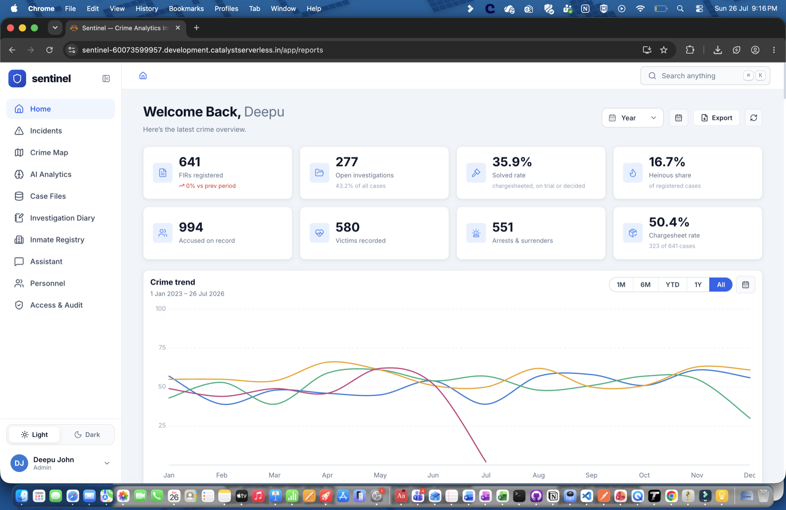

### The main sections

<table>
<tr>
<td width="50%">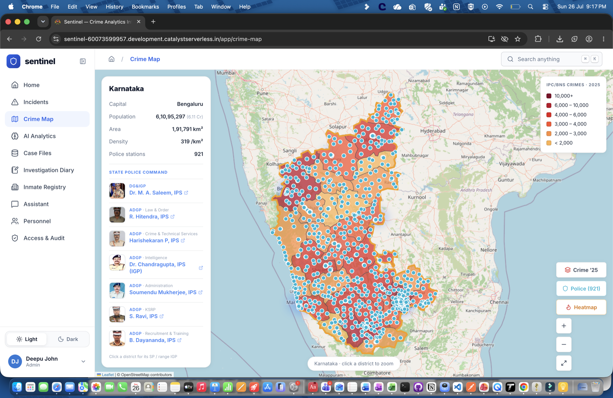<br><b>Crime Map</b><br>State → district → station drill-down with hotspot clustering and one-tap officer call links.</td>
<td width="50%">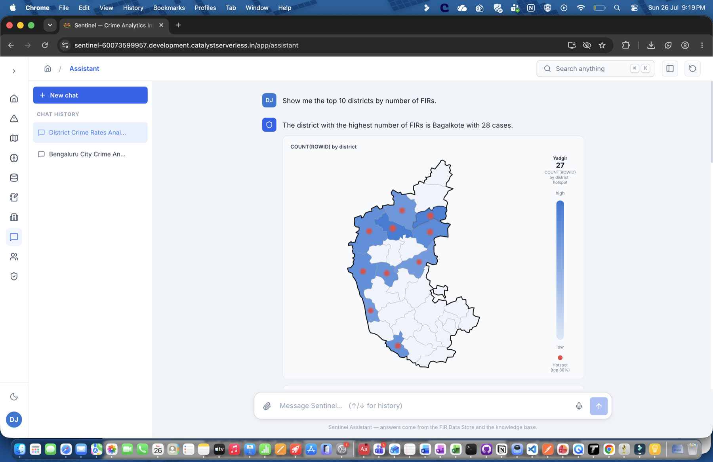<br><b>AI Assistant</b><br>Plain-language questions answered from the live database or the legal knowledge base, with cited chart, table and map replies.</td>
</tr>
<tr>
<td width="50%">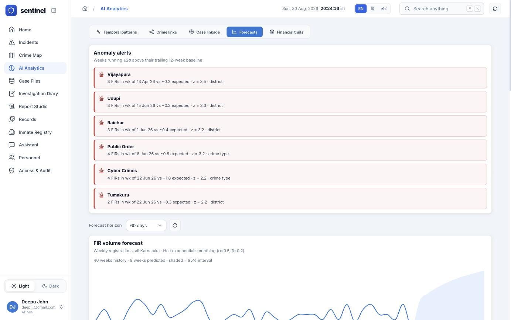<br><b>AI Analytics — Forecasts</b><br>Month-ahead crime projections with 95% confidence bands and district risk scoring.</td>
<td width="50%">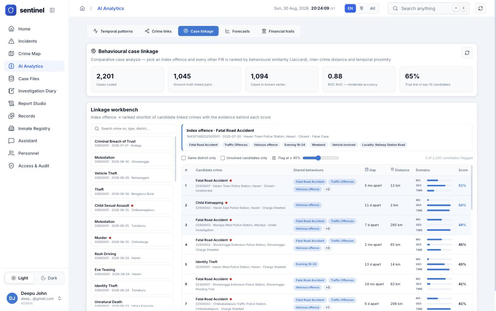<br><b>AI Analytics — Case Linkage</b><br>Behavioural case-linkage ranking that surfaces likely same-offender series across FIRs.</td>
</tr>
<tr>
<td width="50%">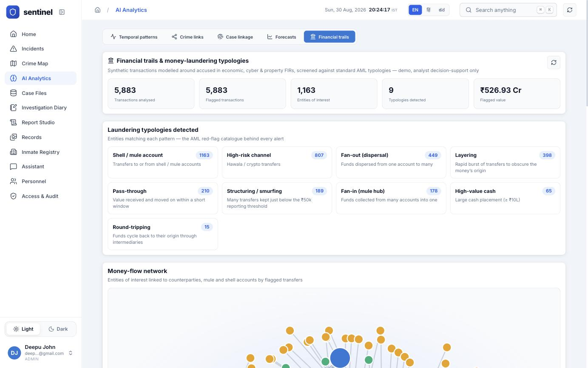<br><b>AI Analytics — Financial Trails</b><br>AML typology detection over transaction trails — layering, structuring, mule accounts.</td>
<td width="50%">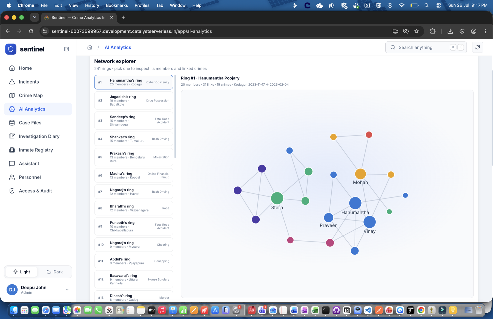<br><b>AI Analytics — Crime Links</b><br>Co-offending network graph built from a global offender identity across all cases.</td>
</tr>
<tr>
<td width="50%">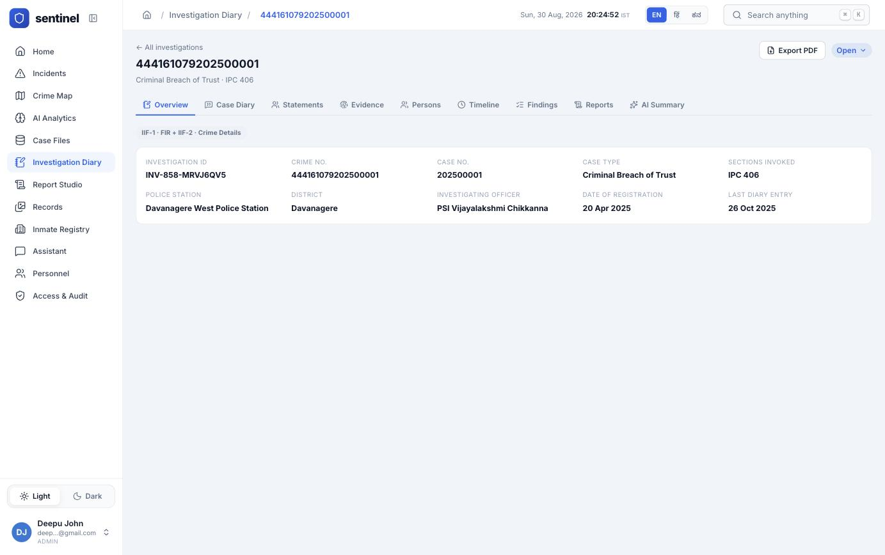<br><b>Investigation Diary</b><br>Case overview: charges, persons, timeline, findings and an AI-drafted cited case summary.</td>
<td width="50%">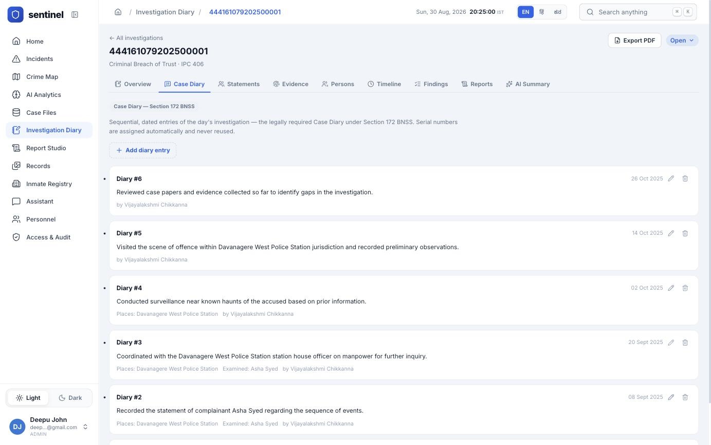<br><b>Case Diary (BNSS S.172)</b><br>Dated diary proceedings, S.161 statements and evidence with chain-of-custody.</td>
</tr>
<tr>
<td width="50%">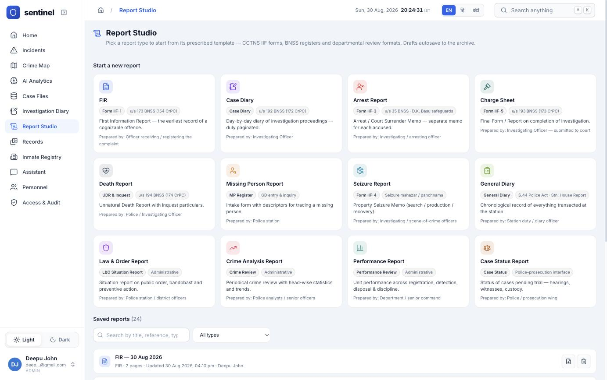<br><b>Report Studio</b><br>Paged A4 editor over 12 IIF-based statutory report templates, with AI narrative polish.</td>
<td width="50%"><br><b>Records</b><br>Legacy paper and media digitised by OCR/transcription into structured, searchable records.</td>
</tr>
<tr>
<td width="50%">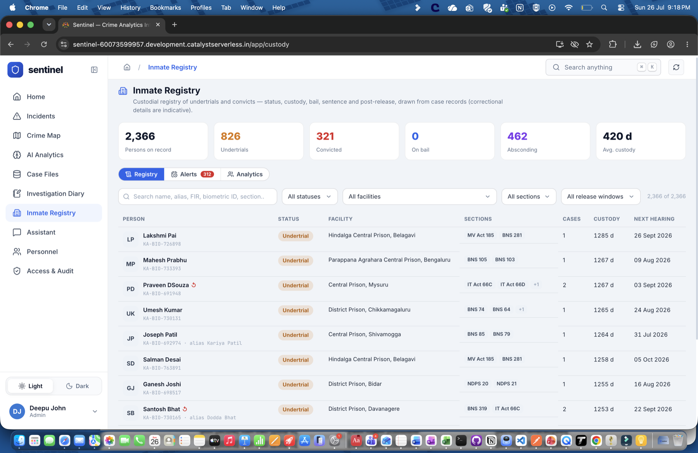<br><b>Inmate Registry</b><br>Person-centric custodial registry for undertrials and convicts, with alerts and analytics.</td>
<td width="50%">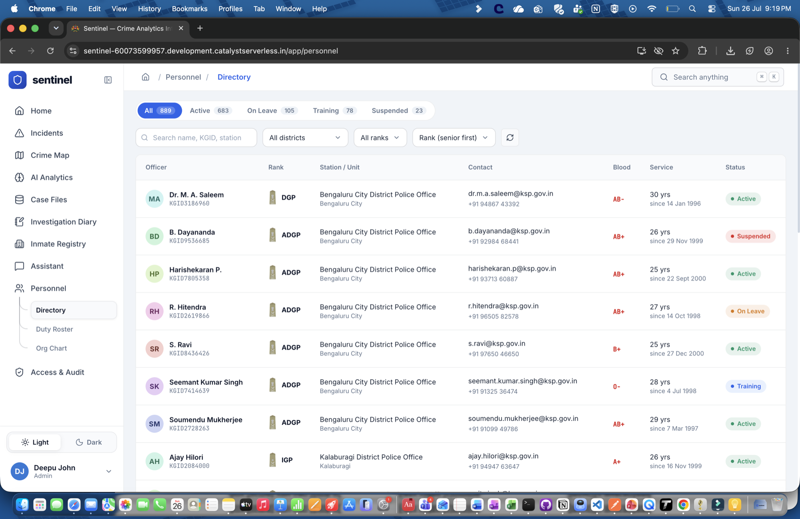<br><b>Personnel</b><br>Officer directory, weekly duty roster and per-district organisation chart.</td>
</tr>
<tr>
<td width="50%">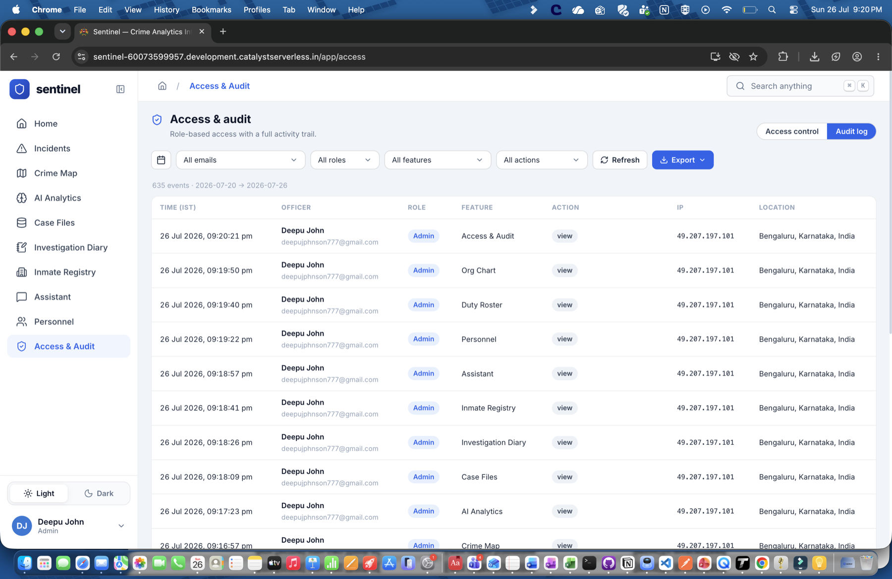<br><b>Access & Audit</b><br>Role assignment plus a tamper-evident, CSV/XLSX-exportable trail of every action.</td>
<td width="50%">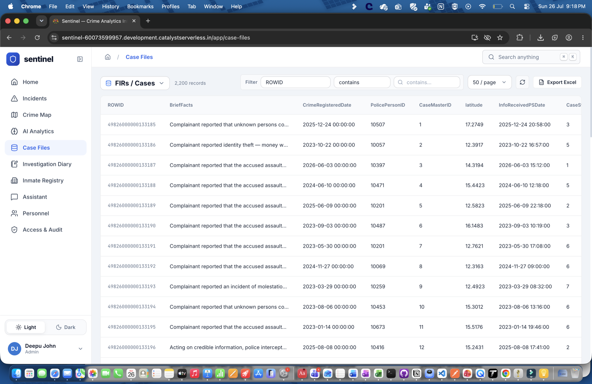<br><b>Case Files</b><br>Direct browse and filter of the underlying 26-table FIR schema.</td>
</tr>
</table>

### Screenshot file manifest

Save each image into `docs/screenshots/` with **exactly** these names and the gallery above
renders. Several already exist in the Google Drive submission folder under `KSP/Screenshots/` —
download and rename them; the rest need capturing.

| Filename | Screen to capture | Existing Drive file |
| --- | --- | --- |
| `01-dashboard.png` | Home — the analytics dashboard at `/reports` (trend, composition, funnel, workload, geo-heatmap) | one of the 26 Jul screenshots |
| `02-crime-map.png` | `/crime-map` — ideally drilled into a district so station pins are visible | one of the 26 Jul screenshots |
| `03-assistant.png` | `/assistant` — a question answered with a chart or table reply and visible citation chips | one of the 26 Jul screenshots |
| `04-ai-analytics-forecasts.png` | `/ai-analytics?tab=forecasts` | `AI-Analytics-Forecasts.png` |
| `05-ai-analytics-case-linkage.png` | `/ai-analytics?tab=linkage` | `AI-Analytics-Case-Linkage.png` |
| `06-ai-analytics-financial-trails.png` | `/ai-analytics?tab=financial` | `AI-Analytics-Financial-Trails.png` |
| `07-crime-links.png` | `/ai-analytics?tab=links` — the co-offending network graph | one of the 26 Jul screenshots |
| `08-investigation-diary.png` | An open case at `/investigation-diary/:id`, Overview tab | `Investigation-Diary-Case-Overview.png` |
| `09-case-diary.png` | The same case, Case Diary tab | `Investigation-Diary-Case-Diary-S172.png` |
| `10-report-studio.png` | `/report-studio`, or an open report in the paged A4 editor | `Report-Studio.png` |
| `11-records.png` | `/records` — the digitised records list | — |
| `12-custody.png` | `/custody` — the inmate registry | — |
| `13-personnel.png` | `/personnel` — the officer directory | one of the 26 Jul screenshots |
| `14-access-audit.png` | `/access` — role assignment and the audit trail | one of the 26 Jul screenshots |
| `15-case-files.png` | `/case-files` — the ZCQL table browser | one of the 26 Jul screenshots |

**Capture notes.** Sign in as the **admin** evaluation account so no sidebar item is hidden.
Capture the full window *including* the sidebar — the sidebar is what shows a reader the
platform's scope. A viewport around **1600×1000** keeps charts readable, and aiming for under
~400 KB per image keeps the repository small since the gallery renders them two-up. Anything
missing simply renders as a broken image; no other section is affected.

---

## Key Features

### 🏠 Home Dashboard

The department's daily situational picture, computed in the browser straight from the Data
Store. Shows FIR volume over time, crime composition by major head, a case-lifecycle funnel
(registered → investigated → charge-sheeted → disposed), per-officer caseload, and an
interactive Karnataka geo-heatmap. Every panel responds to a shared filter bar — district,
police station, date range, crime head — and exports to CSV/XLSX.

### 🗺️ Crime Map

A custom SVG + `d3-geo` map of India that drills **state → district → police station**. Districts
are shaded by incident density; drilling into a district reveals station boundaries, beat-level
hotspots and clustered incident pins. Each station card carries its jurisdiction officers with
one-tap `tel:` call links, so a map lookup ends in a phone call rather than a second search.

### 🤖 AI Assistant

A full chat workspace at `/assistant`, not a corner widget. An officer asks a question in plain
English, Hindi or Kannada and a router decides how to answer it:

- **Tool loop** — the model is given four clearance-filtered tools (`query_records`,
  `lookup_reference`, `search_knowledge_base`, `search_scanned_records`) and runs as many
  lookups as one question needs before answering.
- **ZCQL lane** — the question is compiled to a validated, single-table ZCQL query against the
  live FIR schema, then enriched with master-table names and district rollups in code.
- **RAG lane** — legal, procedural and SOP questions are answered from a QuickML knowledge base.
- **Hybrid** — a question that is both ("what does S.41 require, and how many arrests did
  Belagavi make under it") fans out to both lanes and merges the answers.

Around that: per-officer **memory** (a live conversation buffer, durable long-term facts, and
semantic recall of older sessions), **voice input** via Zia speech-to-text, **document
attachments** (PDF/Office files read as context, with each chip stating plainly whether the
assistant can actually see the file), **slash commands**, ↑/↓ prompt history, saved
conversations, and replies rendered as charts, tables, maps and record cards. Every answer
carries interactive **source citations** you can click through to the exact row or document.

### 📈 AI Analytics

Five analytical surfaces under one page:

| Tab | What it does |
| --- | --- |
| **Patterns** | Temporal crime profiling — hour-of-day, day-of-month and day-of-week distributions, peak-window detection and a crime-head × daypart matrix. |
| **Crime Links** | Co-offending network graph. Because `Accused.PersonID` is a *global* offender identity, the same person is tracked across every case they appear in, revealing gangs and repeat associations. |
| **Case Linkage** | Behavioural case linkage after Bennell & Burrell — ranks case pairs by a combined Jaccard (modus operandi) + geographic + temporal proximity score to surface likely same-offender series. |
| **Forecasts** | Month-ahead crime projections with 95% confidence bands, plus district risk and recidivism scoring. |
| **Financial Trails** | An AML/money-laundering typology detector — structuring, layering, mule-account and rapid-passthrough patterns over transaction trails linked to economic, cyber and property FIRs. |

All outputs are advisory, cited and guardrail-bound: protected attributes (religion, caste,
gender) are excluded from every risk model.

### 📓 Investigation Diary

A digital **Case Diary under BNSS S.172**, mapped onto the CCTNS integrated forms **IIF1–IIF5**.
Each case carries dated diary entries, S.161 witness statements, evidence with a
chain-of-custody log, persons (accused / victim / complainant / witness), a case timeline and
investigator findings.

Testimony is captured two ways without typing: **live voice-to-text**, or by **photographing a
handwritten page** and running Zia OCR — with the source scan and the source recording both kept
in object storage, so extracted text is always traceable back to the artefact it came from.
Rule-based logic flags cold cases and suggests next investigative steps; an AI **case summary**
drafts a "state of the investigation" brief using *only* the case's own entries, with numbered
citations back to each one. The whole case exports as a court-ready PDF.

### 📝 Report Studio

Twelve statutory report templates derived from the CCTNS Integrated Investigation Forms — FIR
(IIF-1), Case Diary, Arrest/Surrender Memo (IIF-3), Charge Sheet / Final Form (IIF-5), Seizure
Memo (IIF-4), Unnatural Death Report, Missing Person Report, General Diary, Law & Order Report,
Crime Analysis Report, Performance Report and Case Status Report.

Reports are authored in a **paged A4 editor** (TipTap) that renders exactly as it will print,
with continuation sheets, tables and rich fields. AI narrative polish rewrites a drafted section
into formal report language with the original one click away under Undo. Drafts are stored in
object storage with soft delete, and render to PDF server-side through SmartBrowz.

### 🗄️ Records (Digitisation)

Legacy paper and media brought into the system. An officer uploads a scan, a photograph, a
spreadsheet, a document, a deck or an interview recording; Sentinel extracts the text — Zia OCR
for images, Zia speech-to-text for audio, in-browser extraction for office formats — runs an AI
structuring pass, and files the result as a searchable record linked to a case. Large recordings
upload **directly** to object storage through a short-lived pre-signed PUT rather than through
the function. The original file is always kept alongside the text it produced.

### 🔒 Inmate Registry (Custody & Corrections)

A person-centric custodial view built over the FIR data: every distinct offender becomes a
custodial record aggregating their cases, charges, arrests and case statuses. Registry, alerts
and analytics views, plus a per-person detail page. Correctional facts the FIR schema does not
carry — facility, bail history, sentence and remission, parole, reporting obligations — are
deterministically synthesised per person so the registry is realistic and stable across reloads.

### 👮 Personnel

An 888-officer directory across the full Karnataka rank ladder (PC → DGP, 12 ranks), with a
weekly **duty roster** and a per-district **organisation chart** rendered from the Unit
hierarchy. Rank insignia are drawn inline. Because ZCQL is single-table, `Employee` is joined
against `Rank`, `Unit` and `District` client-side; contact details and duty status are not in the
FIR schema at all, so they are derived deterministically from `EmployeeID` — the same officer
gets the same email, phone and status on every device.

### 📁 Case Files

Direct, paginated browse of the underlying 26-table FIR schema, grouped into Cases / People /
Reference. Read straight from the Data Store in the browser via ZCQL — the raw evidence behind
every dashboard on the platform.

### 🛡️ Access & Audit

Rank-based access control over five roles, assigned by an admin (the `admin` role itself comes
from Catalyst's own *App Administrator* project role and can never be self-assigned). The
sidebar hides what the router blocks, and the block is verified server-side from the session,
not the client.

Alongside it, a tamper-evident **audit trail**: every feature view, record edit, sign-in,
denial, export, role change, AI query and memory write is recorded with user, role, IP,
approximate location and IST timestamp — stored as per-day objects and exportable to CSV/XLSX.
Assistant answers additionally leave an immutable **decision record** describing *how* the
answer was reached: the route taken and its confidence, what the ZCQL validator allowed or
refused, what the clearance filter redacted, and which sources were cited.

### 🌐 Cross-cutting

Multilingual UI and answers (**English / हिन्दी / ಕನ್ನಡ**), global search with deep links into
any tab, a help centre that emails the admin, per-user profiles with photos, and an error
boundary that keeps one broken panel from taking the page down.

---

## Architecture

Sentinel is a **two-path** application, and the split is deliberate.

**Reads are direct.** Dashboards, maps, case files, analytics and the custody registry query the
Catalyst Data Store *from the browser* over ZCQL, authenticated by the user's own Catalyst
session. No function sits in the middle, so a dashboard panel costs one round trip and no
serverless cold start.

**Everything else goes through one function.** Anything that writes, calls a model, touches
media, renders a PDF or reads the audit trail is routed through the `rag` Advanced I/O function.
That function is the only place credentials exist, the only place role checks are authoritative,
and the single choke point where every action gets audited.

> **Editable diagrams (Lucidchart).** The two headline diagrams below are also maintained as
> Lucidchart documents, so they can be exported to PNG/PDF for slides and submission packs, and
> edited by hand rather than only in code:
>
> | Diagram | Lucidchart |
> | --- | --- |
> | System architecture | [Sentinel — System Architecture](https://lucid.app/lucidchart/a0d0b223-126e-40c4-a826-606d9a8b7602/view) |
> | Use case | [Sentinel — Use Case Diagram](https://lucid.app/lucidchart/c355d0a0-1c93-4c48-8c4d-8ced3db8ff21/view) |
>
> The Mermaid versions in this README are the canonical, version-controlled copies — they change
> with the code in the same commit. Treat the Lucid documents as the presentation copies and
> re-export them when the Mermaid changes.

### System architecture

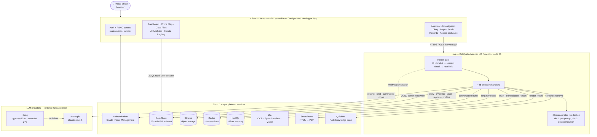
```mermaid
flowchart TB
    User(["👮 Police officer<br/>browser"])

    subgraph Client["Client — React 19 SPA, served from Catalyst Web Hosting at /app"]
        direction LR
        Nav["Auth + RBAC context<br/>route guards, sidebar"]
        Read["Dashboard · Crime Map · Case Files<br/>AI Analytics · Inmate Registry"]
        Write["Assistant · Investigation Diary · Report Studio<br/>Records · Access and Audit"]
    end

    subgraph Fn["rag — Catalyst Advanced I/O Function, Node 20"]
        direction TB
        Gate["Router gate<br/>IP blocklist → session check → rate limit"]
        Handlers["~45 endpoint handlers"]
        Guard["Clearance filter + redaction<br/>tier 1 pre-prompt, tier 2 post-generation"]
        Gate --> Handlers --> Guard
    end

    subgraph Catalyst["Zoho Catalyst platform services"]
        direction LR
        Auth["Authentication<br/>OAuth + User Management"]
        DS[("Data Store<br/>26-table FIR schema")]
        ST[("Stratus<br/>object storage")]
        Cache[("Cache<br/>chat-sessions")]
        NoSQL[("NoSQL<br/>officer memory")]
        Zia["Zia<br/>OCR · Speech-to-Text · Vision"]
        SB["SmartBrowz<br/>HTML → PDF"]
        QML["QuickML<br/>RAG knowledge base"]
    end

    subgraph LLM["LLM providers — ordered fallback chain"]
        Groq["Groq<br/>gpt-oss-120b · qwen3.6-27b"]
        Claude["Anthropic<br/>claude-opus-5"]
    end

    User --> Client
    Nav <--> Auth
    Read -- "ZCQL read, user session" --> DS
    Write -- "HTTPS POST /server/rag/*" --> Fn

    Gate -. "verify caller session" .-> Auth
    Handlers -- "ZCQL admin read/write" --> DS
    Handlers -- "diary · evidence · audit · reports · profiles" --> ST
    Handlers -- "conversation buffer" --> Cache
    Handlers -- "long-term facts" --> NoSQL
    Handlers -- "OCR · transcription · vision" --> Zia
    Handlers -- "render report" --> SB
    Handlers -- "semantic retrieval" --> QML
    Handlers -- "routing · chat · summaries · tools" --> LLM
    Groq -. "on failure" .-> Claude
```

### Use case diagram


```mermaid
flowchart LR
    Inv(["👤 Investigator"])
    Ana(["👤 Analyst"])
    Sup(["👤 Supervisor"])
    Pol(["👤 Policymaker"])
    Adm(["👤 Admin"])

    subgraph S["Sentinel"]
        direction TB
        UC1(["Sign in via Catalyst OAuth"])
        UC2(["View analytics dashboard"])
        UC3(["Explore crime map"])
        UC4(["Browse case files"])
        UC5(["Ask the AI assistant"])
        UC6(["Maintain investigation diary"])
        UC7(["Capture testimony by voice or OCR"])
        UC8(["Generate AI case summary"])
        UC9(["Export case as PDF"])
        UC10(["Author statutory reports"])
        UC11(["Digitise legacy records"])
        UC12(["Run predictive analytics"])
        UC13(["Review case linkage and networks"])
        UC14(["Consult inmate registry"])
        UC15(["Manage personnel and roster"])
        UC16(["View organisation chart"])
        UC17(["Assign roles and access"])
        UC18(["Review audit trail"])
    end

    Inv --> UC1 & UC2 & UC3 & UC4 & UC5 & UC6 & UC7 & UC8 & UC9 & UC10 & UC11 & UC14
    Ana --> UC1 & UC2 & UC3 & UC5 & UC12 & UC13
    Sup --> UC1 & UC2 & UC3 & UC4 & UC5 & UC6 & UC10 & UC12 & UC13 & UC14 & UC15 & UC16
    Pol --> UC1 & UC2 & UC5 & UC12 & UC13 & UC14 & UC15 & UC16
    Adm --> UC1 & UC17 & UC18

    UC7 -.->|includes| UC6
    UC8 -.->|includes| UC6
    UC9 -.->|extends| UC6
```

> Every use case above — including a *denied* attempt at one — is recorded in the audit trail with
> user, role, IP, approximate location and IST timestamp.

### Request lifecycle: assistant question

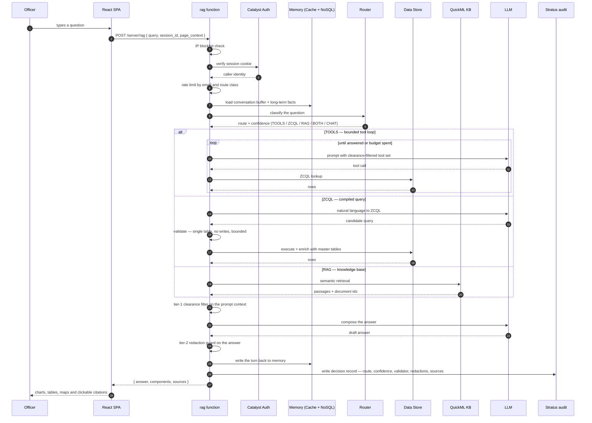
```mermaid
sequenceDiagram
    autonumber
    participant O as Officer
    participant UI as React SPA
    participant F as rag function
    participant A as Catalyst Auth
    participant M as Memory (Cache + NoSQL)
    participant R as Router
    participant D as Data Store
    participant K as QuickML KB
    participant L as LLM
    participant S as Stratus audit

    O->>UI: types a question
    UI->>F: POST /server/rag { query, session_id, page_context }
    F->>F: IP blocklist check
    F->>A: verify session cookie
    A-->>F: caller identity
    F->>F: rate limit by email and route class
    F->>M: load conversation buffer + long-term facts
    F->>R: classify the question
    R-->>F: route + confidence (TOOLS / ZCQL / RAG / BOTH / CHAT)

    alt TOOLS — bounded tool loop
        loop until answered or budget spent
            F->>L: prompt with clearance-filtered tool set
            L-->>F: tool call
            F->>D: ZCQL lookup
            D-->>F: rows
        end
    else ZCQL — compiled query
        F->>L: natural language to ZCQL
        L-->>F: candidate query
        F->>F: validate — single table, no writes, bounded
        F->>D: execute + enrich with master tables
        D-->>F: rows
    else RAG — knowledge base
        F->>K: semantic retrieval
        K-->>F: passages + document ids
    end

    F->>F: tier-1 clearance filter on the prompt context
    F->>L: compose the answer
    L-->>F: draft answer
    F->>F: tier-2 redaction guard on the answer
    F->>M: write the turn back to memory
    F->>S: write decision record — route, confidence, validator, redactions, sources
    F-->>UI: { answer, components, sources }
    UI-->>O: charts, tables, maps and clickable citations
```

### Assistant routing

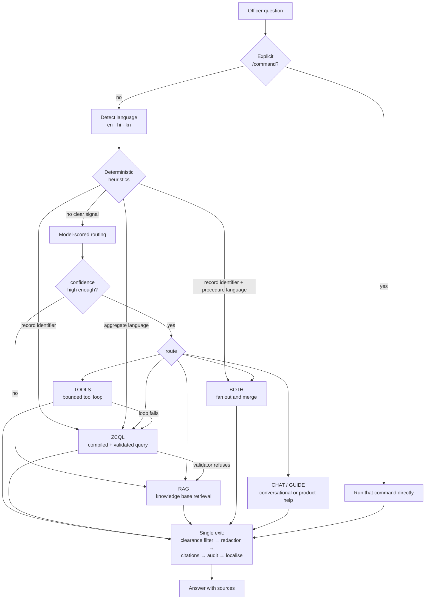
```mermaid
flowchart TD
    Q["Officer question"] --> Slash{"Explicit<br/>/command?"}
    Slash -- yes --> Direct["Run that command directly"]
    Slash -- no --> Lang["Detect language<br/>en · hi · kn"]
    Lang --> Heur{"Deterministic<br/>heuristics"}

    Heur -- "record identifier + procedure language" --> BOTH
    Heur -- "record identifier" --> ZCQL
    Heur -- "aggregate language" --> ZCQL
    Heur -- "no clear signal" --> Model["Model-scored routing"]

    Model --> Conf{"confidence<br/>high enough?"}
    Conf -- no --> RAG
    Conf -- yes --> Pick{"route"}

    Pick --> TOOLS["TOOLS<br/>bounded tool loop"]
    Pick --> ZCQL["ZCQL<br/>compiled + validated query"]
    Pick --> RAG["RAG<br/>knowledge base retrieval"]
    Pick --> BOTH["BOTH<br/>fan out and merge"]
    Pick --> CHAT["CHAT / GUIDE<br/>conversational or product help"]

    TOOLS -- "loop fails" --> ZCQL
    ZCQL -- "validator refuses" --> RAG

    TOOLS & ZCQL & RAG & BOTH & CHAT & Direct --> Out["Single exit:<br/>clearance filter → redaction →<br/>citations → audit → localise"]
    Out --> Ans["Answer with sources"]
```

### Data model: core FIR schema

The 26-table CCTNS-aligned schema, with `CaseMaster` at the centre. Reference/master tables
(`Act`, `Section`, `District`, `Rank`, `CasteMaster`, `ReligionMaster`, …) hang off these.

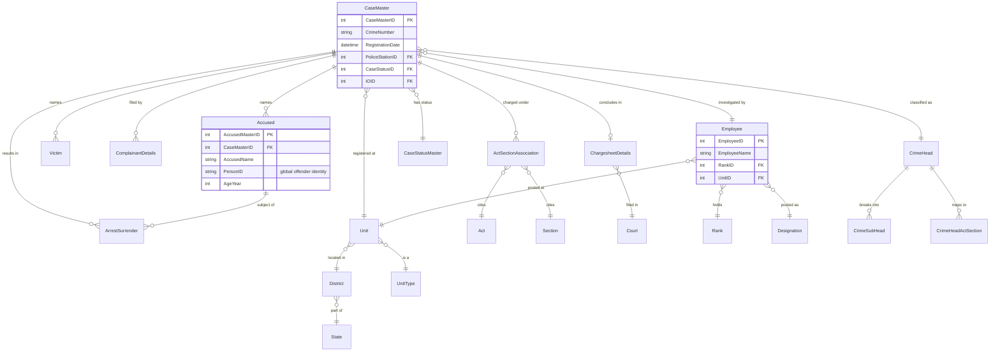
```mermaid
erDiagram
    CaseMaster ||--o{ Accused : "names"
    CaseMaster ||--o{ Victim : "names"
    CaseMaster ||--o{ ComplainantDetails : "filed by"
    CaseMaster ||--o{ ActSectionAssociation : "charged under"
    CaseMaster ||--o{ ArrestSurrender : "results in"
    CaseMaster ||--o| ChargesheetDetails : "concludes in"
    CaseMaster }o--|| Unit : "registered at"
    CaseMaster }o--|| CaseStatusMaster : "has status"
    CaseMaster }o--|| CrimeHead : "classified as"
    CaseMaster }o--|| Employee : "investigated by"

    Accused ||--o{ ArrestSurrender : "subject of"
    ActSectionAssociation }o--|| Act : "cites"
    ActSectionAssociation }o--|| Section : "cites"
    ChargesheetDetails }o--|| Court : "filed in"

    Unit }o--|| District : "located in"
    Unit }o--|| UnitType : "is a"
    District }o--|| State : "part of"

    Employee }o--|| Rank : "holds"
    Employee }o--|| Designation : "posted as"
    Employee }o--|| Unit : "posted at"

    CrimeHead ||--o{ CrimeSubHead : "breaks into"
    CrimeHead ||--o{ CrimeHeadActSection : "maps to"

    CaseMaster {
        int CaseMasterID PK
        string CrimeNumber
        datetime RegistrationDate
        int PoliceStationID FK
        int CaseStatusID FK
        int IOID FK
    }
    Accused {
        int AccusedMasterID PK
        int CaseMasterID FK
        string AccusedName
        string PersonID "global offender identity"
        int AgeYear
    }
    Employee {
        int EmployeeID PK
        string EmployeeName
        int RankID FK
        int UnitID FK
    }
```

> `Accused.PersonID` is a **global** offender identity rather than a per-case one. That single
> decision is what makes the co-offending network, the case-linkage ranking and the custody
> registry possible at all.

### Deployment pipeline

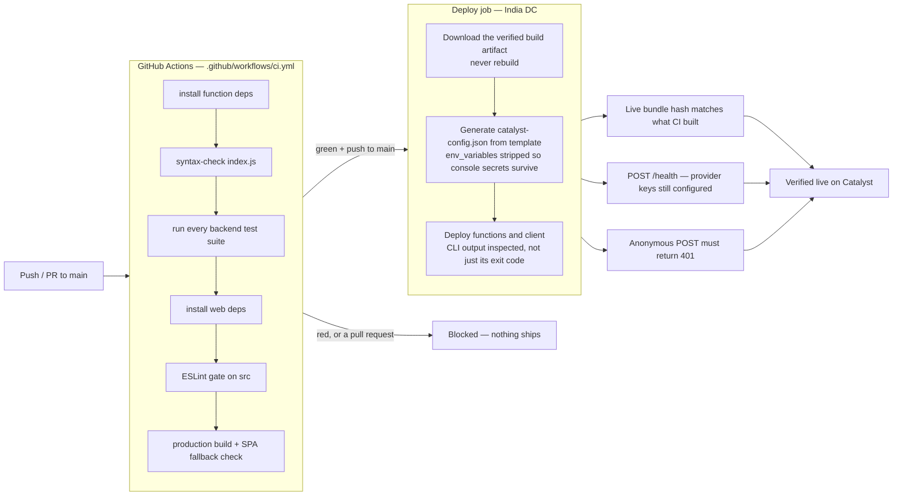
```mermaid
flowchart LR
    Dev["Push / PR to main"] --> CI

    subgraph CI["GitHub Actions — .github/workflows/ci.yml"]
        direction TB
        V1["install function deps"] --> V2["syntax-check index.js"] --> V3["run every backend test suite"]
        V3 --> V4["install web deps"] --> V5["ESLint gate on src"] --> V6["production build + SPA fallback check"]
    end

    CI -->|"green + push to main"| Dep
    CI -->|"red, or a pull request"| Stop["Blocked — nothing ships"]

    subgraph Dep["Deploy job — India DC"]
        direction TB
        P1["Download the verified build artifact<br/>never rebuild"] --> P2["Generate catalyst-config.json from template<br/>env_variables stripped so console secrets survive"]
        P2 --> P3["Deploy functions and client<br/>CLI output inspected, not just its exit code"]
    end

    Dep --> C1["Live bundle hash matches what CI built"]
    Dep --> C2["POST /health — provider keys still configured"]
    Dep --> C3["Anonymous POST must return 401"]
    C1 & C2 & C3 --> Live["Verified live on Catalyst"]
```

Three things this pipeline learned the hard way, all now asserted rather than assumed: the
Catalyst CLI has printed a fatal error and still exited `0`; a deploy carrying an
`env_variables` map silently overwrites the console's secrets; and a deploy can report success
while shipping nothing. So success is proved against the live site — bundle hash, health route
and a 401 on an anonymous call — not against the CLI's exit code.

---

## Tech Stack

### Frontend

| Area | Technology | Used for |
| --- | --- | --- |
| Framework | **React 19** (`react`, `react-dom`) | The whole SPA |
| Language | **JavaScript + TypeScript 5.4** | `App.tsx` and entry points are TS; feature code is JS |
| Build | **react-scripts 5** (CRA) | Dev server, production bundle, `postbuild` SPA fallback |
| Routing | **react-router-dom 7** | Client routing under the `/app` basename, with per-route guards |
| Maps | **d3-geo** + **topojson-client** | Custom SVG India → Karnataka → district → station drill-down |
| Maps | **Leaflet** + `leaflet.heat` + `leaflet.markercluster` | Incident heatmaps and pin clustering |
| Charts | Hand-built SVG (`components/Charts.js`, `Sankey.js`, `NetworkGraph.js`) | Trend areas, bar lists, funnels, Sankey flows, force-directed networks |
| Rich text | **TipTap 3** (`@tiptap/*` + ProseMirror) | The paged A4 report editor, tables and text alignment |
| PDF | **jsPDF** + **html2canvas** | Client-side PDF export of cases and dashboards |
| PDF (server) | **SmartBrowz** | High-fidelity HTML → PDF for statutory reports |
| Documents | **pdfjs-dist** | Reading attached PDFs in the browser for assistant context |
| Spreadsheets | **SheetJS / xlsx** | CSV and XLSX exports, and reading attached spreadsheets |
| i18n | **i18next** + **react-i18next** + browser language detector | English, Hindi and Kannada UI and answers |
| Icons | **lucide-react** | Icon set throughout |
| Browser APIs | Web Speech API, MediaRecorder, IndexedDB | Voice input, evidence recording, local caching |

### Backend

| Area | Technology | Used for |
| --- | --- | --- |
| Runtime | **Node.js 20** on a Catalyst **Advanced I/O** function | The single `rag` function — the entire backend |
| SDK | **zcatalyst-sdk-node 3.4** | Data Store, Stratus, Cache, NoSQL, User Management |
| LLM (primary) | **Groq** — `openai/gpt-oss-120b`, `qwen/qwen3.6-27b` | Routing, chat, ZCQL compilation, summarisation |
| LLM (fallback) | **Anthropic** — `claude-opus-5` via `@anthropic-ai/sdk` | The tool loop, and failover when Groq is unavailable |
| Retrieval | **QuickML RAG API** | Legal / SOP knowledge base and semantic memory recall |
| Auth | **OAuth 2.0** refresh-token flow against `accounts.zoho.in` | Server-to-server calls to Zia, QuickML and SmartBrowz |
| Mail | **nodemailer** | Help Centre tickets to the administrator |

Provider order is configurable (`LLM_PROVIDER_ORDER`, default `groq,claude`) and every lane
falls through the chain, so one provider being down degrades latency rather than the feature.

### Data tooling

| Technology | Used for |
| --- | --- |
| **Python 3** + **Pandas** / **NumPy** | Generating the synthetic FIR dataset, the co-offending network and the personnel ladder |
| **Pillow** | Rank-insignia asset generation |
| Catalyst CLI **`ds:import`** | Bulk-loading the 26 tables from CSVs staged in Stratus |

### DevOps

| Technology | Used for |
| --- | --- |
| **GitHub Actions** | Tests, lint gate, production build, deploy, and three post-deploy live assertions |
| **Catalyst CLI** (`zcatalyst-cli`) | `catalyst serve`, `catalyst deploy`, `ds:import` |
| **ESLint** | A hard gate on application source; advisory on smoke tests |
| Plain `node *.test.js` suites | Backend tests with no framework dependency |

---

## Zoho Catalyst Services Used

Sentinel is not "hosted on" Catalyst — it is *built out of* Catalyst. Eleven platform services
are in the critical path, and there is no self-managed server anywhere in the system.

| Catalyst service | How Sentinel uses it |
| --- | --- |
| **Web Hosting (Client)** | Serves the React bundle at `/app`. `postbuild` copies `index.html` → `404.html` so client-side routes survive a hard refresh. |
| **Functions — Advanced I/O** | The single `rag` function (Node 20) is the entire backend: ~45 endpoints behind one router gate that enforces the IP blocklist, session check and rate limit before any handler runs. |
| **Data Store (ZCQL)** | The 26-table CCTNS-aligned FIR schema, plus the `ChatConversations` table. Read **directly from the browser** over ZCQL for dashboards and analytics; read and written with admin scope from the function. |
| **Stratus (object storage)** | Investigation diary entries, evidence media, scanned source documents, per-day audit logs, user profiles and photos, Report Studio drafts, and CSV staging for `ds:import`. |
| **Authentication & User Management** | Zoho OAuth sign-in, session verification on every API call, and the *App Administrator* project role that backs the `admin` app role — so admin can never be self-assigned. |
| **Cache** | The `chat-sessions` segment holds the assistant's live conversation buffer — read and written every turn, so it has to be cheap. |
| **NoSQL** | Durable officer memory: `chat_session_turns` (TTL'd copy of every turn), `officer_long_term_memory` (precise facts keyed by officer) and `memory_kb_documents`. |
| **Zia — OCR** | Reads handwritten and printed pages photographed by an officer, turning them into diary statements and digitised records. |
| **Zia — Speech-to-Text** | Live voice-to-text for testimony capture and assistant voice input, plus transcription of uploaded interview recordings. |
| **Zia — Vision** | The fast attachment pre-parser: runs vision services in parallel on an attached image the moment it is attached, so the digest is ready before the officer finishes typing. |
| **SmartBrowz** | Renders the composed HTML of a statutory report or a full case file into a court-ready PDF, server-side. |
| **QuickML** | The RAG knowledge base behind legal and procedural answers, and the semantic-recall tier of officer memory. |

> **Graceful degradation is deliberate.** Cache segments and NoSQL tables cannot be created from
> code — only from the console. Every memory read returns empty and every write returns `false`
> when the backing store is absent, so the assistant behaves exactly as it did before memory
> existed rather than erroring. The same applies to QuickML: no knowledge base means the RAG lane
> falls through, not fails.

---

## Project Structure

```
sentinel/
├── catalyst.json                    # Catalyst project config — client source dir + function targets
├── .catalystrc                      # Project/org/environment ids the CLI deploys against (public ids)
├── app-config.json                  # AppSail stack config (node20) — not used by the current deploy
├── README.md                        # This document
│
├── .github/
│   └── workflows/ci.yml             # Test → lint → build → deploy → verify-live pipeline
│
├── docs/
│   ├── sentinel-wireframes.png      # Low-fidelity layout of every screen
│   └── screenshots/                 # App screenshots referenced by this README
│
├── scripts/
│   └── rotate-rag-token.sh          # Renews the Zoho OAuth refresh token used by the function
│
├── react-app/                       # ── FRONTEND ── React SPA, deployed to Web Hosting, served at /app
│   ├── package.json                 # Deps + scripts; `homepage: /app`; postbuild writes the SPA 404 fallback
│   ├── client-package.json          # Catalyst client manifest — entry page, login redirect, 404 route
│   ├── tsconfig.json                # TypeScript config for the TS entry points
│   ├── public/
│   │   ├── index.html               # Shell; loads Catalyst Web SDK v4 + /__catalyst/sdk/init.js
│   │   ├── maps/india.json          # TopoJSON boundaries for India, its states and districts
│   │   ├── insignia/                # Rank-insignia images for the personnel ladder
│   │   └── manifest.json            # PWA manifest, icons, favicons
│   └── src/
│       ├── index.tsx                # React root; mounts the app and i18n
│       ├── App.tsx                  # Router, providers and the guarded route table
│       ├── i18n.js                  # i18next setup and language detection
│       ├── locales/{en,hi,kn}/      # UI translation catalogues — English, Hindi, Kannada
│       │
│       ├── pages/                   # ── One file per screen ──
│       │   ├── Reports.js           # Home dashboard — trends, composition, funnel, workload, geo-heatmap
│       │   ├── Dashboard.js         # Post-sign-in welcome landing
│       │   ├── CrimeMap.js          # State → district → station drill-down map
│       │   ├── Incidents.js         # Latest FIRs with fully enriched detail
│       │   ├── CaseFiles.js         # Paginated ZCQL browser over the 26-table schema
│       │   ├── Assistant.js         # Full AI chat workspace — sessions, files, voice, citations
│       │   ├── AIAnalytics.js       # Five-tab analytics shell (patterns/links/linkage/forecasts/financial)
│       │   ├── InvestigationDiary.js# Case list for the BNSS S.172 diary
│       │   ├── InvestigationCase.js # Single case — diary, statements, evidence, persons, timeline
│       │   ├── ReportStudio.js      # Statutory report library and draft manager
│       │   ├── ReportEditor.js      # Paged A4 editor for a single report
│       │   ├── Records.js           # Digitised legacy records list and search
│       │   ├── RecordDetail.js      # One digitised record with its source artefact
│       │   ├── Custody.js           # Inmate registry — registry, alerts, analytics
│       │   ├── CustodyRecord.js     # Per-person custodial detail page
│       │   ├── Personnel.js         # Officer directory
│       │   ├── Roster.js            # Weekly duty roster
│       │   ├── OrgChart.js          # Per-district organisation chart
│       │   ├── AccessAudit.js       # Role assignment + audit-trail console with CSV/XLSX export
│       │   ├── Profile.js           # Per-officer profile and photo
│       │   └── HelpCenter.js        # Help articles and support ticket to the admin
│       │
│       ├── components/              # ── Reusable UI ──
│       │   ├── Sidebar.js           # Primary navigation; hides what the router blocks
│       │   ├── TopBar.js            # Page header, filters, breadcrumbs
│       │   ├── GlobalSearch.js      # Command-palette search across every destination
│       │   ├── Charts.js            # Trend areas, bar lists, funnels and stat tiles
│       │   ├── Sankey.js            # Case-lifecycle flow diagram
│       │   ├── NetworkGraph.js      # Force-directed graph primitive
│       │   ├── NetworkOverview.js   # Summary panel for a network graph
│       │   ├── CrimeLinks.js        # Co-offending network tab
│       │   ├── CaseLinkage.js       # Behavioural case-linkage tab
│       │   ├── Forecasts.js         # Forecast + district-risk tab
│       │   ├── FinancialTrails.js   # AML typology-detection tab
│       │   ├── GeoHeatMap.js        # District-shaded Karnataka heatmap
│       │   ├── SocioCrimeMap.js     # Socio-economic indicators overlaid on crime
│       │   ├── ChatWidget.js        # Compact assistant surface embedded in other pages
│       │   ├── AguiRenderer.js      # Renders assistant replies as charts, tables, maps, cards
│       │   ├── SourceCitations.js   # Interactive citation chips and the source viewer
│       │   ├── Thinking.js          # Streaming "working on it" state for the assistant
│       │   ├── SlashMenu.js         # Slash-command picker in the composer
│       │   ├── DocEditor.js         # TipTap paged A4 editor core
│       │   ├── DocToolbar.js        # Formatting toolbar for the editor
│       │   ├── RichText.js          # Read-only rich-text renderer
│       │   ├── RichField.js         # Inline editable field inside a report template
│       │   ├── TextBoxNode.js       # Custom TipTap node for positioned form boxes
│       │   ├── RingList.js          # Circular progress list used on dashboards
│       │   ├── RankInsignia.js      # Draws a Karnataka Police rank badge
│       │   ├── Avatar.js            # Officer avatar with photo fallback
│       │   ├── AuditTracker.js      # Fires an audit event on every route/feature view
│       │   ├── RequireAccess.js     # Route guard; blocks and logs unauthorised visits
│       │   ├── ErrorBoundary.js     # Keeps one broken panel from taking down the page
│       │   ├── LoadingScreen.js     # Full-page and panel loading states
│       │   ├── ConfirmDialog.js     # Destructive-action confirmation
│       │   ├── DateRangeCalendar.js # Shared date-range picker
│       │   ├── LanguageSwitcher.js  # en / hi / kn switcher
│       │   ├── LiveClock.js         # IST clock in the top bar
│       │   ├── ScrollToHash.js      # Deep-link scrolling for global search
│       │   └── ZoomControls.js      # Pan/zoom controls for maps and graphs
│       │
│       ├── context/
│       │   ├── AuthContext.js       # Catalyst OAuth session, sign-in/out, current user
│       │   ├── AccessContext.js     # Current app role and the feature→role matrix
│       │   └── LayoutContext.js     # Sidebar collapse and shared layout state
│       │
│       ├── utils/                   # ── Data layers and domain logic ──
│       │   ├── catalyst.js          # Loads and wraps the Catalyst Web SDK v4
│       │   ├── datastore.js         # Browser ZCQL — query, paginate and flatten Data Store rows
│       │   ├── access.js            # Role labels and the authoritative feature→role registry
│       │   ├── audit.js             # Client-side audit event emitter
│       │   ├── reports.js           # Home-dashboard data layer over the FIR schema
│       │   ├── incidents.js         # Latest FIRs with related rows stitched in (ZCQL has no joins)
│       │   ├── aianalytics.js       # Temporal pattern mining — hour/day profiles, peak windows
│       │   ├── predict.js           # Forecasting and district-risk scoring
│       │   ├── crimelinks.js        # Co-offending network construction
│       │   ├── caselinkage.js       # Jaccard + geo + temporal case-linkage ranking
│       │   ├── financial.js         # Deterministic transaction synthesis + AML typology detection
│       │   ├── custody.js           # Person-centric custodial registry derivation
│       │   ├── personnel.js         # Officer directory derivation from Employee/Rank/Unit
│       │   ├── roster.js            # Weekly duty-roster derivation
│       │   ├── investigation.js     # Case diary client — entries, statements, evidence, persons
│       │   ├── digitise.js          # Records-digitisation data layer
│       │   ├── extract.js           # Turns an attached file into text the assistant can use
│       │   ├── unzip.js             # Minimal ZIP reader so Office formats can be opened in-browser
│       │   ├── attachments.js       # Decides and states what an attachment actually gives the model
│       │   ├── vision.js            # Client half of the fast attachment pre-parser
│       │   ├── assistant.js         # Conversation storage, history and the pluggable reply path
│       │   ├── pageContext.js       # Sends "what the officer is looking at" with every message
│       │   ├── slashCommands.js     # Slash-command definitions for the composer
│       │   ├── sources.js           # Client-side citation model
│       │   ├── provenance.js        # How a record was captured governs what its page may claim
│       │   ├── richFormat.js        # One formatter for everything the assistant renders
│       │   ├── searchIndex.js       # Catalogue of every navigable destination for global search
│       │   ├── reportStudio.js      # Report draft CRUD against the function
│       │   ├── reportPdf.js         # Composes report HTML and requests the server-side PDF
│       │   ├── profile.js           # Profile and photo read/write
│       │   └── lazyWithReload.js    # Code-split imports that survive a redeploy
│       │
│       ├── data/
│       │   ├── reportTemplates.js   # The 12 IIF-based statutory report templates
│       │   ├── hierarchyStore.js    # Unit/rank hierarchy used by the org chart
│       │   └── socioeconomic.js     # District socio-economic indicators
│       │
│       └── __smoke__/               # Front-end smoke tests (citations, extraction, PDF, i18n, …)
│
├── functions/
│   └── rag/                         # ── BACKEND ── the single Catalyst Advanced I/O function
│       ├── index.js                 # Router gate + all ~45 endpoint handlers + the assistant lanes
│       ├── zcql.js                  # Natural language → ZCQL compiler, validator and row enrichment
│       ├── tools.js                 # The four clearance-filtered tools the model may call
│       ├── memory.js                # Officer memory over Cache + NoSQL + QuickML KB
│       ├── sources.js               # The unified citation contract, server side
│       ├── redaction.js             # Two-tier clearance filter — pre-prompt and post-generation
│       ├── vision.js                # Fast attachment pre-parser over Zia vision services
│       ├── masters.json             # Snapshot of master tables, for enriching ZCQL results in code
│       ├── catalyst-config.template.json  # Env-var template — copy to catalyst-config.json
│       └── *.test.js                # Backend suites — router, validator, sources, tools, memory, api gate
│
├── ksp/                             # ── DATASET ── synthetic Karnataka FIR data, generators, importers
│   ├── fir/                         # The 26-table CCTNS-aligned schema (the live dataset)
│   │   ├── *.csv                    # One CSV per table — CaseMaster, Accused, Victim, Employee, …
│   │   ├── generate_fir_dataset.py  # Seeded generator for the whole FIR schema
│   │   ├── generate_accused_network.py # Builds consistent offender series and co-offending links
│   │   ├── enrich_personnel.py      # Expands Employee into 881 officers on a 12-rank ladder
│   │   └── import/
│   │       ├── SCHEMA.md            # Column types and lengths for every table — create these first
│   │       ├── configs/*.json       # One non-interactive `ds:import` config per table
│   │       ├── prepare_import.py    # Stages CSVs and writes the import configs
│   │       └── run_import.sh        # Runs every import in dependency order
│   ├── rag_docs/                    # Plain-text corpus uploaded to the QuickML knowledge base
│   ├── import/                      # Import tooling for the earlier flat dataset
│   ├── *.csv                        # The earlier flat 16-table dataset (superseded by fir/)
│   └── fix_datetimes.py             # Normalises datetime columns to what the Data Store accepts
│
└── datastore_export/                # Ad-hoc Data Store exports (untracked working files)
```

---

## The Dataset

Real FIR data cannot leave a police network, so Sentinel runs on a **synthetic Karnataka FIR
dataset** built specifically for this project. It is not random filler: the schema is modelled
on the CCTNS Integrated Investigation Forms, the values are drawn from real Karnataka
geography and the Karnataka Police rank ladder, and the relationships between tables were
generated so that the analytics on top of them have something true to find.

### Schema — 26 tables

Live in the Catalyst **Data Store**; column types and lengths are in
[`ksp/fir/import/SCHEMA.md`](ksp/fir/import/SCHEMA.md).

| Group | Table | Rows | What it holds |
| --- | --- | --- | --- |
| **Cases** | `CaseMaster` | 2,200 | The FIR itself — crime number, registration date, station, status, IO |
| | `ChargesheetDetails` | 1,658 | Final report / charge sheet filed with the court |
| | `ActSectionAssociation` | 2,535 | Which Act and Section each case is charged under |
| | `ArrestSurrender` | 1,803 | Arrest and court-surrender events per accused |
| **People** | `Accused` | 3,268 | Accused persons, carrying the **global** `PersonID` offender identity |
| | `Victim` | 1,988 | Victims linked to their case |
| | `ComplainantDetails` | 2,374 | Who filed the complaint |
| | `Employee` | 888 | Police officers across a 12-rank ladder, with unique full names |
| **Geography** | `Unit` | 155 | Police stations, circles and sub-divisions |
| | `District` | 39 | Karnataka districts (plus neighbouring-state entries) |
| | `State` | 7 | States referenced by the data |
| | `UnitType` | 6 | Station / circle / sub-division / range classification |
| | `Court` | 62 | Courts that charge sheets are filed in |
| **Crime taxonomy** | `Act` | 10 | IPC, BNS, and the special/local laws in use |
| | `Section` | 35 | Sections within those Acts |
| | `CrimeHead` | 10 | Major heads — body, property, women, cyber, economic … |
| | `CrimeSubHead` | 31 | Sub-heads beneath each major head |
| | `CrimeHeadActSection` | 36 | Maps a crime head onto its Act–Section combinations |
| | `CaseCategory` | 4 | Case category lookup |
| | `CaseStatusMaster` | 7 | Under investigation, charge-sheeted, disposed, cold … |
| | `GravityOffence` | 2 | Heinous / non-heinous classification |
| **Person masters** | `Rank` | 12 | PC → DGP, the Karnataka Police rank ladder |
| | `Designation` | 6 | Posting designations |
| | `CasteMaster` | 10 | Reference only — **excluded from every risk model** |
| | `ReligionMaster` | 7 | Reference only — **excluded from every risk model** |
| | `OccupationMaster` | 14 | Occupation lookup |

### How it was built

- **[`generate_fir_dataset.py`](ksp/fir/generate_fir_dataset.py)** — seeded generator for the
  whole schema. Case volumes follow plausible district weights, registration dates carry
  realistic seasonality and day-of-week structure, and crime heads are distributed to match
  broad NCRB-shaped proportions rather than a flat random draw.
- **[`generate_accused_network.py`](ksp/fir/generate_accused_network.py)** — the piece that makes
  the analytics real. It assigns each offender a **global `PersonID`** that persists across every
  case they appear in, then plants consistent offender *series*: repeat offenders operating in a
  signature modus operandi, within a coherent geography, over a coherent time window, with
  co-offending partners. This is what the case-linkage ranking (AUC ≈ 0.87 on the planted series)
  and the co-offending network graph actually detect.
- **[`enrich_personnel.py`](ksp/fir/enrich_personnel.py)** — expands `Employee` to 888 officers
  with unique full names distributed across the 12-rank ladder and posted to real units.
- **[`fix_datetimes.py`](ksp/fix_datetimes.py)** — normalises datetime columns to the exact format
  the Data Store's importer accepts.

### Derived, not stored

Some things the demo shows are deliberately *not* in the dataset, and the code says so:

- **Financial transactions** — the FIR schema has none. `utils/financial.js` synthesises
  plausible transaction trails deterministically (seeded PRNG) around accused named in economic,
  cyber and property FIRs, purely to demonstrate the AML workflow. Real deployment needs STR/CTR
  feeds from FIU-IND, bank and UPI records, and legal authorisation.
- **Correctional facts** — facility, bail history, sentence and remission, parole and reporting
  obligations are synthesised per person (mulberry32, seeded by `PersonID`) so the Inmate
  Registry is realistic and stable across reloads.
- **Officer contact details** — email, phone and duty status are derived from name and posting,
  not stored.

### Knowledge base corpus

[`ksp/rag_docs/`](ksp/rag_docs/) holds the plain-text corpus uploaded to QuickML that the RAG
lane answers legal and procedural questions from — station directories, modus-operandi
descriptions, gang profiles, investigation-officer references, network edges and socio-economic
indicators.

### Legacy flat dataset

The top level of [`ksp/`](ksp/) still carries the earlier **16-table flat dataset** (5,000 FIRs,
2,500 accused, 5,640 victims, 559 beats, 144 police stations …) that the first version of the
platform ran on. It is superseded by `ksp/fir/` but kept because the beat-level hotspot
coordinates and socio-economic indicators are still referenced by the map layers.

### Loading it

Catalyst does **not** auto-create tables, and there is no CLI for schema creation. So the order
is: create all 26 tables in the console from `SCHEMA.md`, stage the CSVs in Stratus, then run the
non-interactive `ds:import` configs. [`run_import.sh`](ksp/fir/import/run_import.sh) does the last
two steps in dependency order.

---

## REST API Reference

Every endpoint is a **`POST`** to the `rag` function under `/server/rag/…`. There are no `GET`
routes — the router rejects any other method with `405`.

### The gate every request passes

```
POST /server/rag/<path>
   │
   ├─ /health only ─────────────────► answered before the gate (deploy verification)
   │
   ├─ 1. IP blocklist ──────────────► 403 Access denied
   ├─ 2. Catalyst session check ────► 401 (this is asserted in CI on every deploy)
   ├─ 3. Rate limit ────────────────► 429 + Retry-After
   │      general routes vs. metered routes (transcription, OCR, PDF, every LLM lane)
   └─ 4. Handler
```

### Assistant

| Endpoint | Body | Does |
| --- | --- | --- |
| `POST /server/rag/` | `{ query, session_id?, preferred_lang?, page_context?, attachments? }` | **The main assistant endpoint.** Detects language, routes the question (TOOLS / ZCQL / RAG / BOTH / CHAT), runs the lane, applies the two-tier clearance filter, attaches citations, writes the audit decision record, and returns `{ answer, components, sources, response_id }`. |
| `POST /server/rag/transcribe` | audio payload | Zia speech-to-text for voice input and uploaded recordings. |
| `POST /server/rag/vision/parse` | image payload | Fast attachment pre-parser — runs Zia vision services in parallel on attach so the digest is ready before the officer hits send. |
| `POST /server/rag/health` | `{}` | Reports **whether** each provider and the RAG credentials are configured — never a value. The one route ahead of the session gate; CI asserts against it after every deploy. |

### Assistant memory

| Endpoint | Body | Does |
| --- | --- | --- |
| `POST /server/rag/memory/get` | `{ badge_id? }` | Returns the officer's long-term facts and recent turns. |
| `POST /server/rag/memory/consolidate` | `{ session_id }` | Folds a session's turns into durable long-term facts. |
| `POST /server/rag/memory/forget` | `{ match? }` | Deletes memory — scoped by `match`, or all. The deletion itself is audited even though the memory is gone, and any KB document that could not be deleted is reported rather than silently counted as wiped. |

### Conversations

| Endpoint | Body | Does |
| --- | --- | --- |
| `POST /server/rag/conversations/list` | `{}` | The signed-in officer's saved chats. |
| `POST /server/rag/conversations/save` | `{ id, title, messages }` | Upserts one chat as a single row in the `ChatConversations` Data Store table (one row per chat, so concurrent sessions cannot clobber each other), with a Stratus fallback. |
| `POST /server/rag/conversations/delete` | `{ id }` | Deletes one chat. |

### Investigation Diary

| Endpoint | Body | Does |
| --- | --- | --- |
| `POST /server/rag/investigation/list` | `{ filters? }` | Cases with status, IO and cold-case flags. |
| `POST /server/rag/investigation/get` | `{ caseMasterId }` | One case in full — diary entries, statements, evidence, persons, timeline, findings. |
| `POST /server/rag/investigation/create` | `{ caseMasterId, … }` | Opens a case file. |
| `POST /server/rag/investigation/append` | `{ caseMasterId, section, entry }` | Adds a diary entry, S.161 statement, evidence item, person or finding. |
| `POST /server/rag/investigation/update` | `{ caseMasterId, section, id, patch }` | Edits an existing entry. |
| `POST /server/rag/investigation/reorder` | `{ caseMasterId, section, order }` | Reorders entries within a section. |
| `POST /server/rag/investigation/delete` | `{ caseMasterId, section, id }` | Removes an entry. |
| `POST /server/rag/investigation/status` | `{ caseMasterId, status }` | Changes case status. |
| `POST /server/rag/investigation/summarize` | `{ caseMasterId }` | Drafts a "state of the investigation" brief from **only** that case's own entries, with numbered citations back to each source entry. |
| `POST /server/rag/investigation/ocr` | hex image body; `?caseMasterId&filename&mime` | Runs Zia OCR on a photographed page **and** keeps the source scan in Stratus, so extracted text is always traceable to the document it came from. |
| `POST /server/rag/investigation/media/upload` | hex bytes; `?caseMasterId&mime&filename` | Stores evidence media. Bodies are hex-encoded because raw binary and base64 trip the gateway's resource-access scanner on cookie-authenticated calls. |
| `POST /server/rag/investigation/media/get` | `{ key }` | Returns `{ data, mime }` for playback, so recordings are never served from a bare unauthenticated URL. |

### Records digitisation

| Endpoint | Body | Does |
| --- | --- | --- |
| `POST /server/rag/digitise/upload` | hex bytes; `?filename&mime&batchId&caseMasterId` | Uploads a scan or photo and OCRs it. |
| `POST /server/rag/digitise/ingest` | `{ text, sourceKind, … }` | Ingests text the browser already extracted from a spreadsheet, document, deck or transcript. Everything downstream is identical to a scan; `sourceKind` records honestly how the text was obtained. |
| `POST /server/rag/digitise/source-url` | `{ id, ext }` | Hands back a **short-lived pre-signed PUT** so a large file goes straight to Stratus instead of being hex-encoded through the function. |
| `POST /server/rag/digitise/source-done` | `{ id }` | Confirms a direct upload and kicks off processing. |
| `POST /server/rag/digitise/source` | hex bytes; `?id&ext` | Attaches the original file to a record that was ingested as text — a transcript is not a substitute for the recording it came from. |
| `POST /server/rag/digitise/list` | `{ filters? }` | Digitised records. |
| `POST /server/rag/digitise/get` | `{ id }` | One record with its structured fields. |
| `POST /server/rag/digitise/update` | `{ id, patch }` | Corrects extracted fields. |
| `POST /server/rag/digitise/delete` | `{ id }` | Removes a record. |
| `POST /server/rag/digitise/file` | `{ id }` | Returns the stored source artefact. |
| `POST /server/rag/digitise/search` | `{ q }` | Full-text search across digitised records — also reachable by the assistant as a tool. |

### Report Studio

| Endpoint | Body | Does |
| --- | --- | --- |
| `POST /server/rag/reportdocs/list` | `{}` | Report drafts, excluding soft-deleted ones. |
| `POST /server/rag/reportdocs/get` | `{ reportId }` | One draft. |
| `POST /server/rag/reportdocs/save` | `{ reportId, doc }` | Saves a draft to Stratus. |
| `POST /server/rag/reportdocs/delete` | `{ reportId }` | Soft-deletes a draft. |
| `POST /server/rag/reportdocs/ai` | `{ text, section }` | Rewrites a drafted section into formal report language. Facts are preserved by instruction, the officer reviews before saving, and the original stays one click away under Undo. |
| `POST /server/rag/report-pdf` | `{ html }` | The browser composes self-contained HTML; **SmartBrowz** renders it and the function returns `{ pdf: <base64> }`. |

### Inmate registry

| Endpoint | Body | Does |
| --- | --- | --- |
| `POST /server/rag/custody/list` | `{ filters? }` | Custodial records. |
| `POST /server/rag/custody/save` | `{ personId, patch }` | Updates a custodial record. |
| `POST /server/rag/custody/seed` | `{}` | Seeds the registry from the FIR data. |

### Access, audit and identity

| Endpoint | Body | Does |
| --- | --- | --- |
| `POST /server/rag/access/me` | `{ email }` | The caller's app role. Fails **open** to the least-privileged field role so a cold function start never locks anyone out of the UI — note that disclosure decisions deliberately do *not* reuse this fallback. |
| `POST /server/rag/access/users` | `{}` | All users and their roles. **Admin only.** |
| `POST /server/rag/access/save` | `{ email, role }` | Assigns a role. **Admin only**; `admin` itself comes from the Catalyst project role and cannot be granted here. |
| `POST /server/rag/access/record` | `{ action, feature, path, detail }` | Writes one audit event. Deliberately bland path — `/audit/log` matches ad-blocker privacy lists, which silently kill the fetch in the browser. |
| `POST /server/rag/access/records` | `{ from, to, filters? }` | Reads the audit trail from per-day Stratus objects. **Admin only.** |
| `POST /server/rag/profile/get` | `{}` | The signed-in officer's profile. |
| `POST /server/rag/profile/save` | `{ patch }` | Updates it. |
| `POST /server/rag/profile/photo` | raw image octet-stream | Photo upload as a **raw binary** body — the gateway's resource-access policy rejects arbitrary base64 blobs inside a scanned JSON request. |
| `POST /server/rag/support` | `{ subject, message }` | Emails the administrator a Help Centre ticket and keeps a Stratus copy. |

### Assistant tools

Within the TOOLS lane the model may call four tools, each filtered by the caller's clearance
before the results ever reach a prompt:

| Tool | Does |
| --- | --- |
| `query_records` | Runs a validated single-table ZCQL query against the live FIR schema. |
| `lookup_reference` | Resolves master-table codes to names — Acts, Sections, districts, ranks, statuses. |
| `search_knowledge_base` | Semantic retrieval from the QuickML legal/SOP corpus. |
| `search_scanned_records` | Searches the station's own digitised uploads. |

---

## Prerequisites

| Requirement | Notes |
| --- | --- |
| **Node.js 18+** and npm | The function targets the Node 20 runtime; CI builds on 20 |
| **Python 3.9+** | Only if you want to regenerate the dataset rather than use the committed CSVs |
| **Zoho Catalyst account** | <https://catalyst.zoho.in> — this project lives on the **India** data centre |
| **Catalyst CLI** | `npm install -g zcatalyst-cli` |
| **Zoho Self-Client** | <https://api-console.zoho.in> — issues the OAuth refresh token the function uses |
| **Groq API key** | <https://console.groq.com> — the primary LLM provider |
| **Anthropic API key** | <https://console.anthropic.com> — optional, but the assistant's tool loop runs on Claude |

---

## Setup & Installation

### 1. Clone and link the Catalyst project

```bash
git clone https://github.com/vanguard-hack/sentinel.git
cd sentinel

catalyst login
catalyst init          # choose "Associate project", pick YOUR project, keep client + functions
```

> The committed `.catalystrc` points at the authors' project. `catalyst init` overwrites it with
> yours. If the CLI authenticates against the wrong region, set `CATALYST_ACTIVE_DC=in` — without
> a local config store it defaults to the US data centre and fails with a bare
> "Authentication failure".

### 2. Install dependencies

```bash
# Frontend — react-scripts 5 and the Catalyst react plugin declare conflicting
# TypeScript peers; the lockfile already pins the resolution that works.
cd react-app && npm install --legacy-peer-deps && cd ..

# Backend function
cd functions/rag && npm install && cd ../..
```

### 3. Configure backend secrets

```bash
cp functions/rag/catalyst-config.template.json functions/rag/catalyst-config.json
```

`catalyst-config.json` is gitignored — keep real secrets out of version control.

**Required:**

| Variable | Where it comes from |
| --- | --- |
| `RAG_CLIENT_ID` / `RAG_CLIENT_SECRET` | Your Zoho Self-Client at api-console.zoho.in |
| `RAG_REFRESH_TOKEN` | Generate once from the Self-Client; [`scripts/rotate-rag-token.sh`](scripts/rotate-rag-token.sh) renews it |
| `RAG_ORG` | Your Catalyst organisation ID |
| `GROQ_API_KEY` | console.groq.com |

**Optional but recommended:**

| Variable | Default | Purpose |
| --- | --- | --- |
| `ANTHROPIC_API_KEY` | — | Enables the Claude lane; the assistant's tool loop needs it |
| `LLM_PROVIDER_ORDER` | `groq,claude` | Set `claude,groq` to put answer quality ahead of latency |
| `CLAUDE_MODEL` / `CLAUDE_MODEL_FAST` | `claude-opus-5` | Set `CLAUDE_MODEL_FAST=claude-haiku-4-5` to cut the cost of cheap calls |
| `GROQ_MODEL` / `GROQ_MODEL_FAST` | `openai/gpt-oss-120b` / `qwen/qwen3.6-27b` | Model overrides |
| `CONV_BUCKET` | `accused` | Your Stratus bucket name |
| `RAG_DOCUMENT_IDS` | — | Scopes RAG retrieval to specific knowledge-base documents |
| `SUPPORT_EMAIL`, `SMTP_USER`, `SMTP_PASS` | — | Help Centre ticket delivery (a Gmail **app password**, not the account password) |
| `RATE_LIMIT_PER_MIN` / `RATE_LIMIT_METERED_PER_MIN` | — | Per-user rate limits for general and metered routes |
| `BLOCKED_IPS` | — | Comma-separated IP blocklist, checked before anything else |
| `TOOL_MAX_ITERATIONS` / `TOOL_BUDGET_MS` | — | Bounds on the assistant's tool loop |
| `MEMORY_*` | see [`functions/rag/memory.js`](functions/rag/memory.js) | Cache segment, NoSQL table names and TTLs for officer memory |

The refresh token needs scopes for **QuickML** (including `QuickML.deployment.READ` for
transcription, not just `QuickML.rag.READ`), **Data Store**, **Stratus**, **Zia**, **SmartBrowz**
and **User Management**.

> ⚠️ **On deploy, `env_variables` overwrites the Catalyst console's values.** If you set secrets in
> the console, strip `env_variables` from the config before deploying — otherwise the template's
> placeholders replace your real keys. This is exactly what CI does; see
> [`.github/workflows/ci.yml`](.github/workflows/ci.yml).

### 4. Create the Stratus bucket

In the Catalyst console → **Stratus**, create a bucket named **`accused`** (or set `CONV_BUCKET`
to your own name). Under **Bucket Permissions**, authenticated users need at minimum:

```json
"allowed_actions": ["GetObject", "PutObject"]
```

This is not optional — investigation records, evidence, audit logs, report drafts and profiles
all live here. Without `PutObject`, every save fails with *"request denied by resource access
policy"*.

### 5. Load the FIR dataset

```bash
# 1. In the console → Data Store, create all 26 tables from ksp/fir/import/SCHEMA.md.
#    Catalyst does NOT auto-create tables and there is no CLI for schema creation.

# 2. Stage the CSVs in Stratus and run the imports in dependency order.
cd ksp/fir/import
./run_import.sh
```

Two gotchas the configs already work around: `ds:import` prompts interactively for a bucket
unless you pass `--config`, and staged object keys must **not** have a leading slash.

### 6. Enable Zia and QuickML

- **Zia** — enable OCR, Speech-to-Text and Vision in the console.
- **QuickML** — create a RAG knowledge base and upload the corpus in
  [`ksp/rag_docs/`](ksp/rag_docs/). Put the resulting document IDs in `RAG_DOCUMENT_IDS` if you
  want to scope retrieval.

### 7. (Optional) Enable assistant memory

Cache segments and NoSQL tables can only be created from the console. Create them once:

| Resource | Name | Keys |
| --- | --- | --- |
| Cache segment | `chat-sessions` | — |
| NoSQL table | `chat_session_turns` | PK `session_id` (S), SK `turn_timestamp` (N), TTL `expires_at` |
| NoSQL table | `officer_long_term_memory` | PK `badge_id` (S), SK `memory_key` (S), TTL `expires_at` |
| NoSQL table | `memory_kb_documents` | PK `badge_id` (S), SK `kb_document_id` (S) |

Skip this and the assistant simply behaves as it did before memory existed — every read returns
empty, every write returns `false`, nothing errors.

---

## Running Locally

```bash
# Frontend only — fast iteration on UI.
cd react-app && npm start          # → http://localhost:3000

# Functions + client together — needed for anything that calls the backend.
catalyst serve
```

Two things to know:

- The app is served under the **`/app`** base path (`homepage` in `package.json`, `basename` on
  the router). Running the dev server bare works, but links assume that prefix.
- The `rag` function must be reachable at **`/server/rag/*`** for the assistant, diary, reports,
  records, custody and audit to work at all. Use `catalyst serve`, or point the dev server at a
  deployed function.

---

## Build & Deploy

```bash
# 1. Build the frontend. Always `npm run build`, never `react-scripts build` directly —
#    postbuild copies index.html → 404.html, which is the SPA fallback Catalyst serves
#    for client routes. Without it, a hard refresh on /app/personnel shows Catalyst's 404.
cd react-app && npm run build && cd ..

# 2. Deploy client + functions
catalyst deploy

# Or selectively
catalyst deploy --only client
catalyst deploy --only functions
```

Live at:

```
https://<project>-<org>.development.catalystserverless.in/app/index.html
```

### Verifying a deploy actually landed

The Catalyst CLI has printed a fatal error and still exited `0`, and deploys have reported
success while shipping nothing. Check the live site, not the exit code:

```bash
# Did the bundle change?
curl -fsSL https://<host>/app/index.html | grep -o 'main\.[a-z0-9]*\.js'

# Are the provider keys still configured? (reports presence, never values)
curl -fsS -X POST https://<host>/server/rag/health -H 'Content-Type: application/json' -d '{}'

# Is the session gate still up? Must be 401.
curl -s -o /dev/null -w '%{http_code}\n' -X POST https://<host>/server/rag/ \
  -H 'Content-Type: application/json' -d '{"query":"ping"}'
```

CI runs all three automatically on every push to `main`.

---

## Testing

**358 checks across 28 suites**, all passing as of the last run on `main`. Everything runs
locally in well under a minute and needs no database, no network and no credentials — the tests
that cover platform behaviour assert against the *source* and against injected fakes rather than
a live Catalyst project.

```bash
# ── Backend: 221 checks, 8 suites. Plain Node, zero test framework.
cd functions/rag
for t in *.test.js; do echo "── $t"; node "$t" || exit 1; done

# ── Frontend: 137 tests, 20 suites (Jest + React Testing Library).
cd react-app
CI=true npx react-scripts test --watchAll=false

# ── The lint gate CI enforces on application source.
npx eslint src --ext .js --ignore-pattern '__smoke__'
```

### Backend suites (`functions/rag/*.test.js`)

| Suite | Checks | What it holds the code to |
| --- | :-: | --- |
| `sources.test.js` | 50 | The unified citation contract — how a database row, a knowledge-base passage and a digitised record are each labelled, deduplicated and ordered. Includes the rule that a record whose title came from its filename is not printed twice. |
| `apigate.test.js` | 41 | The security gate. Asserts on the router source itself that the session check is dispatched **before the first route**, that a missing session returns rather than falls through, and that the route count hasn't grown past what the gate covers — so a newly added endpoint cannot quietly land outside it. Also covers identity resolution and the rate limiter. |
| `tools.test.js` | 33 | Tool schemas, dispatch and the bounded loop. Every tool must declare a name, description and schema with required inputs; `query_records` must warn the model that joins fail *and* tell it to use an `IN` clause instead; and the clearance filter must run on every tool result. |
| `vision.test.js` | 27 | The fast attachment pre-parser — document-type heuristics, field extraction from OCR text, and per-service degradation (one slow or broken Zia service nulls its own field instead of sinking the digest). |
| `router.test.js` | 24 | Route classification and the confidence floor. The deterministic heuristics and the model-reply parser are lifted out of `index.js` source so the test stays dependency-free. Also covers redaction. |
| `validator.test.js` | 17 | The ZCQL validator, written adversarially — each case is something an injected prompt might realistically emit. Rejects comma cross-joins, explicit joins, subqueries, stacked statements and every write keyword; accepts a literal that merely *contains* a keyword (`WHERE BriefFacts = 'join the gang'`) as data, not syntax. Must fail closed with a reason rather than silently rewrite. |
| `memory.test.js` | 16 | Recall intent (a question about the past triggers retrieval; `list thefts in Beforepur` does not), context assembly, and graceful behaviour when the Cache segment and NoSQL tables are absent. |
| `noanswer.test.js` | 13 | One rule: if the assistant did not answer, it attributes nothing. A source chip beside *"the records don't hold this"* reads as though something was found and invites an officer to open a record that does not exist. |

### Frontend suites (`react-app/src/__smoke__/`)

20 suites, 137 tests, covering citation rendering, file extraction (PDF/Office/ZIP), attachment
context, page context, provenance rules, PDF export, record and network rendering, slash
commands, global search surfaces, i18n, sidebar account state, and interaction behaviour.

### What CI runs

Every push and pull request: install both workspaces → syntax-check the function → run all 8
backend suites → lint `src` as a hard gate (`__smoke__` is advisory) → production build →
assert `build/404.html` exists. Only a green run on `main` proceeds to deploy, and the deploy
then asserts three things against the **live** site: the bundle hash matches what CI built,
`/health` still reports its provider keys, and an anonymous `POST` still returns `401`.

### Gaps worth knowing about

- There is **no end-to-end browser test**. The deploy-time live assertions are the closest thing.
- Coverage is not measured or gated — the suites are behaviour-led, not line-count-led.
- `src/__smoke__` carries ~47 ESLint findings, all testing-library style preferences
  (`no-node-access`, `prefer-find-by`) rather than correctness. They are reported advisory-only
  so they cannot block an unrelated change. Worth cleaning up separately.

---

## Documentation

**This README is the documentation.** Everything — the architecture, the API, setup, the dataset,
testing, and the guide for anyone forking the project — is in this one file, by design. There is
no separate docs site, wiki or handbook to fall out of date.

### Where to look for what

| Topic | Section |
| --- | --- |
| What the product does, screen by screen | [Key Features](#key-features) · [Screenshots](#screenshots) |
| How it is put together | [Architecture](#architecture) (six diagrams) · [Tech Stack](#tech-stack) · [Zoho Catalyst Services Used](#zoho-catalyst-services-used) |
| What every file and folder is for | [Project Structure](#project-structure) |
| The data it runs on | [The Dataset](#the-dataset) |
| Every endpoint | [REST API Reference](#rest-api-reference) |
| Standing it up yourself | [Prerequisites](#prerequisites) → [Setup & Installation](#setup--installation) → [Running Locally](#running-locally) → [Build & Deploy](#build--deploy) |
| What is tested, and what isn't | [Testing](#testing) |
| Working on the codebase | [Forking & Extending](#forking--extending) |
| Which screenshot goes where | [Screenshot file manifest](#screenshot-file-manifest) |
| When something breaks | [Troubleshooting](#troubleshooting) · [Gotchas that will cost you a day](#gotchas-that-will-cost-you-a-day) |

### Reference files kept outside this README

Three things are too long or too machine-oriented to inline, and stay as files:

| File | What it covers |
| --- | --- |
| **[`ksp/fir/import/SCHEMA.md`](ksp/fir/import/SCHEMA.md)** | Every column, type and length across all 26 FIR tables. **Required** to recreate the Data Store — Catalyst cannot auto-create tables. |
| **[`ksp/README.md`](ksp/README.md)** + **[`ksp/import/SCHEMA.md`](ksp/import/SCHEMA.md)** | The earlier flat dataset, its tables and row counts. |
| **[`.github/workflows/ci.yml`](.github/workflows/ci.yml)** | Heavily commented. It is the best single explanation of the deployment failure modes, because each guard names the failure it exists to catch. |

### In the code

The most useful documentation in this project is not in Markdown. Nearly every non-obvious
decision carries a comment explaining *the failure that motivated it* — which makes the source
readable in a way a separate design document would not be. The densest and most worth reading:

| File | What its comments explain |
| --- | --- |
| [`functions/rag/index.js`](functions/rag/index.js) | The router gate and why it belongs to the router rather than each handler; the fail-open/fail-closed split between navigation and disclosure; why the audit routes are named the way they are; why media bodies are hex-encoded. |
| [`functions/rag/memory.js`](functions/rag/memory.js) | Why officer memory needs three stores; the exact console resources to create; the `cache.segment()` trap. |
| [`functions/rag/tools.js`](functions/rag/tools.js) | How to write a tool description *for a model* — including stating what the tool cannot do. |
| [`functions/rag/zcql.js`](functions/rag/zcql.js) + [`validator.test.js`](functions/rag/validator.test.js) | Why the ZCQL validator is adversarial and must fail closed — each test case is something an injected prompt might realistically emit. |
| [`react-app/src/utils/access.js`](react-app/src/utils/access.js) | The feature→role registry and why `admin` comes from Catalyst rather than the app. |
| [`react-app/src/utils/financial.js`](react-app/src/utils/financial.js), [`custody.js`](react-app/src/utils/custody.js) | Exactly which data is synthesised and what real deployment would require instead. |

### Diagrams

| Diagram | Canonical (Mermaid, in this README) | Presentation copy |
| --- | --- | --- |
| System architecture | [↑ System architecture](#system-architecture) | [Lucidchart](https://lucid.app/lucidchart/a0d0b223-126e-40c4-a826-606d9a8b7602/view) |
| Use case | [↑ Use case diagram](#use-case-diagram) | [Lucidchart](https://lucid.app/lucidchart/c355d0a0-1c93-4c48-8c4d-8ced3db8ff21/view) |
| Request lifecycle (sequence) | [↑ Request lifecycle](#request-lifecycle-assistant-question) | — |
| Assistant routing | [↑ Assistant routing](#assistant-routing) | — |
| Data model (ER) | [↑ Data model](#data-model-core-fir-schema) | — |
| Deployment pipeline | [↑ Deployment pipeline](#deployment-pipeline) | — |
| Screen wireframes | — | [`docs/sentinel-wireframes.png`](docs/sentinel-wireframes.png) |

The Mermaid diagrams are the source of truth: they live in version control and change with the
code in the same commit. The Lucidchart documents are for slides and export — re-export them when
the Mermaid changes.

---

## Forking & Extending

Everything below is for someone who has cloned this repository and wants to stand it up,
understand how it is put together, and change it — whether to enhance the product or to reuse it
as the base for something else.

### Before you start

**Know what you are forking.** Sentinel is a working prototype built for a hackathon submission,
running on synthetic data. It is well-structured and tested, but it is not a production police
system: it has never handled a real FIR, never been security-audited by a third party, and never
been assessed for DPDP compliance. If your goal is a deployment against real citizen data, treat
this as a starting architecture, not a finished product — and read
[Security & Compliance](#security--compliance) and
[Known limitations today](#known-limitations-today) first.

**Know what it is coupled to.** Sentinel is deliberately built *out of* Zoho Catalyst rather than
merely hosted on it — eleven platform services are in the critical path. Porting it off Catalyst
is a real project, not a config change; see
[Reusing this for something else](#reusing-this-for-something-else).

### The 30-minute mental model

If you read four files, read these:

| File | Why |
| --- | --- |
| [`react-app/src/App.tsx`](react-app/src/App.tsx) | The whole route table. Every screen in the product is one line here, wrapped in a `guarded(...)` call. |
| [`react-app/src/utils/access.js`](react-app/src/utils/access.js) | The single source of truth for who can see what. The sidebar, the router guard and the server all read this shape. |
| [`functions/rag/index.js`](functions/rag/index.js) | The entire backend. The `module.exports` handler at the bottom is the router; everything above it is handlers and the assistant's lanes. |
| [`react-app/src/utils/datastore.js`](react-app/src/utils/datastore.js) | How the browser talks to the Data Store directly, and the shape rows come back in. |

**The one structural idea.** There are two paths to data, and knowing which one you are on
answers most questions:

- **Read path** — the browser runs ZCQL against the Data Store itself, using the signed-in user's
  Catalyst session. No function involved. This is why dashboards are fast and why there is no
  backend code behind the Crime Map.
- **Write / AI path** — everything that writes, calls a model, touches media, renders a PDF or
  reads the audit trail goes through the single `rag` function. That function is the only place
  credentials exist and the only place role checks are authoritative.

If you are adding a feature, decide which path it is on **first**. A read-only analytics view
belongs in `utils/` querying ZCQL directly. Anything that persists, costs money per call, or must
not be forgeable belongs behind the function.

### The minimum viable clone

The full install is in [Setup & Installation](#setup--installation). If you only want to see it
run and don't need every feature, you can skip a lot — here is what each provisioned service
actually buys you, in rough order of value per unit of setup effort:

| Provision | Unlocks | Skippable? |
| --- | --- | --- |
| Web Hosting + Data Store + the 26 tables | Dashboard, Crime Map, Case Files, AI Analytics, Inmate Registry — most of the product | **No.** This is the floor. |
| Stratus bucket | Investigation Diary, Report Studio, Records, audit trail, profiles | No, if you want anything that writes |
| `GROQ_API_KEY` | The assistant's routing, chat and ZCQL lanes | No, if you want the assistant |
| `ANTHROPIC_API_KEY` | The tool loop (the best assistant lane) | Yes — it falls back to the older lanes |
| QuickML KB | Legal/procedural answers, semantic memory recall | Yes — the RAG lane degrades, doesn't fail |
| Zia | Voice input, OCR, scan digitisation | Yes — those features simply don't work |
| SmartBrowz | Server-side report PDFs | Yes — client-side jsPDF export still works |
| Cache + NoSQL | Assistant memory across turns and sessions | Yes — behaves as it did before memory existed |

Everything in the "Yes" rows degrades deliberately rather than erroring. That is a design
property worth preserving if you extend it.

### What you must provision by hand

Four things **cannot be created from code** on Catalyst, and every fresh environment needs them
done manually in the console. This is the single biggest friction point in replicating the
project, so it is worth stating plainly:

| Resource | Why it can't be scripted |
| --- | --- |
| **Data Store tables** | No auto-create on import, and no CLI for schema creation. All 26 must exist before `ds:import` runs. |
| **Stratus bucket + permissions** | Bucket creation and the resource-access policy are console operations. |
| **Cache segments** | Console-only. Note that `cache.segment(name)` does *not* resolve a segment by name — the SDK `parseInt`s the argument, so a name silently resolves to the **default** segment. The code looks the segment up by name via `getAllSegment()` first; keep that if you touch it. |
| **NoSQL tables** | Console-only, including their partition/sort keys and TTL attribute. |

If you are standing up more than one environment, budget an hour for this each time.

### Running costs

Rough shape, for a fork running on the free/entry tiers:

- **Catalyst** — the free tier covers development comfortably at this data volume.
- **LLM** — by far the dominant variable cost. Groq is cheap; Claude is not. The provider chain
  exists partly for this reason: `LLM_PROVIDER_ORDER=groq,claude` puts the cheap, fast provider
  first and only reaches Claude on failure or for the tool loop. Set
  `CLAUDE_MODEL_FAST=claude-haiku-4-5` to cut the cost of the cheap calls that currently use the
  main model.
- **Zia and SmartBrowz** — per-call. This is why they sit behind `METERED_ROUTES` with a separate,
  tighter rate limit.

A phased cost model for an actual statewide deployment (pilot → regional → statewide) exists in
the submission pack rather than in this repository.

### Recipes — how to make common changes

#### Add a new page / module

Five files, always in this order:

1. **`react-app/src/pages/YourPage.js`** — the screen itself.
2. **[`react-app/src/utils/access.js`](react-app/src/utils/access.js)** — add an entry to
   `FEATURES` with a `key`, `label`, `path` and the roles allowed. *Do this even for a page
   everyone can see* — a path that matches no feature is open to every signed-in user, which is
   fine by design but means the page will not appear in the audit trail's feature column with a
   proper name.
3. **[`react-app/src/App.tsx`](react-app/src/App.tsx)** — one `<Route>` wrapped in
   `guarded('yourKey', <YourPage />)`.
4. **[`react-app/src/components/Sidebar.js`](react-app/src/components/Sidebar.js)** — one entry in
   the nav array (`to`, `Icon`, `key`). The sidebar hides what the router blocks automatically;
   you don't write that logic.
5. **[`react-app/src/utils/searchIndex.js`](react-app/src/utils/searchIndex.js)** — one or more
   entries so global search can find it. Add deep-linkable sub-sections here too (this is how
   `/ai-analytics?tab=financial` is reachable from search).

Then add translations under `react-app/src/locales/{en,hi,kn}/translation.json`.

#### Add a backend endpoint

1. Write `async function handleThing(req, res, action)` in
   [`functions/rag/index.js`](functions/rag/index.js).
2. Register it in the router at the bottom:
   `if (path.endsWith('/thing')) return await handleThing(req, res);`

That's it — the gate is in the router, ahead of every route, so your endpoint is behind the IP
blocklist, session check and rate limiter by default. **Do not add your own session check**, and
do not register your route above the gate.

Two things to get right:

- **If it costs money per call** (a model, Zia, SmartBrowz), add its path to the `METERED_ROUTES`
  regex so it gets the tighter rate limit.
- **If it writes or discloses**, emit an audit event via `storeAuditEvents`.

`apigate.test.js` counts the registered routes and will fail if the count drifts past what the
gate covers — that is intentional. Update the expected count in the same commit, which forces you
to have looked at where your route sits.

#### Add an assistant tool

[`functions/rag/tools.js`](functions/rag/tools.js) — two places:

1. An entry in `DEFINITIONS` with `name`, `description` and `input_schema`. **Write the
   description for the model, not for a human.** The existing ones state what the tool *cannot*
   do, because the model will otherwise try it and get a validator rejection back —
   `query_records` explicitly says joins are rejected and tells the model to use an `IN` clause
   instead.
2. A `case` in the `switch` inside `run()`.

Every tool result **must** pass through the clearance filter before it reaches a prompt.
`tools.test.js` asserts this; don't route around it.

#### Add or change a Data Store table

1. Create the table in the console (there is no other way).
2. Update [`ksp/fir/import/SCHEMA.md`](ksp/fir/import/SCHEMA.md) so the next person can recreate it.
3. Add a `ds:import` config under [`ksp/fir/import/configs/`](ksp/fir/import/configs/).
4. If the assistant should be able to query it, add it to the ZCQL prompt context in
   [`functions/rag/zcql.js`](functions/rag/zcql.js), and — if it's a master/lookup table — add a
   snapshot to [`functions/rag/masters.json`](functions/rag/masters.json) so results can be
   enriched with names in code rather than a second query.
5. If it should appear in Case Files, add it to `TABLE_GROUPS` in
   [`react-app/src/utils/datastore.js`](react-app/src/utils/datastore.js).

Remember the constraint that shapes everything downstream: **ZCQL is single-table.** There are no
joins. Relating two tables means querying the first, reading the ids, and querying the second with
an `IN` clause. The client-side data layers in `utils/` all do this; follow the pattern in
[`utils/incidents.js`](react-app/src/utils/incidents.js) or
[`utils/personnel.js`](react-app/src/utils/personnel.js).

#### Add a report template

[`react-app/src/data/reportTemplates.js`](react-app/src/data/reportTemplates.js) — add an entry to
`REPORT_TYPES`. Each template is a declarative page structure: `title`, `subtitle`, and a tree of
fields with `id`s. The paged A4 editor renders it directly; you do not write a component. Match
the existing IIF-derived templates for field naming so exports stay consistent.

#### Add a language

1. `react-app/src/locales/<code>/translation.json` — copy the `en` file and translate.
2. Register the code in [`react-app/src/i18n.js`](react-app/src/i18n.js).
3. Add it to `SUPPORTED_LANGS` in [`functions/rag/index.js`](functions/rag/index.js) so the
   assistant will answer in it.

Routing, ZCQL and RAG all work in English internally; the officer's language is carried through
and applied to the answer at the very end. You do not need to translate any prompt.

#### Swap or add an LLM provider

The provider chain is in [`functions/rag/index.js`](functions/rag/index.js): `callGroq`,
`callClaude`, and `callLLM` which walks `PROVIDER_ORDER`. To add a third, write a `callX` with the
same signature and add it to the dispatch in `callLLM`. Keep the two-tier `main` / `fast` model
split — a lot of calls in this codebase deliberately use the cheap model.

Watch the reasoning-token trap: `gpt-oss` models spend reasoning tokens from `max_tokens`, so too
low a budget returns an empty reply rather than an error. `callGroq` handles this per model
family; a new provider needs the same care.

#### Replace the synthetic dataset with real data

This is the big one, and the schema was chosen to make it tractable. The 26 tables are
CCTNS-aligned, so the work is a **field-mapping and sync-connector exercise**, not a
re-architecture:

1. Map your CCTNS/ICJS fields onto the tables in
   [`ksp/fir/import/SCHEMA.md`](ksp/fir/import/SCHEMA.md).
2. Build a sync connector into the Data Store (a scheduled Catalyst function is the natural home).
3. Decide what `Accused.PersonID` maps to. **This matters more than anything else in the schema** —
   it is a *global* offender identity, and the co-offending network, case linkage and the entire
   custody registry are built on the assumption that the same person carries the same id across
   every case. If your source data only has per-case accused ids, you need an entity-resolution
   step first, and until you have one those three features will not work.
4. Delete the synthesis paths that exist only because the demo data lacks them — the transaction
   trails in [`utils/financial.js`](react-app/src/utils/financial.js) and the correctional facts
   in [`utils/custody.js`](react-app/src/utils/custody.js). Both are clearly marked in their file
   headers. **Do not ship them against real data**; they will fabricate records that look real.

### Conventions this codebase follows

Match these and your change will look like it belongs:

- **Comments explain *why*, not *what*.** Nearly every non-obvious decision in this codebase has a
  comment above it explaining the failure that motivated it. If you fix a bug that was hard to
  find, leave the reason behind — that is the house style, and it is why the gotchas below are
  documented at all.
- **Fail open for navigation, fail closed for disclosure.** `myRole()` falls back to the
  least-privileged field role so a cold function start never locks a user out of the UI. The
  clearance filter deliberately does *not* reuse that fallback — an identity lookup that fails
  there redacts *more*, not less. Keep that distinction.
- **Degrade, don't error.** Every optional platform resource is treated as possibly absent. Follow
  the pattern in [`memory.js`](functions/rag/memory.js): reads return empty, writes return
  `false`, and the feature behaves as though it was never built.
- **One exit path.** Every assistant answer leaves through a single function that applies
  attribution, the clearance filter, tier-2 redaction and the audit record. Don't add a second
  return path that skips it.
- **Say what is true.** Where the product shows synthesised data, the code says so in the file
  header and the UI says so to the officer. Attachment chips state plainly whether the assistant
  can actually read the file. Keep this.
- **Tests are behaviour-led.** They are named as sentences describing the rule being held
  (`'a place name containing "before" is not a recall question'`). There is no coverage gate.

### Gotchas that will cost you a day

Every one of these was found the hard way. [Troubleshooting](#troubleshooting) has the full list;
these are the ones most likely to bite someone *extending* the project:

| | |
| --- | --- |
| **The Catalyst CLI can print a fatal error and exit `0`.** | A deploy has shipped nothing and reported success. Never trust the exit code — assert against the live site. CI greps the deploy log for `✖` and `cannot be empty` for exactly this reason. |
| **Deploying with an `env_variables` map overwrites the console's secrets.** | Ship the template's placeholders and you replace real keys with the literal string `<groq-api-key>`. CI strips the key from the generated config so the console wins. |
| **`cache.segment(name)` silently writes to the wrong segment.** | The SDK `parseInt`s the argument, so a name resolves to the default segment. Look the id up via `getAllSegment()` first. |
| **Cache TTLs are in whole hours.** | The API cannot express "45 minutes". |
| **`/audit/log` is blocked by ad blockers.** | The audit routes are deliberately named `/access/record` and `/access/records`. If you add an audit-adjacent route, avoid the obvious word — the fetch dies silently in the browser with no error you can catch. |
| **Binary request bodies trip the gateway's resource-access scanner.** | On cookie-authenticated calls, raw binary and base64-in-JSON get 403'd. Media uploads hex-encode the body; the profile photo goes as a raw octet-stream. Neither is arbitrary — copy whichever pattern matches your case, and prefer a pre-signed Stratus PUT for anything large. |
| **`react-scripts build` directly will break SPA routing.** | Use `npm run build`. The `postbuild` step copies `index.html` → `404.html`, which is the fallback Catalyst serves for client routes. |
| **The CLI ignores `.catalystrc` when `CI=true`.** | Pass `CATALYST_PROJECT_ID`, `CATALYST_ORG` and `CATALYST_ACTIVE_DC=in` explicitly. Without the DC it defaults to the US and fails with a bare "Authentication failure". |
| **`ds:import` prompts for a bucket unless you pass `--config`,** | and staged object keys must have **no leading slash**. |

### Testing your change

Commands are in [Testing](#testing). Two things specific to extending:

- If you **add an endpoint**, `apigate.test.js` will fail on the route count until you update it.
  That is the test doing its job — it exists so a new route cannot quietly land outside the
  security gate.
- If you **add a tool**, `tools.test.js` will check it declares a schema with required inputs and
  that its results pass the clearance filter.

Adding a test is cheap here: the backend suites are plain Node files with a local
`check(name, cond)` helper and no dependencies. Copy the top of any existing suite.

### Reusing this for something else

The pieces most worth lifting, roughly in order of how transferable they are:

| Piece | Transferability |
| --- | --- |
| **The router-gate pattern** ([`index.js`](functions/rag/index.js)) — one IP/session/rate gate ahead of every route, so a new endpoint is protected by default rather than by remembering | Very high. Framework-agnostic idea, ~40 lines. |
| **The two-tier clearance filter** ([`redaction.js`](functions/rag/redaction.js)) — filter the prompt context, then guard the generated answer for anything the model inferred rather than copied | Very high. Applies to any RAG system with per-user data visibility. |
| **The unified citation contract** ([`sources.js`](functions/rag/sources.js)) — one source shape for database rows, retrieved passages and uploaded documents, with a single exit that attaches them | High. |
| **The ZCQL validator** ([`zcql.js`](functions/rag/zcql.js)) — adversarial, fail-closed validation of model-generated queries | High, if your store speaks SQL-ish. |
| **The three-tier memory design** ([`memory.js`](functions/rag/memory.js)) — cache for the live buffer, durable KV for facts, vector KB for semantic recall | High, though the implementation is Catalyst-specific. |
| **The dataset generators** ([`ksp/fir/`](ksp/fir/)) — synthetic FIR data with *planted, detectable structure* rather than noise | High for anyone needing realistic law-enforcement test data. |
| **The React app** | Low. Tightly coupled to the CCTNS schema and the Catalyst Web SDK. |

**Porting off Catalyst** is not a config change. You would need to replace: Web Hosting (any
static host), Advanced I/O Functions (any Node runtime), Data Store + ZCQL (Postgres — and you'd
*gain* joins, which would let you delete a lot of client-side stitching), Stratus (S3), Auth (any
OIDC provider), Cache (Redis), NoSQL (DynamoDB), Zia (a vision/speech provider), SmartBrowz
(Playwright or Puppeteer), and QuickML (any vector store). The browser-side ZCQL read path would
have to become an API, since you cannot expose Postgres to a browser — that is the largest single
change, and it would touch every file in `utils/`.

### Licensing and attribution

> ⚠️ **There is currently no `LICENSE` file in this repository.** Without one, default copyright
> applies and others have no granted right to use, modify or redistribute the code. If you own
> this repository and intend it to be open source, add a licence file — MIT or Apache-2.0 are the
> usual choices for a project like this, with Apache-2.0 preferred if patent grants matter to you.
> If you have forked it, resolve the licensing question with the authors before publishing
> anything derived from it.

Two further things to carry forward if you build on this:

- **The dataset is synthetic and must stay labelled as such.** If you publish screenshots, demos
  or figures derived from `ksp/`, say so. Data that looks like real FIR records and is not
  labelled will eventually be mistaken for real FIR records.
- **The AI guardrails are not decoration.** Protected attributes (religion, caste, gender) are
  excluded from every risk model, outputs are advisory and cited, and a human stays in the loop.
  If you extend the analytics, keep those properties — they are the difference between a
  decision-support tool and something that should not exist.

---

## Roles & Access

Access is tied to the **KSP rank hierarchy**. An admin assigns roles on the **Access & Audit**
page; the `admin` role itself comes from the Catalyst *App Administrator* project role and can
never be self-assigned. The sidebar hides what the router blocks, and the block is verified
server-side from the session — blocked visits are audit-logged, not silently dropped.

| Feature | Investigator | Analyst | Supervisor | Policymaker | Admin |
| --- | :-: | :-: | :-: | :-: | :-: |
| Home dashboard | ✅ | ✅ | ✅ | ✅ | ✅ |
| AI Assistant | ✅ | ✅ | ✅ | ✅ | ✅ |
| Profile · Help Centre | ✅ | ✅ | ✅ | ✅ | ✅ |
| Crime Map | ✅ | ✅ | ✅ | — | ✅ |
| Incidents | ✅ | — | ✅ | — | ✅ |
| Case Files | ✅ | — | ✅ | — | ✅ |
| Investigation Diary | ✅ | — | ✅ | — | ✅ |
| Report Studio | ✅ | — | ✅ | — | ✅ |
| Records | ✅ | — | ✅ | — | ✅ |
| Inmate Registry | ✅ | — | ✅ | ✅ | ✅ |
| AI Analytics | — | ✅ | ✅ | ✅ | ✅ |
| Personnel · Org Chart | — | — | ✅ | ✅ | ✅ |
| Duty Roster | — | — | ✅ | — | ✅ |
| **Access & Audit** | — | — | — | — | ✅ |

The matrix above is generated from [`react-app/src/utils/access.js`](react-app/src/utils/access.js),
which is the single source of truth.

---

## Security & Compliance

- **Credentials never reach the browser.** Every API key, OAuth token and SMTP password lives
  server-side in the function's environment. All AI, media, OCR and PDF calls proxy through it.
- **One gate, ahead of every route.** IP blocklist → session verification → rate limit, applied
  by the router rather than by each handler, so a new endpoint cannot forget to check. CI asserts
  on every deploy that an anonymous `POST` still returns `401`.
- **Two-tier clearance filtering.** Tier 1 keeps unauthorised data out of the model's prompt;
  tier 2 catches an identifier the model restated or inferred rather than copied. An identity
  lookup that *fails* redacts more, not less — the disclosure path deliberately does not reuse
  the UI's fail-open role default.
- **ZCQL is validated before it runs.** One `SELECT` over one table. Joins, subqueries,
  comma-joins, multiple statements and every write keyword are rejected, and a query with no
  `WHERE` must carry a `LIMIT`.
- **Immutable decision records.** Every assistant answer leaves an audit event describing *how*
  it was reached — route and confidence, what the officer was looking at, what the validator
  allowed or refused, what was redacted and which sources were cited. A reviewer can reconstruct
  the decision without the answer.
- **Full audit trail.** Every feature view, edit, sign-in, denial, export, role change and memory
  write is recorded with user, role, IP, approximate location and IST timestamp, stored as
  per-day objects and exportable to CSV/XLSX.
- **AI guardrails.** Outputs are advisory and cited. Protected attributes — religion, caste,
  gender — are excluded from every risk model. A human officer stays in the loop throughout.
- **Rate limiting by cost.** Routes that cost money per call (Zia transcription and OCR,
  SmartBrowz rendering, every LLM lane) are metered separately from general reads.
- Aligns with **DPDP Act** and *Puttaswamy* principles of need-to-know, proportionality and
  accountability.

---

## Troubleshooting

| Symptom | Cause & fix |
| --- | --- |
| **"request denied by resource access policy"** on save | The Stratus bucket lacks `PutObject` for authenticated users. Add it under Bucket Permissions. |
| **Hard refresh shows a Catalyst 404** | `postbuild` did not run. Use `npm run build`, never `react-scripts build` — the SPA fallback is `build/404.html`. |
| **Assistant returns 500** | Check `functions/rag/catalyst-config.json` and that the refresh token is still valid; `scripts/rotate-rag-token.sh` renews it. |
| **Assistant answers but has no data / no knowledge base** | `POST /server/rag/health` — if `groq` or `rag` is `false`, a deploy carrying `env_variables` overwrote the console secrets. |
| **Deploy reports success but nothing changed** | Compare the live `main.<hash>.js` against what you built. The CLI can exit `0` after a fatal error. |
| **CLI: bare "Authentication failure"** | Wrong data centre. Set `CATALYST_ACTIVE_DC=in` — this project is on the India DC. |
| **CLI: "Org and Project Id cannot be empty"** | The CLI ignores `.catalystrc` when `CI=true`; pass `CATALYST_PROJECT_ID` and `CATALYST_ORG` explicitly. |
| **`ds:import` fails or hangs on a prompt** | Tables must be pre-created; CSVs must be staged in Stratus with **no leading slash** in the key; pass `--config` to keep it non-interactive. |
| **OCR: "wrong request body or parameters"** | The function must stage the image to a temp file and hand Zia a file *stream*, not a raw buffer. |
| **Audit calls silently fail in the browser** | An ad blocker matched the URL. The routes are deliberately named `/access/record` and `/access/records` rather than `/audit/log` for this reason. |
| **`npm install` fails on peer deps** | Use `npm install --legacy-peer-deps` in `react-app/`. |
| **Memory features do nothing** | The Cache segment and NoSQL tables are console-only and are probably absent. See step 7 of Setup. |

---

## Future Scope

Sentinel is deliberately positioned as an **analytics and AI layer on top of existing
CCTNS/BNSS infrastructure**, not a replacement for it. That framing shapes everything below.

### Near term — from prototype to pilot

| | |
| --- | --- |
| **Live CCTNS / ICJS integration** | Replace the synthetic dataset with a live sync connector to CCTNS and ICJS. The schema is already CCTNS-aligned, so this is a connector and a field-mapping exercise, not a re-architecture — and a sync, not a full historical re-migration. |
| **Production hardening** | Third-party security review, VAPT, load testing at district scale, and a formal DPDP compliance assessment before a single real FIR enters the system. |
| **Write-back to CCTNS** | Today Sentinel reads from the FIR schema and writes diary, report and record artefacts to its own store. A pilot needs a governed write-back path so a digital Case Diary is the system of record, not a parallel copy. |
| **Offline-first field capture** | Station connectivity is uneven. Queue diary entries, statements and evidence locally and sync on reconnect, so an officer is never blocked by the network. |
| **Native mobile app** | The web app is responsive, but testimony capture, evidence photography and hotspot navigation belong on a phone in the field. |

### Medium term — deeper intelligence

| | |
| --- | --- |
| **Multi-modal evidence analysis** | CCTV and dashcam footage, vehicle number-plate recognition, and face matching against wanted lists — each behind an explicit legal authorisation gate, none of it automated to a decision. |
| **Real financial-intelligence feeds** | Replace the synthesised transaction trails with STR/CTR feeds from FIU-IND and authorised bank/UPI records, turning the AML typology detector from a demo into an operational tool. |
| **Cross-state linkage** | The case-linkage and co-offending models stop at the Karnataka boundary. Offenders do not. Federated linkage across state ICJS instances is the natural extension. |
| **Predictive resource allocation** | Move from forecasting *where* crime will occur to recommending patrol beats, shift strength and duty-roster allocation against it — with the roster and org-chart data already in place. |
| **Victim and complainant portal** | Case-status transparency for complainants, reducing the follow-up load on station staff. |
| **Court and prosecution integration** | Charge-sheet quality scoring against historic conviction outcomes, and case-status sync with e-Courts. |

### Longer term — platform and governance

| | |
| --- | --- |
| **Statewide rollout** | ~1,000 police stations, 31 districts, an estimated 40,000–50,000 active users. The phased cost model (pilot → regional → statewide) is documented separately in the submission pack. |
| **Fine-tuned domain models** | An Indian-legal-domain model fine-tuned on BNSS/BNS, standing orders and departmental circulars would cut both latency and cost against the general-purpose models used today. |
| **Full Indic language coverage** | English, Hindi and Kannada are live. Tulu, Konkani and the other languages spoken across Karnataka's districts matter for testimony capture in particular. |
| **Continuous fairness auditing** | Scheduled re-verification that protected attributes stay excluded from every risk model, with published audit results — not a one-time check at launch. |
| **Explainability surface for court use** | Every AI output is already cited and audited. The next step is a defensible, exportable explanation of *why* a linkage or risk score was produced, suitable for disclosure to a court. |
| **Open API for authorised agencies** | A governed, rate-limited, fully audited API so other authorised agencies can query aggregate intelligence without direct database access. |

### Known limitations today

Stated plainly, because they bound everything above:

- The dataset is **synthetic**. Model accuracy figures (case linkage AUC ≈ 0.87, for instance) are
  measured against planted series, not real crime.
- The ZCQL lane is **single-table only** — no joins. Relating two tables means two queries, which
  the tool loop handles but which costs latency on complex questions.
- **Financial transactions and correctional records are synthesised**, not sourced. Both need real
  authorised feeds before they mean anything operationally.
- **Cache segments and NoSQL tables cannot be provisioned from code**, so memory setup is a manual
  console step on any new environment.
- The platform is **decision-support only**. Nothing in it should be, or currently is, capable of
  taking an action against a person without an officer's judgement in between.

---

## Team & Disclaimer

**Built for the Karnataka State Police datathon by:**

| Name | Role |
| --- | --- |
| **Deepu John** | Team Leader |
| **Riddhishwar Senthil** | Team Member |

**Repository:** <https://github.com/vanguard-hack/sentinel>
**Live app:** <https://sentinel-60073599957.development.catalystserverless.in/app/index.html>

---

> **Disclaimer.** Sentinel runs on a **synthetic** dataset for demonstration and evaluation. It is
> a decision-support tool: every AI output is advisory, cited, and must be verified by an officer
> before it is acted on. Production deployment against real citizen data requires legal sign-off —
> DPDP Act compliance, evidence-handling review, and departmental approval.
